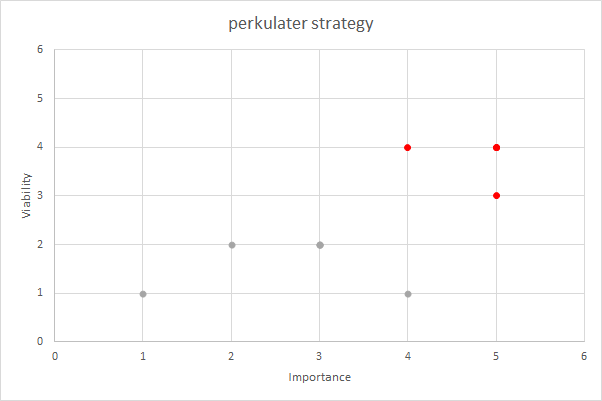
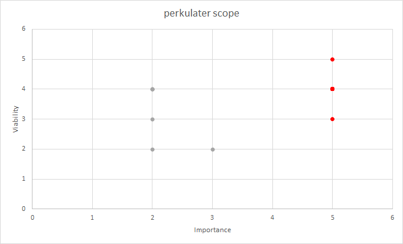

# perkulater #
[perkulater Live Site](https://perkulater.herokuapp.com/)  

## Contents ##
- [Background](#background)
- [Mission Statement](#mission-statement)
- [Target Audience](#target-audience)
- [Business Objectives](#business-objectives)
- [User Objectives](#user-objectives)
- [UX](#ux)
    - [Project Strategy](#project-strategy)
        - [Opportunities Matrix](#opportunities-matrix)
    - [Project Scope](#project-scope)
        - [User Demographics](#user-demographics)
        - [User Requirements](#user-requirements)
        - [Functional Requirements](#functional-requirements)
        - [User Stories](#user-stories)
        - [Constraints](#constraints)
        - [Business Rules](#business-rules)
        - [Key Features](#key-features)
    - [Site Map](#site-map)
    - [Wireframes](#wireframes)
    - [Design Choices](#design-choices)
        - [Fonts](#fonts)
        - [Colours](#colours)
- [Technologies](#technologies)
    - [Integrated Development Environment](#integrated-development-environment)
    - [Database](#database)
    - [Languages](#languages)
    - [Frameworks Libraries and Tools](#frameworks-libraries-and-tools)
    - [Browser Support](#browser-support)
- [Structure](#structure)
    - [Information Architecture](#information-architecture)
    - [Features Implemented](#features-implemented)
        - [Features Implemented in Phase 1](#features-implemented-in-phase-1)
        - [Features To Be Implemented In Future Development Phases](#features-to-be-implemented-in-future-development-phases)
        - [Design Changes During The Phase 1 Development](#design-changes-during-the-phase-1-development)
    - [Responsive Styling](#responsive-styling)
    - [Python Code Logic](#python-code-logic)
        - [Products](#products)
        - [Categories](#categories)
        - [Allergens](#allergens)
        - [User Authentication](#user-authentication)
        - [Mail](#mail)
    - [Python Code Refactoring](#python-code-refactoring)
    - [Form Validation](#form-validation)
    - [JavaScript Code Logic](#javascript-code-logic)
- [Testing](#testing)
- [Deployment](#deployment)
- [Credits](#credits)
- [Acknowledgements](#acknowledgements)

## Background ##
With the rise in home working, many former commuters now miss out on a the joy of drinking a high quality morning coffee made with the finest ingredients. Perkulater aims to provide great quality coffee beans and ground coffee, delivered to your home.

## Mission Statement ##
To provide great quality coffee beans and ground coffee delivered to your home.

## Target Audience ##
The target audience for perkulater are consumers who love great quality coffee and would like to be able to make coffee shop quality coffee at home.

## Business Objectives ##
* Provide a high quality, well designed online shop that enables secure purchases, inspires confidence in the quality of the product, and increases the likelyhood of repeat purchases and subscriptions.
* Provide the ability for customers to leave positive feedback and reviews on the products, to inspire confidence.
* Grow the brand over time, starting with coffee beans and ground coffee and scaling up to add more products as the brand grows.
* Track sales data to inform future business strategy.

## User Objectives ##
* Purchase high quality, great tasting coffee beans or ground coffee for home delivery.
* Subscribe for a regular delivery of high quality, great tasting coffee beans or ground coffee.
* Purchase a gift card.
* See other user's positive reviews and feedback to inspire confidence in making a purchase.
* Review and recommend products.
* Contact the business about an order.
* Contact the business with a general enquiry.
* Customise my subscription service so that I can try different coffees based on my preferences.
* Purchase high quality cold brew coffee in a can (this product line will be added in a future development phase).
* Purchase high quality coffee making equipment (this product line will be added in a future development phase).
* Purchase high quality, great tasting coffee pods (this product line will be added in a future development phase).
* Purchase branded merchadise (this product line will be added in a future development phase).

## UX ##

### Project Strategy ###

#### Opportunities Matrix ####
The following opportunities were identified and ranked using a score of 1 - 5 for importance and viability:

Opportunity|Description|Importance|Viability|Opportunity ID|Development Phase
-----------|-----------|----------|---------|--------------|-----------------
Coffee beans and ground coffee|Develop an online store to sell high quality coffee beans and ground coffee|5|4|Op-1|1
Showcase developer skills|The site will serve as a showcase for the developer's skills, and increase the developer's standing within the tech community|5|4|Op-2|1
Subscriptions|Provide a subscription service so customers can have coffee delivered on a regular basis|5|3|Op-3|1
Gift cards|Sell gift cards and/or the ability to gift a subscription|4|4|Op-4|1
Customer recommendations|Provide the facility to add positive customer feedback and recommendations|5|4|Op-5|1
Customised subscription service|Customise the subscription service so that customers can try different coffee each time their subscription is fulfilled based on their preferences|3|2|Op-6|2
Cold brew|Add cold brew cans to the product line|3|2|Op-7|2
Coffee making equipment|Add coffee making equipment e.g. V60 drippers, filters, stove top espresso pots, aeropresses, espresso machines etc to the product line|2|2|Op-8|2
Pods|Add coffee pods compatible with nespresso machines etc. to the product line|3|2|Op-9|2
Engage with suppliers|Engage directly with coffee farmers in order to source high quality ethically grown coffee directly from source|4|1|Op-10|3
Merchandise|Sell company branded merchadise|1|1|Op-11|3
				

### Project Scope ###
#### User Demographics ####
* The primary users of the site will be consumers who are looking for high quality coffee beans and ground coffee for home delivery. 
* A simple, clean and modern looking, well layed out site with the key information being easy to find would suit this demographic.

#### User Requirements ####
* Simple and well layed out.
* Clean and modern looking.
* Easy to find key information.
* Easy to make a purchase in just a few clicks.
* The site should inspire the consumer with the confidence to make a purchase.
* Responsive design is required as users may be viewing the site on Mobile, Tablet or Desktop.

#### Functional Requirements ####
In order to determine the functional requirements of the site, user stories have been developed.

#### User Stories ####
As a **User**, I would like to be able to:
* Search for products.
* Purchase products.
* Register on the site.
* Sign in to my account
* Sign out of my account.
* Update my personal profile.
* See a summary of my previous orders.
* Contact the business about a specific order.
* Contact the business with a general query.

As a **Business Owner**, I would like to be able to:
* Add, edit and delete products.
* Add, edit and delete product categories.
* Add and update positive customer feedback to display.
* Track sales data

#### Constraints #####
* Developer skill set - the Developer is currently learning **Python** and **Django**. 
This may impact on which features can be succesfully implemented during the phase 1 development.
* Developer's available time - the developer is working full time whilst studying.
This coupled with the developer's current skills constraints may impact which features 
can be succesfully implemented during the phase 1 development.

#### Business Rules ####
It is not envisaged at this stage that the **perkulater** will become a real business. The site has been created for the purposes of satifying the ciriteria for the Code Institute Milestone Project 4

#### Key Features ####
The following key features have been identified for development and scored from 1 - 5 for importance and viability. 
Each feature is mapped back to the [Opportunities Matrix](#opportunities-matrix). 
The proposed development phase has also been indicated:

Feature|Description|Importance|Viability|Opportunity ID|Development Phase
-------|-----------|----------|---------|--------------|-----------------
Product Search|Enables users to search the product database|5|4|Op-1|1
Purchase Products|Enables users to purchase a product|5|4|Op-1|1
Registration Form|User registration form|5|4|Op-1|1
Sign In	User|Sign In form|5|4|Op-1|1
Sign Out|User Sign Out|5|4|Op-1|1
Update Profile|Update user profile|5|4|Op-1|1
Order Summary|See a summary of previous orders|5|4|Op-1|1
Order Contact|Contact the business owner about a specific order|5|4|Op-1|1
General Contact|Contact the business owner about a general enquiry|5|4|Op-1|1
Add Product|Enables users with required privelages to add a product|5|4|Op-1|1
Edit Product|Enables users with required privelages to edit a product|5|4|Op-1|1
Delete Product|Enables users with required privelages to delete a product|5|4|Op-1|1
Add Category|Enables users with required privelages to add a category|5|4|Op-1|1
Edit Category|Enables users with required privelages to edit a category|5|4|Op-1|1
Delete Category|Enables users with required privelages to delete a category|5|4|Op-1|1
Add Customer Feedback|Enables users with required privelages to add customer feedback|5|4|Op-5|1
Edit Customer Feedback|Enables users with required privelages to edit customer feedback|5|4|Op-5|1
Delete Customer Feedback|Enables users with required privelages to delete customer feedback|5|4|Op-5|1
Subscribe|Enables users to subscribe for regular coffee delivery|5|3|Op-3|1
Purchase Gift Card|Enables users to purchase a gift card|4|4|Op-4|1
Track sales data|Enables users with required privelages to export sales data from the database|3|2|Op-1|2
Customised Subscription Service|Customise the subscription service so that customers can try different coffee each time their subscription is fulfilled based on their preferences|3|2|Op-6|2

### Site Map ###
An initial [Site Map](/static/wireframes/site-map.png) was produced, and is shown below:  

### Wireframes ### 
[Initial Wireframes](/static/wireframes/rev0) were produced showing the **Home**, **Sign In**, **Register**, **View Product**, 
**Edit Product**, **Add Product**, **Add Category**, **Edit Category**, **Delete Category**, **Add Allergen**, **Edit Allergen**, **Delete Allergen** and 
**Contact Developer** page layouts. The **Home** page is shown below:  

[Responsive design wireframes](/static/wireframes/rev1) were then produced showing the **Home** page layout on **Tablet** and **Phone**. 
The [Responsive design wireframes](/static/wireframes/rev1) are shown below:  

### Design Choices ###

#### Fonts ####
[Architect's Daughter](https://fonts.google.com/specimen/Architects+Daughter) has been chosen as the logo font for the [FreeFrom logo](/static/testing/logo.png). 
The font has a hand drawn appearence, looks very attractive with the dove logo and fits well with the overall site theme.  
* font-family: "Architects Daughter", sans-serif;

[Montserrat](https://fonts.google.com/specimen/Montserrat) has been chosen as the title font and is used for the 
navigation menu, controls, forms and footer links. [Montserrat](https://fonts.google.com/specimen/Montserrat) has 
a simple, clean, rounded look and is available in a good selection of weights.
* font-family: "Montserrat", sans-serif;

[Open Sans](https://fonts.google.com/specimen/Montserrat) has been chosen as the body font and is used for the search results and review tables. 
[Open Sans](https://fonts.google.com/specimen/Montserrat) is complimentary to [Montserrat](https://fonts.google.com/specimen/Montserrat) and has 
a similar clean look and feel but is not quite as wide, which will allow for more information to be displayed in the search results and review tables. 
[Open Sans](https://fonts.google.com/specimen/Montserrat) is also available in a good selection of weights.
* font-family: "Open Sans", sans-serif;

[Architect's Daughter](https://fonts.google.com/specimen/Architects+Daughter) and [Montserrat](https://fonts.google.com/specimen/Montserrat) 
are available from [Google Fonts](https://fonts.google.com/) and are licensed under the [Open Font License](https://scripts.sil.org/cms/scripts/page.php?site_id=nrsi&id=OFL).  
[Open Sans](https://fonts.google.com/specimen/Montserrat) is available from [Google Fonts](https://fonts.google.com/) and is licensed under the 
[Apache License, Version 2.0](https://www.apache.org/licenses/LICENSE-2.0.html).

#### Colours ####
White was chosen as the background colour to enable a simple and clear design to be implemented.  
Bright foreground colours were chosen to contrast with the white background. Colour ideas were generated 
using the [ColorSpace](https://mycolor.space/) **Colour Palette** generator. The final **Colour Palette** selected 
is shown below: 

  

* #FFFFFF - "White" - used for the background.
* #009EA3 - "Vividian Green" - used for results and review table links.
* #E97C72 - "Salmon" - used for form control borders and results and review table next and previous buttons.
* #E35B4F - "Fire Opal" - used for navbar background, buttons, results table header backround, inputs and footer links.
* #C22C1E - "Venetian Red" - used as a higlighting colour for items coloured with "Fire Opal".
* #F5B800 - "Orange Yellow" - used for alerts, buttons, results and review table row borders and stars.
* #CC9900 - "Lemon Curry" - used as a higlighting colour for items coloured with "Orange Yellow".

## Technologies ##

### Integrated Development Environment ##
* [GitHub](https://github.com/)

### Database ###
* [Mongo DB](https://www.mongodb.com/)

### Languages ###
* [HTML](https://developer.mozilla.org/en-US/docs/Web/HTML)
* [CSS](https://www.w3.org/Style/CSS/Overview.en.html)
* [JavaScript](https://developer.mozilla.org/en-US/docs/Web/JavaScript)
* [Python](https://www.python.org/)

### Frameworks Libraries and Tools ###
* [Bootstrap](https://getbootstrap.com/docs/5.0/getting-started/introduction/) - to assist with responsive design.
* [Font Awesome](https://fontawesome.com/) - for icons.
* [Google Fonts](https://fonts.google.com/) - for fonts.
* [jQuery](https://jquery.com/) - to assist with JavaScript coding and DOM manipulation.
* [PyMongo](https://pypi.org/project/pymongo/) - to enable interaction with [Mongo DB](https://www.mongodb.com/).
* [Flask](https://flask.palletsprojects.com/en/2.0.x/) - to render and display web pages.
* [DataTables](https://datatables.net/) - to enable easy display of data tables.
* [WTForms](https://wtforms.readthedocs.io/en/2.3.x/) - for **Form Validation**.
* [wftorms-validators](https://pypi.org/project/wtforms-validators/) - for additional form validators.
* [Jinja](https://jinja.palletsprojects.com/en/3.0.x/) - to enable easy display of database information using templating.
* [Werkzeug](https://werkzeug.palletsprojects.com/en/2.0.x/) - to enable generation and checking of secure password hashes.
* [SMTPLib](https://docs.python.org/3/library/smtplib.html) - to enable contact emails to be sent.
* [unittest](https://docs.python.org/3/library/unittest.html#) - framework for **Python Unit Testing**.
* [mongomock](https://pypi.org/project/mongomock/) - used to create a "mock" of the **Mongo DB** for **Python Unit Testing**.

### Browser Support ###
The following browsers are all supported by **FreeFrom**.
* [Google Chrome](https://www.google.com/intl/en_uk/chrome/)
* [Microsoft Edge](https://www.microsoft.com/en-us/edge)
* [Safari](https://www.apple.com/uk/safari/)
* [Firefox](https://www.mozilla.org/en-GB/firefox/new/)
* [Opera](https://www.opera.com/)

For further information please see  the **Browser Compatibility** section in [TESTING.md](TESTING.md).  

## Structure ##

### Information Architecture ###
[Mongo DB](https://www.mongodb.com/) has been selected to host the back end database for [FreeFrom](https://freefrom.herokuapp.com/). 
[Mongo DB](https://www.mongodb.com/) is a non relational [NoSQL](https://www.mongodb.com/nosql-explained) database hosting platform, 
which provides an easily scalable platform to base the [FreeFrom](https://freefrom.herokuapp.com/) site on.  

The project data schema 
was modelled using [Moon Modeller](https://www.datensen.com/data-modeling/moon-modeler-for-databases.html) and is shown below:  

 

As shown in the schema diagram, there are four collections, **Users**, **Products**, **Categories** and **Allergens**.  

Please note that the field **allergens_suitability** in the **Products** collection was renamed to **free_from_allergens**. 
This change was not picked up in the note below the "products" collection in the schema diagram shown above 
and unfortunately the free 14 day trial for the software ended. 

[FreeFrom](https://freefrom.herokuapp.com/) is deployed using [Heroku](https://dashboard.heroku.com/). 
For further information see [Deployment](#deployment).

### Features Implemented ###
Please note that an account with **Admin** privileges has been created for testing purposes. This will facilitate testing of 
features which require **Admin** privileges. The username is *testadmin1* and the password is *testadmin1*.

#### Features Implemented in Phase 1 ####
* **Home Page**, enables users to search for products which are free from one or more allergens:  
 

* **FreeFrom** logo, links to home page if selected:  
 

* **Home Page Alert**, explains the purpose of the site, shows user name if signed in:  
 

* **Navigation Menu**, enables navigation to the **Home** and **Sign In** pages if the user is not **Signed In**. 
If the user is **Signed In**, enables **Sign Out**. If the user is signed in with **Admin** privileges, 
displays the **Allergens** and **Categories** menus:  

 

* **Search Input**, allows the user to optionally input product search criteria to filter search results:  
  

* **Category Selector**, allows the user to optionally select category to filter search results:  
  

* **Search Button**, searches the database and returns matched products in the **Product Results Table**. 
Resizes if the user is not signed in and add button is not displayed:  
  

* **Add Button**, links to the **Product Add** form. Only shown if the user is signed in:  
  

* **Allergen Selector**, allows the user to optionally select allergens to filter search results:  
  

* **Product Results Table**, displays product search results. Product name links to **Product View** page:
 

* **Sign In**, displays form allowing the user to sign in. Includes link to **Register**:  
 

* **Register**, displays form allowing the user to register:  
 

* **Product View**, displays **Product** details. If the user is signed in, allows review and rating to 
be added or updated.   
**Add** button enables the user to review and rate **Product**.  
**Add** button text is changed to **Update** if the user has already reviewed the **Product**.  
**Update** button updates review and rating if **Product** has already been reviewed by the user.  
**Product Edit** button links to **Product Edit** page.  
User reviews are shown below in the **User Reviews Table**:  
  

* **Product Edit**, displays form allowing **Product** to be edited. If the **Product** has been added by the 
signed in **User**, or if the signed in **User** has **Admin** privileges, **Delete** button is shown:  
  

* **Product Delete Confirm**, displays form confirming **Product** should be deleted:  
  

* **Product Add**, displays form allowing **Product** to be added:  
  

* **Allergen Add**, displays form allowing **Allergen** to be added:  
  

* **Allergen Edit**, displays form allowing **Allergen** to be edited:  
  

* **Allergen Delete**, displays form allowing **Allergen** to be deleted:  
  

* **Allergen Delete Confirm**, displays form confirming **Allergen** should be deleted:  
  

* **Category Add**, displays form allowing **Category** to be added:  
  

* **Category Edit**, displays form allowing **Category** to be edited:  
  

* **Category Delete**, displays form allowing **Category** to be deleted:  
  

* **Category Delete Confirm**, displays form confirming **Category** should be deleted:  
  

* **Footer Contact Developer Link**, links to **Contact Developer** form:  
  

* **Footer GitHub Link**, links to developer page on [GitHub](https://github.com/richardhenyash):  
  

* **Contact Developer**, enables developer to be contacted by email:  
  

* **Error Page**, returns a customised error message and link to the **Home** page if an error is encountered:  
  

#### Features To Be Implemented In Future Development Phases ####
* Currently, when the user navigates back to the **Home** page from the **Product View** page, 
the previous search results are not displayed. Adding this functionality was investigated and
is likely to involve significant restructuring and re-testing of the python code. This feature 
is recommended to be implemented in a **Future Development Phase**.
* Functionality for deleting user accounts should be added. Currently this has to be done in the 
[Mongo DB](https://www.mongodb.com/) back end.
* Functionality for enabling the user to change their password should be added.
* Functionality to enable an **Admin** user to assign **Admin** rights to another user, which would allow the user to edit **Categories** and **Allergens**. Currently **Admin** rights have to be assigned in the [Mongo DB](https://www.mongodb.com/) back end.
* Functionality to enable pictures of **Products** to be uploaded.
* Functionality to enable **Products** to be added by scanning barcodes.

#### Design Changes During The Phase 1 Development ####
The following design changes were implemented following initial user feedback:
* The **Home** and **Product View** page alerts were updated to include links to **Sign In** and **Register** 
if the user is not signed in:  

* The **Home** page search button was updated to take up the space of the search and add buttons 
if the user is not signed in:  
  

* The **Register** form was updated to include a link to **Sign In**:  
  

* The **Product Add** route was updated to redirect to the **Product View** of the 
successfully added product.  

* The **Product View** form was updated to include an **Add Product** button:  
 

* **Form Validation** for the **Product** form was updated to allow special characters 
(e.g. "&", "-" etc) in product names, and to allow **Product** and **Manufacturer** 
names to be a minumum of 3 characters long.

* Selection highlighting was turned off on the **Product View** form fields.

* Font sizes were increased slightly.

* Additional error checking was implemented.

### Responsive Styling ###
* The **Navigation Menu** is collapsible, and collapses to an icon on small devices less than 768 pixels wide. 
This is implemented using the [Bootstrap Navbar](https://getbootstrap.com/docs/5.0/components/navbar/) component.  
* The **Search Input**, **Category Selector**, **Search Button** and **Add Button** are responsively styled, 
and stack on small devices less than 768 pixels wide.  
* The **Product Results Table** and **User Reviews Table** are responsively styled, so that columns are collapsed 
on smaller devices. This is implemented using the [DataTables](https://datatables.net/) 
[Responsive Extension](https://datatables.net/extensions/responsive/). The class **responsive** is added to the 
**table** html classes. Table columns are assigned a **prioirity** by adding the **data-priority** attribute to 
the **table header** html.

See **Responsive Design** section in [TESTING.md](TESTING.md) for further information and [Responsive Testing](/static/testing/responsive) screen prints.

### Python Code Logic ###
The **Python Code** for the project has been split into the following modules, using the 
[Flask Blueprint](https://flask.palletsprojects.com/en/2.0.x/blueprints/) function:

* [Application](/app.py) - Flask routes and functions related to the **Flask Application** and **Error Handling**.
* [Database](/database.py) - Functions related to the **Mongo Database**.
* [Products](/products.py) - Flask routes and functions related to **Products**.
* [Allergens](/allergens.py) - Flask routes and functions related to **Allergens**.
* [Categories](/categories.py) - Flask routes and functions related to **Categories**.
* [Forms](/forms.py) - [WTForms](https://wtforms.readthedocs.io/en/2.3.x/) form class definitions.
* [User Authentication](userauth.py) - Flask routes and functions related to **User Authentication**.
* [Mail](/mail.py) - Flask routes and functions related to sending an email via the **Contact Developer** form.

The high level code logic is explained in the [UML Diagrams](/static/wireframes/uml/) below: 

#### [Products](/static/wireframes/uml/products-logic.png) ####
  

#### [Allergens](/static/wireframes/uml/allergens-logic.png) ####
  

#### [Categories](/static/wireframes/uml/categories-logic.png) ####
  

#### [User Authentication](/static/wireframes/uml/userauth-logic.png) ####
  

#### [Mail](/static/wireframes/uml/mail-logic.png) ####
 

### Python Code Refactoring ###
After attending an online [Code Institute](https://codeinstitute.net/) seminar on [Python Classes](https://www.w3schools.com/python/python_classes.asp) 
given by [Ben Kavanagh](https://github.com/BAK2K3), consideration was given to refactoring the code using an object orientated approach. 
A new [Class](https://github.com/richardhenyash/freefrom/tree/class) branch was created on in the 
[Project Code Repository](https://github.com/richardhenyash/freefrom). Classes and class methods were created in the 
**products**, **allergens**, **categories** and **userauth** python code modules. The class orientated approach was succesfully 
implemented as a test on the **Product View** route, which resulted in a significant simplification of the code. Unfortunately, 
due to time constraints, it was not possible to implement the object orientated approach across the project, but this should 
definitely be considered for a future project development phase, and as a better method of working for future projects.

Due to time constraints, the developer decided to refactor the **Python Code** using **Procedural Programming**. The code was reviewed at a high level, and functions that could be split out and re-used were identified. A [Refactor](https://github.com/richardhenyash/freefrom/tree/refactor) branch was created in the [Project Code Repository](https://github.com/richardhenyash/freefrom). The **Products**, **Categories**, **Allergens**, **User Authentication** and **Mail** modules were refactored, the site was re-tested and the **Refactor** branch was merged into the **Master** branch in the [Project Code Repository](https://github.com/richardhenyash/freefrom). The refactoring has greatly improved the readability of the code 
and will make any further future development and bug fixes much easier to incorporate.

### Form Validation ###
Form validation is achieved in [Python](https://www.python.org/) using [WTForms](https://wtforms.readthedocs.io/en/2.3.x/). 
Custom **Form Classes** are defined within the [Forms](/forms.py) module for each required form. 
Additional custom validators have been imported from [wftorms-validators](https://pypi.org/project/wtforms-validators/) and implemented.
See below table for form validation implemented using WTForms:  

Form|Field|WTForms Field Type|Required|Minimum Length|Maximum Length|Notes
----|-----|------------------|--------|--------------|--------------|-----
Sign In|User Name|StringField|Yes|5|25|May only contain letters or numbers
Sign In|Password|PasswordField|Yes|5|25|
Register|User Name|StringField|Yes|5|25|Inherits field from Sign In form class
Register|Password|PasswordField|Yes|5|25|Inherits field from Sign In form class
Register|Email|PasswordField|Yes|5|None|Inherits field from Sign In form class
Register|Confirm Password|PasswordField|Yes|None|None|Must match Password
Contact|Name|StringField|Yes|3|100|May only contain letters or spaces
Contact|Email|StringField|Yes|5|None|
Contact|Message|TextAreaField|Yes|10|500|
Product Add|Name|StringField|Yes|3|50|
Product Add|Manufacturer|StringField|Yes|3|50|
Product Add|FreeFrom|StringField|No|None|None|Automatically populated from check boxes
Product Add|Review|TextAreaField|Yes|5|50|
Product Add|Rating|StringField|No|1|1|Automatically populated using JavaScript event handlers
Product View|Name|StringField|No|None|None|Read Only
Product View|Manufacturer|StringField|No|None|None|Read Only
Product View|FreeFrom|StringField|No|None|None|Read Only
Product View|Review|TextAreaField|Yes|5|250|
Product View|Rating|StringField|No|1|1|Automatically populated using JavaScript event handlers
Product Edit|Name|StringField|Yes|3|50|
Product Edit|Manufacturer|StringField|Yes|3|50|
Product Edit|FreeFrom|StringField|No|None|None|Automatically populated from check boxes
Allergen Add|Name|StringField|Yes|3|20|May only contain letters or spaces
Allergen Edit|Name|StringField|Yes|3|20|May only contain letters or spaces
Category Add|Name|StringField|Yes|3|30|May only contain letters or spaces
Category Edit|Name|StringField|Yes|3|30|May only contain letters or spaces

### JavaScript Code Logic ###
[JavaScript](https://developer.mozilla.org/en-US/docs/Web/JavaScript) has been used to implement the following features:  

* Initialisation of [DataTables](https://datatables.net/), which are used to display the **Product** search results on the **Home** 
page and the **Reviews** on the **Product View** page in a searchable, sortable, paginated data table format using a plug in.

* Clickable **Rating** stars on the **Product View** and **Product Add** forms. When the star icons are clicked on the 
**Product View** and **Product Add** forms, a hidden form input with the id of "Rating" is updated to the correct "star" rating 
between 1 and 5 using the **JavaScript** on click event handlers defined in the [Events](/static/js/events.js) module.

* When the **Product View** form is ready, the hidden form input with id "Rating" is read and the **Rating** star icons 
are updated to reflect the correct rating value.

See [UML Diagram](/static/wireframes/uml/) below:  

  

## Testing ##

Further testing information and screen prints can be found in [TESTING.md](TESTING.md).

## Deployment ##
The project has been developed using [Gitpod](https://www.Gitpod.io/) and [GitHub](https://github.com/). 
The project was regularly commited to [GitHub](https://github.com/) during the initial development phase.
The website resides as a repository in [GitHub](https://github.com/), and has been been deployed 
using [Heroku](https://dashboard.heroku.com/).

In order to make a *Fork* or *Clone* of the project, a [GitHub](https://www.Gitpod.io/) account is required. 
The [Gitpod Browser Extension](https://www.Gitpod.io/docs/browser-extension/) is also recommended.  

The project may be *Forked* by following these steps:
* Go to the [Project Code Repository Location](https://github.com/richardhenyash/freefrom) on [GitHub](https://github.com/).
* In the top-right corner of the page, click *Fork*.  

For further information on *Forking* a [GitHub](https://github.com/) repository, 
see the [GitHub Documentation](https://docs.github.com/en/github/getting-started-with-github/fork-a-repo).

The project may be *Cloned* by following these steps:
* Go to the [Project Code Repository Location](https://github.com/richardhenyash/freefrom) on [GitHub](https://github.com/).
* Select the *Code* dropdown and choose *GitHub CLI* under *Clone*. This will give you a *URL* that may be copied into the clipboard. 
* Open the Git Bash command line interface in [Gitpod](https://www.Gitpod.io/).
* Change the current working directory to the location where you would like the cloned directory to reside.
* Type `git clone`, and then paste the *URL* copied earlier, eg:  
`$ git clone https://github.com/richardhenyash/free-from`
* Press Enter to create the local clone.
* Any required **Python** dependencies should be installed locally using `$ pip install -r requirements.txt`.

The code may also be downloaded to a local computer by following these steps:
* Go to the [Project Code Repository Location](https://github.com/richardhenyash/freefrom) on [GitHub](https://github.com/).
* Select the *Code* dropdown and choose the *Download ZIP* option.
* This will download a copy of the entire project locally as a .zip file. 
* Any required **Python** dependencies should be installed locally using the terminal command `$ pip install -r requirements.txt`.

For further information on *Cloning* a [GitHub](https://github.com/) repository, see the 
[GitHub Documentation](https://docs.github.com/en/github/creating-cloning-and-archiving-repositories/cloning-a-repository).

To set up the local testing environment once the code has been *Cloned* or *Forked*, an [env.py](/static/testing/deployment/example_env.py) file should be created in the root directory. The [env.py](/static/testing/deployment/example_env.py) file should be included in the *gitignore* file, as it contains sensitive information and should not be committed to a public **GitHub** repository. The [env.py](/static/testing/deployment/example_env.py) file should include the following *environment* variables:  

Variable|Value|
--------|-----|
IP|0.0.0.0|
PORT|5000
SECRET_KEY|`your_secret_key`
MONGO_DBNAME|The Mongo database name, currently set to `freefrom`
MONGO_URI|The Mongo connection string, currently set to `mongodb+srv://<username>:<password>@<clustername>.z6xjx.mongodb.net/<database_name>?retryWrites=true&w=majority`
MAIL_USERNAME|The mail account that **Contact** emails will be sent to. Currently set to `freefrom.contact@gmail.com`
MAIL_PASSWORD|The mail password associated with the mail account that **Contact** emails will be sent to.  

Please see [Example env.py file](/static/testing/deployment/example_env.py).

The steps required to deploy the website to [Heroku](https://dashboard.heroku.com/) are as follows:
* Use the `pip freeze > requirements.txt` terminal command to to create a `requirements.txt` file, 
which lists all the **Python** dependencies.
* Use the `echo web: python app.py > Procfile` terminal command to create a `Procfile`, which declares the process type. 
Note that the `Procfile` should have one line that reads `web: python app.py`, with no empty white space or lines.
* Push the newly created `requirements.txt` and `Procfile` files to the the [GitHub](https://github.com/) 
repository using the `git add`, `git commit` and `git push` commands.
* Log in to [Heroku](https://id.heroku.com/login), and create a new **App** by clicking the *New* button in the top right of 
your *Dashboard* and selecting *Create new app*. Give the new **App** a name and set the region to your closest geographical region, 
then click *Create app*.
* Select the new **App** from your **Heroku** *Dashboard*, then from your **App** *Dashboard*, click on the *Deploy* menu > *Deployment method* 
section and select *GitHub*.
* Search for your [GitHub](https://github.com/) repository then click *Connect* to connect.
* Confirm that the **App** is connected to the correct [GitHub](https://github.com/) repository.
* In the *Dashboard* for the new application, click on *Settings* menu > *Reveal Config Vars*.
* Set the following **Config Vars**:

Variable|Value|
--------|-----|
IP|0.0.0.0|
PORT|5000
SECRET_KEY|`your_secret_key`
MONGO_DBNAME|The Mongo database name, currently set to `freefrom`
MONGO_URI|The Mongo connection string, currently set to `mongodb+srv://<username>:<password>@<clustername>.z6xjx.mongodb.net/<database_name>?retryWrites=true&w=majority`
MAIL_USERNAME|The mail account that **Contact** emails will be sent to. Currently set to `freefrom.contact@gmail.com`
MAIL_PASSWORD|The mail password associated with the mail account that **Contact** emails will be sent to.

* To get the correct **MongoDB** connection string, go to the *Cluster* dashboard in **MongoDB**, 
click on *Connect* > *Connect your application*, select *Python*, select version *3.11 or later*
and the connection string is displayed below. For more information see 
[Mongo DB Connection String](https://docs.mongodb.com/manual/reference/connection-string/#std-label-connections-standard-connection-string-format]).
* In the *Dashboard* for the new application, click on *Deploy* menu > *Automatic deploys*, choose the **Branch** which you would like to connect 
and select *Enable Automatic Deploys*.
* In the *Manual deploy* section, select the branch which you would like to deploy and click the *Deploy Branch* button.
* **Heroku** will receive the code from **GitHub** and build the **App** with the required packages and dependencies.
* Once complete, you should see the message *Your app was succesfully deployed*.
* **Heroku** is now succesfully connected to **GitHub** and any changes made in the **GitHub** repository 
will be automatically pushed to **Heroku**.

## Credits ##

* [Pin Clip Art](https://www.pinclipart.com/) for the coffee bean logo.

* [Vector Stock](https://www.vectorstock.com/) for the attractive dove logo.
* [DataTables](https://datatables.net/) for the brilliant tables plug in.
* [WTForms](https://wtforms.readthedocs.io/en/2.3.x/) for the excellent form validation library and 
[Crash Course](https://wtforms.readthedocs.io/en/2.3.x/crash_course/) which I followed to implement the **Form Validation**.
* [wftorms-validators](https://pypi.org/project/wtforms-validators/) for the awesome additional form validation library.
* My mentor [Reuben Ferrante](https://github.com/arex18) for the examples which helped me implement the **Form Validation**, [Flask Blueprints](https://flask.palletsprojects.com/en/2.0.x/blueprints/) and **Python Unit Testing**.
* [Google Fonts](https://fonts.google.com/) for the attractive fonts used on the site, which enabled me to get started quickly.
* [hex 2 rgba](http://hex2rgba.devoth.com/) for the hex to RGBA conversion tool.
* The excellent [Code Institute](https://codeinstitute.net/) course material which enabled me to succefully implement the project.
* [ColorSpace](https://mycolor.space/) for the colour ideas generated using the colour pallete generator.
* [favicon.io](https://favicon.io/favicon-converter/) for the favicon conversion tool.
* The following [link](https://datatables.net/forums/discussion/51763/page-paging-number-color-styles) for information on **DataTables** 
page and page number styling.
* The following [link](https://docs.python.org/3/library/unittest.html#) for information on **unittest**, used for **Python Unit Testing**.
* The following [link](http://docs.mongoengine.org/guide/mongomock.html) for information on **mongomock**, used to create a "mock" of 
the **Mongo DB** for **Python Unit Testing**.

## Acknowledgements ##

Many thanks to the following for help and inspiration during this project:
* My mentor [Reuben Ferrante](https://github.com/arex18) for helping to get me started off on the right footing, for the insightful
review and comments on the site and for the help with **Form validation**, [Flask Blueprints](https://flask.palletsprojects.com/en/2.0.x/blueprints/), **Python Code Refactoring** and **Python Unit Testing**.  
* [Neringa Bickmore](https://github.com/neringabickmore) for your encouragement with my project idea.
* [Ben Kavanagh](https://github.com/BAK2K3) for the very helpful comments on the site and general 
 encouragement, and for the excellent online seminar on **Python Classes**.
* The [Code Institute](https://codeinstitute.net/) [slack](https://slack.com/intl/en-gb/) community, for all your encouragement and help.