# perkulater #
[perkulater Live Site](https://perkulater.herokuapp.com/)  

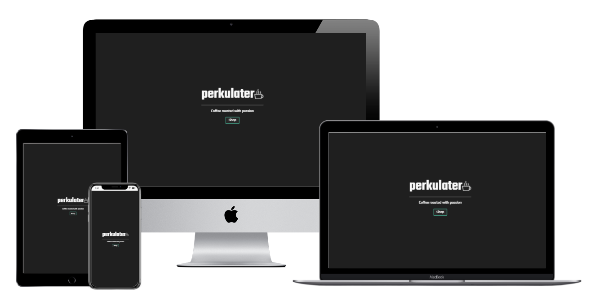  

## Contents ##
- [Background](#background)
- [Mission Statement](#mission-statement)
- [Target Audience](#target-audience)
- [Business Objectives](#business-objectives)
- [User Objectives](#user-objectives)
- [UX](#ux)
    - [Project Strategy](#project-strategy)
        - [Opportunities Matrix](#opportunities-matrix)
    - [Project Scope](#project-scope)
        - [User Demographics](#user-demographics)
        - [User Requirements](#user-requirements)
        - [Functional Requirements](#functional-requirements)
        - [User Stories](#user-stories)
        - [Constraints](#constraints)
        - [Business Rules](#business-rules)
        - [Key Features](#key-features)
    - [Site Map](#site-map)
    - [Wireframes](#wireframes)
    - [Design Choices](#design-choices)
        - [Fonts](#fonts)
        - [Colours](#colours)
- [Technologies](#technologies)
    - [Integrated Development Environment](#integrated-development-environment)
    - [Languages](#languages)
    - [Database](#database)
    - [Storage](#storage)
    - [Payments](#payments)
    - [Frameworks](#frameworks)
    - [Libraries and Tools](#libraries-and-tools)
    - [Browser Support](#browser-support)
- [Structure](#structure)
    - [Information Architecture](#information-architecture)
        - [Products Models](#products-models)
        - [Checkout Models](#checkout-models)
        - [Profile Models](#profile-models)
        - [Basket Models](#basket-models)
    - [Features Implemented](#features-implemented)
        - [Features Implemented in Phase 1](#features-implemented-in-phase-1)
            - [Features Included In Base Template](#features-included-in-base-template)
            - [Contact](#contact)
            - [User Authentication System](#user-authentication-system)
            - [Products](#products)
            - [Messaging System](#messaging-system)
            - [Basket](#basket)
            - [Checkout](#checkout)
            - [User Profile](#user-profile)
        - [Features To Be Implemented In Future Development Phases](#features-to-be-implemented-in-future-development-phases)
        - [Design Changes During The Phase 1 Development](#design-changes-during-the-phase-1-development)
    - [Responsive Styling](#responsive-styling)
    - [Python Code Logic](#python-code-logic)
    - [Form Validation](#form-validation)
    - [JavaScript Code Logic](#javascript-code-logic)

- [Testing](#testing)
- [Deployment](#deployment)
- [Credits](#credits)
- [Acknowledgements](#acknowledgements)

## Background ##
With the rise in home working seen in 2020 and 2021 due to the coronavirus pandemic, many former commuters now miss out on a the joy of drinking a high quality morning coffee made with the finest quality ingredients. Specialist, small batch coffee roasters and coffee subscription services have been a significant growth market in 2020 and 2021, as the links below show:  
[CNN Business](https://edition.cnn.com/2020/06/21/business/people-signing-up-for-coffee-subscriptions/index.html)  
[World Coffee Portal](https://www.worldcoffeeportal.com/Latest/InsightAnalysis/2020/November/Home-Is-Where-the-Coffee-Is)  
[BBC News](https://www.bbc.com/future/bespoke/made-on-earth/how-the-coffee-trade-survived-Covid-19.html)  

**perkulater** aims to provide great quality, ethically sourced and expertly roasted coffee beans and ground coffee, delivered to your home. The business will initially focus on providing a just a handful of lovingly curated, high quality coffees. If the initial business proves to be successful, the future growth strategy would be to begin to expand into offering **cold brew**, **coffee making equipment** e.g. V60 drippers, stove top espresso pots, AeroPress coffee makers etc., **coffee pods** and eventually **branded merchandise**.

Please note that at this stage, **perkulater** is a fictitious store which has been created for the purposes of satisfying the requirements for the **Code Institute** Full Stack Development Course Milestone Project 4.

## Mission Statement ##
To provide great quality, ethically sourced and expertly roasted coffee beans and ground coffee, delivered to your home.

## Target Audience ##
The target audience for **perkulater** are consumers who love great quality coffee, are concerned at how the coffee beans are sourced, and would like to be able to make coffee shop quality coffee at home. **Perkulater** will be aimed at the higher end of the market, where consumers prioritise high quality and responsibly sourced coffee over low prices.

## Stakeholder Interviews
Short interviews were carried out with potential customers.

"What information would you need in order to make a purchase from an online coffee beans and ground coffee website?"
* "What variety are the coffee beans?"
* "Are the beans roasted by perkulater?"
* "Are the coffee beans responsibly sourced?"
* "Are the coffee beans available in whole beans and ground?"
* "Which coffee machines are the ground coffees and coffee beans suitable for?"
* "What is the price?"
* "What are the delivery costs?"
* "Is there positive feedback from happy customers?"
* "How do I know that the coffee will be tailored to my taste?"

"Are there any particular features you would like to see in an online coffee beans and ground coffee website?"
* "I would like to be able to subscribe to get a regular delivery of my favourite coffee beans."
* "I would like to be able to subscribe to get a regular delivery of different coffee beans selected based on my taste preferences."
* "I would like to be able to purchase a gift card for friends or family."

## Business Objectives ##
Although the business is fictitious at this stage, the following business objectives have been considered as part of the overall development strategy:  
* Provide a high quality, well designed online shop that enables secure purchases, inspires confidence in the quality of the product, and increases the likelyhood of repeat purchases and subscriptions.
* Provide the ability and incentivise customers to leave positive feedback and reviews on the products, to inspire confidence in new customers.
* Grow the brand over time, starting with coffee beans and ground coffee and scaling up to add more products as the brand grows.
* Track sales data to inform future business strategy.

## User Objectives ##
* Purchase high quality, great tasting coffee beans or ground coffee for home delivery.
* See other user's positive reviews and feedback to inspire confidence in making a purchase.
* Review and recommend products.
* Contact the business about an order.
* Subscribe for a regular delivery of high quality, great tasting coffee beans or ground coffee.
* Customise my subscription service so that I can try different coffees specifically tailored to my taste preferences.
* Purchase a gift card.
* Purchase high quality cold brew coffee in a can (this product line could potentially be added in a future development phase).
* Purchase high quality coffee making equipment (this product line could potentially be added in a future development phase).
* Purchase high quality, great tasting coffee pods (this product line could potentially be added in a future development phase).
* Purchase branded merchadise (this product line could potentially be added in a future development phase).

## UX ##

### Project Strategy ###

#### Opportunities Matrix ####
The following opportunities were identified and ranked using a score of 1 - 5 for importance and viability:

Opportunity|Description|Importance|Viability|Opportunity ID|Development Phase
-----------|-----------|----------|---------|--------------|-----------------
Engage with suppliers|Engage directly with coffee farmers in order to source high quality ethically grown coffee directly from source|5|3|Op-1|1
Coffee beans and ground coffee|Develop an online store to sell high quality, ethically sourced coffee beans and ground coffee|5|4|Op-2|1
Showcase developer skills|The site will serve as a showcase for the developer's skills, and increase the developer's standing within the tech community|5|4|Op-3|1
Customer reviews|Provide the facility for customers to add reviews to products|5|4|Op-4|1
Subscriptions|Provide a subscription service so customers can have coffee delivered on a regular basis|3|3|Op-5|2
Gift cards|Sell gift cards and/or the ability to gift a subscription|3|2|Op-6|2
Customised subscription service|Customise the subscription service so that customers can try different coffee each time their subscription is fulfilled tailored to their specific taste preferences|3|2|Op-7|2
Cold brew|Add cold brew to the product line|3|2|Op-8|2
Coffee making equipment|Add coffee making equipment e.g. V60 drippers, filters, stove top espresso pots, AeroPresses, espresso machines etc to the product line|2|2|Op-9|2
Pods|Add coffee pods compatible with popular coffee machines to the product line|3|2|Op-10|2
Merchandise|Add company branded merchadise to the product line|1|1|Op-11|3

See **perkulater** strategy chart below. Opportunities to be included for phase 1 are shown in *Red*, and opportunities to be deferred to a future development phase are shown in *Grey*: 

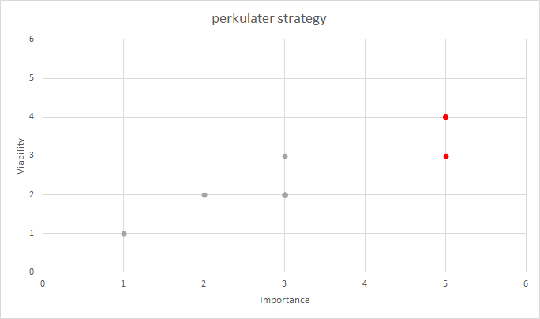

### Project Scope ###
#### User Demographics ####
* The primary users of the site will be consumers who are looking for high quality, ethically sourced coffee beans and ground coffee for home delivery. 
* A simple, clean and modern looking, well layed out site with the key information being easy to find and purchases being easy to make in a few clicks would suit this demographic.

#### User Requirements ####
* Simple and well layed out.
* Visually appealing.
* Intuitive.
* Clean and modern looking.
* Easy to find key information.
* Easy to make a purchase in just a few clicks.
* The site should inspire the consumer with the confidence to make a purchase.
* The site should be secure as the consumer is handing over credit card information.
* Responsive design is required as users may be viewing the site on Mobile, Tablet or Desktop.

#### Functional Requirements ####
In order to determine the functional requirements of the site, the following user stories have been developed.

#### User Stories ####
As a **Potential Customer**, I would like to be able to:
* Immediately understand the intent of the site.
* View and navigate the site on all devices.
* Learn about the coffees on offer, including a description of the flavours, so I can make an informed purchasing decision.
* Learn about where the coffee beans are sourced from, so I can make an informed purchasing decision.
* Understand the delivery charges, and how much I need to spend to get free delivery, so I can make an informed purchasing decision.
* Add products to my cart, so I can make a purchase.
* Receive confirmation of my purchase via email, so I can be confident that the purchase has been made succesfully.
* Register on the site, so I can make a repeat purchase more easily and get access to any rewards on offer.
* Contact the business with a general query.
* Subscribe for a regular purchase of a product (this feature will be added in a future development phase).

As a **Registered User**, I would like to be able to:
* Sign in to my account.
* Sign out of my account.
* Recover a forgotten password.
* View and update my personal profile, including default delivery details.
* See a summary of my previous orders.
* Contact the business about a specific order.
* Add reviews to products, to help other customers make informed purchasing decisions.
* Edit previous reviews.

As a **Business Owner**, I would like to be able to:
* Incentivise customers to add reviews to products, so that other customers will feel more confident about making a purchase.
* Add, edit and delete products.
* Edit product prices.
* Delete user reviews, in case malicious reviews are added.
* Add, edit and delete product categories (this feature will be added in a future development phase).
* Track sales data, to inform future purchasing decisions (this feature will be added in a future development phase).

#### Constraints #####
* Developer skill set - the Developer is currently learning **Python** and **Django**. 
This may impact on which features can be succesfully implemented during the phase 1 development.
* Developer's available time - the developer is working full time whilst studying.
This coupled with the developer's current skills constraints may impact which features 
can be succesfully implemented during the phase 1 development.

#### Business Rules ####
It is not envisaged at this stage that the **perkulater** will become a real business. The site has been created for the purposes of satisfying the criteria for the **Code Institute** Full Stack Development Course Milestone Project 4.

#### Key Features ####
The following key features have been identified for development and scored from 1 - 5 for importance and viability. 
Each feature is mapped back to the [Opportunities Matrix](#opportunities-matrix). 
The proposed development phase has also been indicated:

Feature ID|Feature|Description|Importance|Viability|Opportunity ID|Development Phase|
----------|-------|-----------|----------|---------|--------------|-----------------|
F01|Product Detail|Description of the products on offer, including a description of the coffee flavours and a description of where the coffee beans are sourced from, sizes etc|5|5|Op-2|1
F02|Purchase Products|Enables users to purchase a product, including secure card verification and confirmation email|5|4|Op-2|1
F03|Registration Form|User registration form|5|4|Op-2|1
F04|Sign In|Sign in to User Profile|5|4|Op-2|1
F05|Sign Out|Sign out of User Profile|5|4|Op-2|1
F06|Update Profile|Update user profile|5|4|Op-2|1
F07|Recover Password|Recover a forgotten user profile password|5|4|Op-2|1
F08|Order Summary|See a summary of previous orders|5|4|Op-2|1
F09|Order Contact|Contact the business owner about a specific order|5|4|Op-2|1
F10|Review Product|Review a product I have purchased|5|4|Op-2|1
F11|Reward for Reviewing Product|Give a customer a reward for reviewing a product, to incentivise reviews|5|4|Op-2|1
F12|Add Product|Enables users with required privileges to add a product|5|4|Op-2|1
F13|Edit Product|Enables users with required privileges to edit a product|5|4|Op-2|1
F14|Delete Product|Enables users with required privileges to delete a product|5|4|Op-2|1
F15|Edit Prices|Enables users with required privileges to edit prices|5|4|Op-2|1
F16|Delete Review|Enables users with required privileges to delete a review|5|4|Op-2|1
F17|Add Category|Enables users with required privileges to add a category|2|4|Op-2|2
F18|Edit Category|Enables users with required privileges to edit a category|2|4|Op-2|2
F19|Delete Category|Enables users with required privileges to delete a category|2|4|Op-2|2
F20|Subscribe|Enables users to subscribe for regular coffee delivery|3|3|Op-5|2
F21|Purchase Gift Card|Enables users to purchase a gift card|2|3|Op-4|2
F22|Track sales data|Enables users with required privileges to export sales data from the database|3|2|Op-2|2
F23|Customised Subscription Service|Customise the subscription service so that customers can try different coffee each time their subscription is fulfilled tailored to their specific taste preferences|3|2|Op-6|2

See **perkulater** scope chart below. Opportunities to be included for phase 1 are shown in *Red*, and opportunities to be deferred to a future development phase are shown in *Grey*: 


### Site Map ###
A preliminary [Site Map](media/wireframes/perkulater-site-map.png) was produced for the **Phase 1** development, and is shown below. Note that the **Create Plan** 
route is also shown. This feature will be implemented in a later devleopment phase, but has been included in the **Site Map** for planning purposes. 

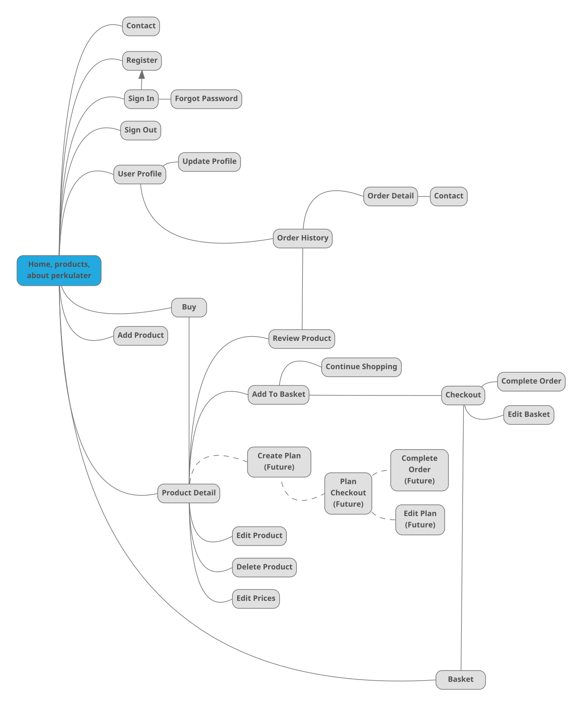

### Wireframes ### 
[Initial Wireframes](media/wireframes/rev0) were produced showing the **Products**, **Product Detail**, **Basket**, **Checkout**, **Sign Up**, **Sign In**, **User Profile**, **Order Detail**, **Order Contact** and **Product Review** page layouts. Note that a wireframe has also been created for the **Create Plan** page layout, which will be implemented in a future development phase.
The **Products** and **Product Detail** page layouts are shown below:  

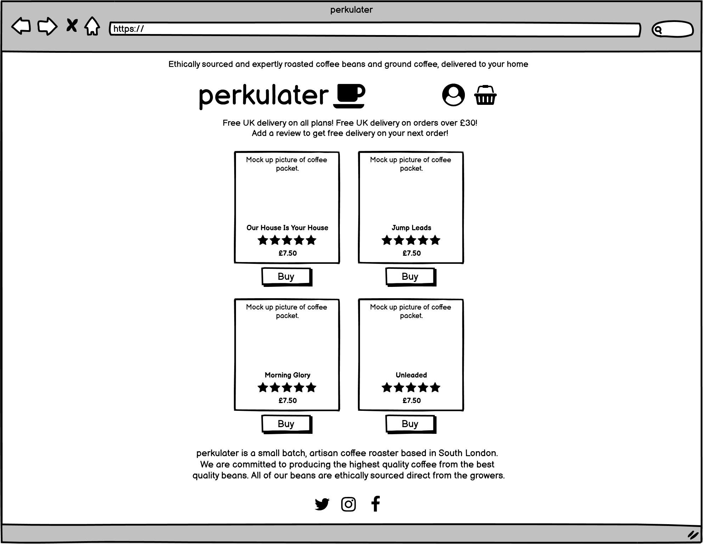  

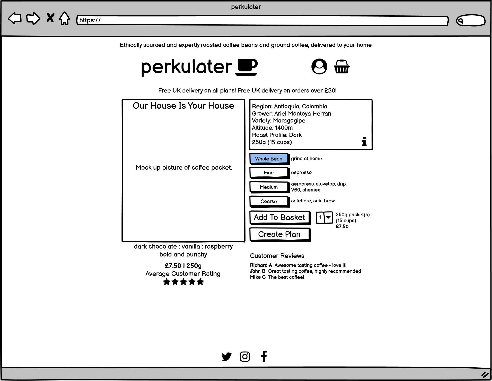

[Responsive design wireframes](media/wireframes/rev1) were then produced showing the **Products**, **Product Detail**, **Basket**, **Checkout**, **Create Plan** and **Order Detail** page layouts on **Tablet** and **Phone**. Note that wireframes have also been created for the **Create Plan** page layout, which will be implemented in a future development phase.
The [Responsive design wireframes](media/wireframes/rev1) for the **Products** and **Product Detail** page layouts are shown below: 
<p float="left">
    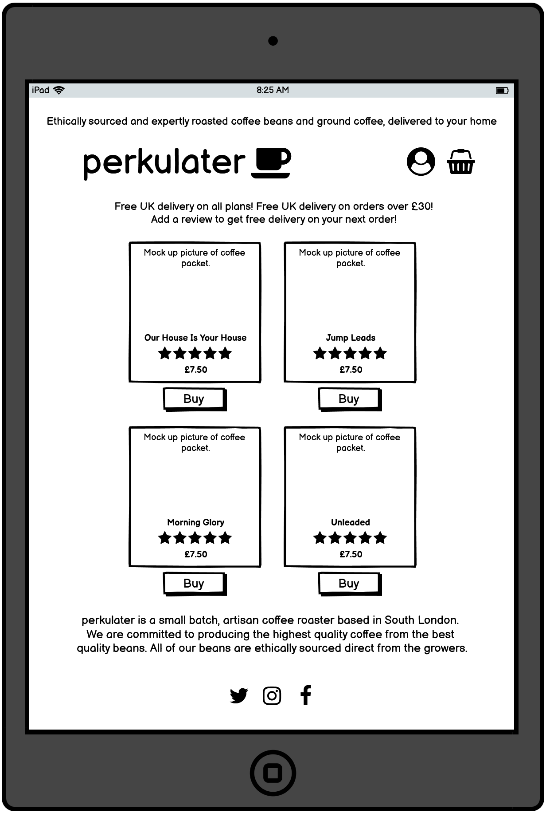
    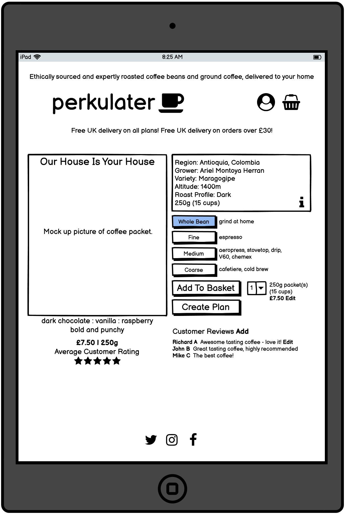
</p>
<p float="left">
    
    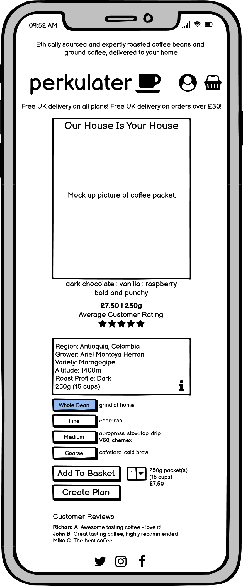
</p>

### Design Choices ###

#### Fonts ####
[Teko](https://fonts.google.com/specimen/Teko) has been chosen as the logo font for the [perkulater logo](static/testing/logo.png).  
[Teko](https://fonts.google.com/specimen/Teko) looks modern and, attractive and chunky and fits well with the overall theme of the site.  
* font-family: "Teko", sans-serif;

[Titillium Web](https://fonts.google.com/specimen/Titillium+Web) has been chosen as the title font for headings.  
[Titillium Web](https://fonts.google.com/specimen/Titillium+Web) has a simple, clear, chunky look and pairs well with the logo font.  
[Titillium Web](https://fonts.google.com/specimen/Titillium+Web) is also available in a good selection of weights.
* font-family: "Tittilium Web", sans-serif;

[Montserrat](https://fonts.google.com/specimen/Montserrat) has been chosen as the body font.  
[Montserrat](https://fonts.google.com/specimen/Montserrat) has a simple, clean, rounded look and is available in a good selection of weights.
* font-family: "Montserrat", sans-serif;

#### Colours ####
A *Dark Theme* was chosen for the site, to enable a simple, modern and clear design to be implemented.
A very dark grey was chosen as the main background colour and is referred to as *Background Level 1*. Additional very dark grey shades are layered over 
the background to convey depth, and contrasting highlighting colours are used for the foreground elements. Colour ideas were generated using the 
using the [Coolors](https://coolors.co/) **Colour Palette** generator. The final **Colour Palette** selected 
is shown below: 

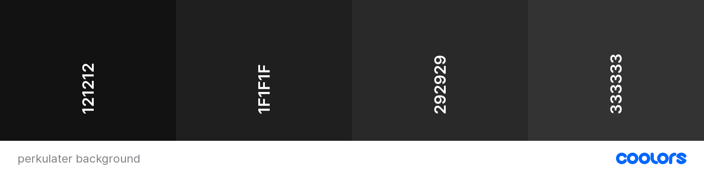  

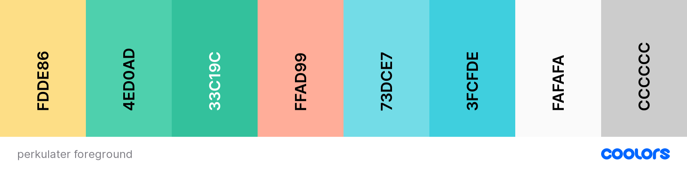  

* #121212 *Background Level 0* - used for background layering.
* #1F1F1F *Background Level 1* - main background colour, used for background layering and for masking the background image.
* #292929 *Background Level 2* - used for background layering.
* #333333 *Background Level 3* - used for background layering.
* #FDDE86 *Yellow* - used for rating stars.
* #4ED0AD *Green* - used for links, button outlines, offer banner and input highlighting.
* #33C19C *Green Highlight* - used for highlighting green elements on hover etc.
* #E97C72 *Pink* - used for error toasts, alerts and text.
* #73DCE7 *Blue* - used for information icons, toasts, alerts and text.
* #3FCFDE *Blue Highlight* - used for highlighting blue elements on hover etc.
* #FAFAFA *White* - used for logo text, tagline text, foreground text elements, horizontal rulers, button text and button highlighting.
* #CCCCCC *White Highlight* - used for highlighting white elements. Also used for navigation menu and footer links.

## Technologies ##

### Integrated Development Environment ##
* [GitHub](https://github.com/)

### Languages ###
* [HTML](https://developer.mozilla.org/en-US/docs/Web/HTML)
* [CSS](https://www.w3.org/Style/CSS/Overview.en.html)
* [JavaScript](https://developer.mozilla.org/en-US/docs/Web/JavaScript)
* [Python](https://www.python.org/)

### Database ###
* Development - [SQLite](https://docs.djangoproject.com/en/3.2/ref/databases/#sqlite-notes)
* Deployed site - [Heroku PostgreSQL](https://www.heroku.com/postgres)

### Storage ###
* [Amazon AWS S3](https://aws.amazon.com/) - used to store static files.

### Payments ###
* [Stripe](https://stripe.com/docs/api) - fully integrated payments platform.

### Frameworks ###
* [Django](https://www.djangoproject.com/) - web development framework.
* [Bootstrap](https://getbootstrap.com/docs/5.0/getting-started/introduction/) - to assist with responsive design.
* [jQuery](https://jquery.com/) - to assist with JavaScript coding and DOM manipulation.

### Libraries and Tools ###
* [MindMup](https://www.mindmup.com/) - used to produce the **Site Map**.
* [Balsamiq](https://balsamiq.com/) - used to produce **Wireframes**.
* [dbdiagram](https://dbdiagram.io/home) - used to plan and visualise the data shema prior to and during development.
* [Font Awesome](https://fontawesome.com/)
* [Google Fonts](https://fonts.google.com/)
* [django-allauth](https://django-allauth.readthedocs.io/en/latest/index.html) - user authentication and account management.
* [boto3](https://boto3.amazonaws.com/v1/documentation/api/latest/index.html) - **Amazon Web Services SDK** for python. Used to configure **Amazon Web Services S3** storage of static files.
* [django-crispy-forms](https://django-crispy-forms.readthedocs.io/en/latest/) - enables enhanced rendering of Django forms including integration with **Bootstrap**.
* [dj-database-url](https://pypi.org/project/dj-database-url/) - Django database configuration utility. Used to configure connection to the **Heroku** deployed postgres database.
* [django-countries](https://pypi.org/project/django-countries/) - Django application providing country choices for use with forms etc. Used to populate country choices on the **Country** dropdowns.
* [django-extensions](https://django-extensions.readthedocs.io/en/latest/) - Collection of custom extensions for **Django***. Used to automatically create data schema diagram for the **Django** model.
* [django-storages](https://django-storages.readthedocs.io/en/latest/) - Custom storage backends for **Django**. Used to configure **Amazon Web Services S3** storage of static files.
* [gunicorn](https://gunicorn.org/) - Python WSGI HTTP Server for UNIX. Used as part of the **Heroku** deployment process.
* [pillow](https://pillow.readthedocs.io/en/stable/) - Python imaging library.
* [psycopg2](https://pypi.org/project/psycopg2/) - **PostgreSQL** database adapter for Python. Used as part of the **Heroku** deployment process.
* [pydot](https://github.com/pydot/pydot) - **Graphviz** interface used to parse the **Django** data model into a .dot file using *django-extensions*.
* [pylint-django](https://pypi.org/project/pylint-django/) - **Pylint** plug-in for **Django**.

### Browser Support ###
The following browsers are all supported by **perkulater**.
* [Google Chrome](https://www.google.com/intl/en_uk/chrome/)
* [Microsoft Edge](https://www.microsoft.com/en-us/edge)
* [Safari](https://www.apple.com/uk/safari/)
* [Firefox](https://www.mozilla.org/en-GB/firefox/new/)
* [Opera](https://www.opera.com/)

For further information please see  the **Browser Compatibility** section in [TESTING.md](TESTING.md).  

## Structure ##

### Information Architecture ###
[Heroku PostgreSQL](https://www.heroku.com/postgres) has been selected to host the back-end database for [perkulater](https://perkulater.herokuapp.com/). 
[Heroku PostgreSQL](https://www.heroku.com/postgres) is a relational open source database which provides a secure and easily scalable platform 
to build the **perkulater** site on.  

The **perkulater** code base has been developed using the **Django** framework, and comprises the following **Django** apps:
* **Basket**
* **Checkout**
* **Home**
* **Products**
* **Profiles**

The project data schema was initially planned using [dbdiagram.io](https://dbdiagram.io/home). The schema model was regularly updated during the development process and is shown below. 
Please note that the planned schema includes the table **Subscription** which was added for planning purposes. **Subscriptions** do not form part of the phase 1 development but may be 
implemented in a future development phase.  

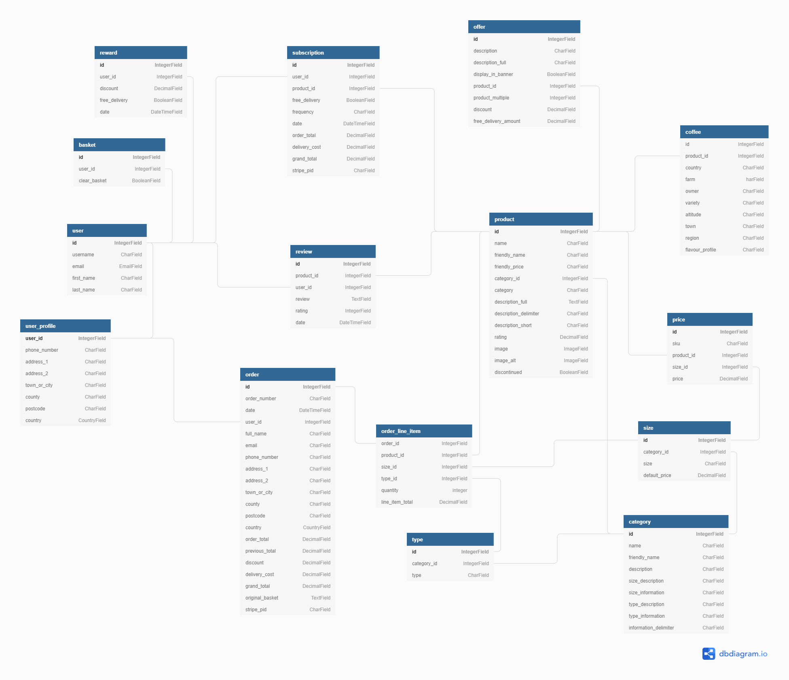 

The final data schema was exported directly fom the **Django** model using [django-extensions](https://django-extensions.readthedocs.io/en/latest/), [pydot](https://github.com/pydot/pydot) 
and [GraphViz](https://graphviz.org/). The final data schema is shown below:  

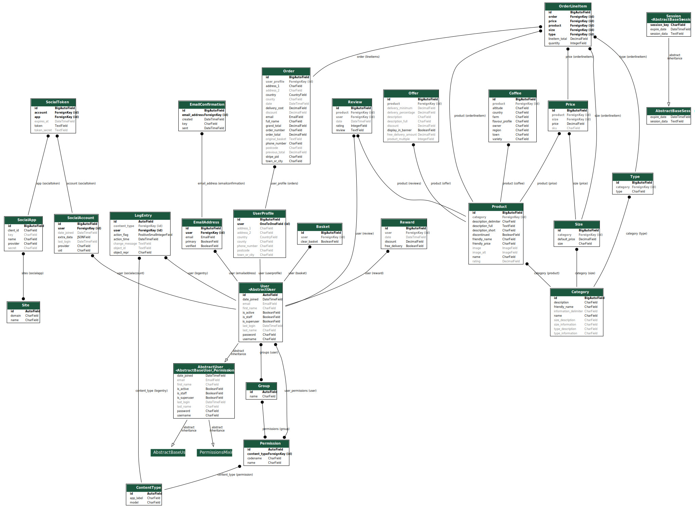 

The database schema was designed for maximum future scalablity and flexibility. Additional future product lines can be easily accommodated due to the design of the schema. 
**Product** **Categories**, **Types**, **Sizes**, **Prices** and **Coffee** details are all broken out into separate related tables to provide maximum flexibility. **perkulater** 
custom models, fields, relationships and methods are explained below:

#### Products Models ####
* **Product** - related to **Category**, **Price**, **Coffee**, **Offer**, **Review** and **Subscription**. The *description_delimeter* field is used to store a delimiter which 
can optionally split the *description_full* field into separate paragraphs for rendering in the **Product Information** pop up modal. The *description_short* field can also be 
optionally split using the delimiter specified in the *description_delimeter* field - the first part of the short description is shown underneath the product name in the 
**Product Detail** view. The *friendly_name* and *friendy_price* fields are used to display the name and price on the **Product Summary** and **Product Detail** pages. 
The *rating* field stores an automatically calculated average rating which is updated using a **Django** signal when a review is added, deleted or edited. There are currently 
four **Products** defined - *Jump Leads*, *Morning Glory*, *Our House Is Your House* and *Unleaded*.

* **Category** - related to **Product**, **Type** and **Size**. Each **Category** may have different **Types** and **Sizes** and is related back to the **Product**. 
This relational structure allows for new product **Categories** with different **Sizes** and **Types** e.g. coffee equipment or cold brew cans to be added in a future development phase. 
The *size_description* field stores the **Size** descriptor, which is displayed to the user in the **Product Detail** view and is currently set to *Size*.
The *size_information* field stores information about the related **Sizes** which is displayed to the user in the **Size Information** modal. 
The *type_description* field stores the **Type** descriptor, which is displayed to the user in the **Product Detail** view and is currently set to *Type*.
The *type_information* field stores information about the related **Types** which is displayed to the user in the **Type Information** modal. 
Both the *size_information* and *type_information* fields are split into paragraphs for display using the delimiter specified in the *information_delimiter* field.
There is currently only one **Category**, called **Coffee**. If more **Categories** are added in future development phases, the *friendly_name* field will be automatically 
shown in the **Navigation Menu**, and the user will be able to filter by **Category** using the **Navigation Nenu** links.

* **Coffee** - related to **Product**. Stores additional information which is only relevant to products with **Category** set to **Coffee**.

* **Type** - related to **Category** and **OrderLineItem**. Product **Types** are stored in a separate model - this allows for different **Types** to be applied as 
required to each **Category**. **Coffee** currently has four **Types** defined, *Coarse*, *Medium*, *Fine* and *Whole Bean*.

* **Price** - related to **Product** and **Size**. Product **Prices** are stored in a separate model - this allows for a different **Price** to be applied to each product and 
related to the **Size** table. Each Product **Size** has a default price, which is applied by default but may be subsequently updated by the **Store Owner** using the 
**Edit Prices** functionality. The product *sku* is unique to the **Price** and is stored in this model.

* **Size** - related to **Category**, **Type** , **Price** and **OrderLineItem**. Each Product **Category** may have different sizes, specified in the **Size** model. 
Each Product **Size** has a default price, which is applied by default but may be subsequently updated by the **Store Owner** using the **Edit Prices** functionality. 
**Coffee** currently has two **Sizes** defined, *250g* and *1kg*. 

* **Offer** - optionally related to **Product**. Stores **Offers**. If *display_in_banner* field is set to `True`, displays the value of the *description_full* field in the **Offer Banner**.
The values of the fields *free_delivery_amount*, *delivery_minumum* and *delivery_precentage* on the *Delivery* offer are used to calculate delivery costs. 
The value of the *discount* field on the *Review* offer (expressed as a percentage) is used to calculate the discount given as a **Reward** on the next order for leaving a **Review**.

* **Review** - related to **Product** and **User**. Stores **Product Reviews**. A **Django** signal updates the **Product** *rating* field when a review is added, deleted or edited.

#### Checkout Models ####
* **Order** - related to **OrderlIneItem** abd **UserProfile**. Stores **Orders** after successful checkout. **Order** *order_number* field is automatically added on save. 
**Order** *discount*, *order_total*, *previous_total*, *delivery* and *grand_total* fields are automatically updated using a **Django** signal when an **OrderLineItem** 
is added or deleted.

* **OrderLineItem** - related to **Order**, **Type**, **Product** and **Size**. Stores each **OrderLineItem** after successful checkout. 
**OrderLineItem** *line_item_total* field is automatically calculated on save.

#### Profiles Models ####
* **UserProfile** - related to **Order** and **User**. Stores default delivery information. **UserProfile** is automatically created or updated using a **Django** 
receiver when a **User** object is updated or created.

* **Reward** - related to **User**. Stores **Rewards** that a **User** has earned. The *discount* field is used to store any discount that the **User** has earned 
(expressed as a percentage), and is applied the user's next order. After the user's next order is placed with the *discount* applied, the *discount* field is reset.

#### Basket Models ####
* **Basket** - related to **User**. The *clear_basket* field is set by the **Stripe** webhook handler function to indicate that the order was succesfully created 
in the webhook handler and that the **Basket** can be cleared. 

[perkulater](https://perkulater.herokuapp.com/) is deployed using [Heroku](https://dashboard.heroku.com/). 
For further information see [Deployment](#deployment).

### Features Implemented ###
Please note that an account with **Super User** privileges has been created for testing purposes. This will facilitate testing of 
features which require **Super User** privileges. The *username* and *password* will be supplied on submission of the project.

#### Features Implemented in Phase 1 ####
* **Home Page**, shows a simple and elegent fade-in animation of the **perkulater** logo, a tagline *Coffee roasted with passion* and a large call to action **Shop** button:  
 

#### Features Included in Base Template ##### 
The following features are included in the **Base** template, and are shown an all pages except for the **Home** page:

* **Background Image**, an attractive image of coffee beans being processed, masked with a an opaque linear gradient mask in the *Background Level 1* colour, to give the image a dark, faded look.

* **Bootstrap Collapsing Navigation Menu**, navigation menu featuring **perkulater logo**, **Product Search**, **Basket Link**, **User Menu** and **Tagline**. 
Collapses to **Menu Icon** on smaller devices.  
 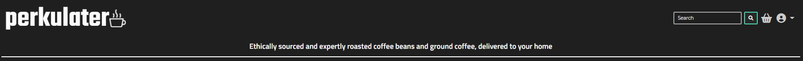 

* **perkulater logo**, links to **Products** page if clicked.  
   

* **Product Search**, enables the user to search for **Products**. Returns any the **Products** page with any products that contain the search string entered in the **Product** model *name* or *description_short* fields. 
Includes hover and focus styling:  
 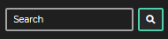   

 * **Basket Link**, links to the **Basket** page. Includes hover styling:  
 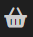  

 * **User Menu**, opens a dropdown menu. For non authenticated users, menu items are *Contact*, *Sign In* and *Sign Up*. For signed in users, menu items are *Contact*, *Profile* and *Sign Out*. 
 For signed in super users, menu items are *Add Product*, *Contact*, *Profile* and *Sign Out*. Includes hover styling.

 * **Category** menu, only shown if there is more than one **Product Category** present in the database (there is only currently one category - Coffee).
 Allows **Products** to be filtered by **Category** and includes hover styling:  
 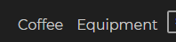 

 * **Tagline**, tagline explaining a little bit more about **perkulater**, to encourage users to make a purchase:  
 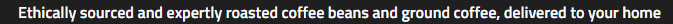 

* **Footer**, featuring **Footer Tagline** and **Social Media Links**.

* **Footer Tagline**, tagline exaplaining a little bit more about **perkulater**, to encourage users to make a purchase:  
 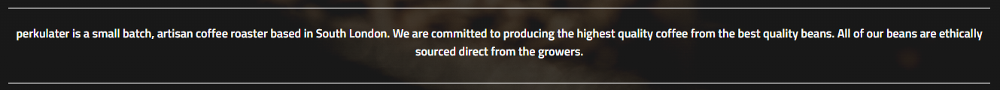  

 * **Social Media Links**, links to **perkulater** social media sites, including hover styling:  
 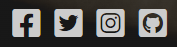  

#### Contact ####

* **Contact** may be accessed from **User Menu** if the **User** is signed in. Enables the **User** to contact **perkulater** using the form. If the **User** is signed in, populates email address. 
Required fields are denoted with a *. Form includes input focus styling. **Keep Shopping** button links to **Products** page, and **Send Message** button submits message. 
Buttons include hover styling. If message is sent succesfully, a toast message is displayed:  

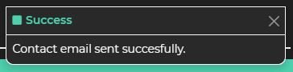  

#### User Authentication System ####  
The **User** authentication system is implemented using [django allauth](https://django-allauth.readthedocs.io/en/latest/installation.html). **allauth** templates have been customised to fit the look and feel of the **perkulater** site.  

 * **Sign In**, enables registered **Users** to **Sign In**, accessed from **User Menu**. **Sign Up** links to **Sign Up**, **Sign In** button submits **Sign Up** form and **Forgot Password** button links to **Password Reset**. Buttons and link include hover styling. Form errors are shown above the **Login** field. A **Toast Message** is shown on successful sign in:  
<p float="left">
    
    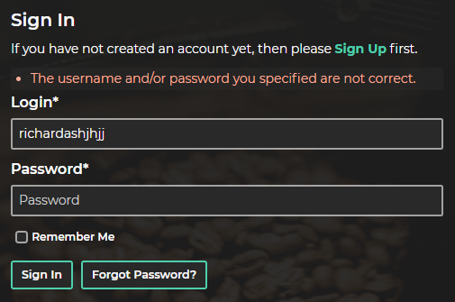
</p>
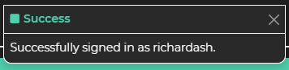  

 * **Sign Out**, enables signed in **Users** to **Sign Out**, accessed from **User Menu**.  
 **Sign Out** button submits sign out form. A **Toast Message** is shown on successful sign out: 
 <p float="left">
    
    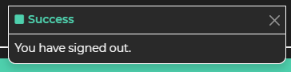
</p>

* **Sign Up**, enables unautheticated **Users** to **Sign Up**, accessed from **User Menu**. **Sign In** links to **Sign In** and **Sign Up** button submits **Sign Up** form.  
Button and link include hover styling. Any form errors are shown below each field. A **Toast Message** is shown on successful **Sign Up**, and an email is sent to the user for verification.  
When the **User** clicks on the verification link, the **Confirm Email Address** page is shown: 
<p float="left"> 
    
    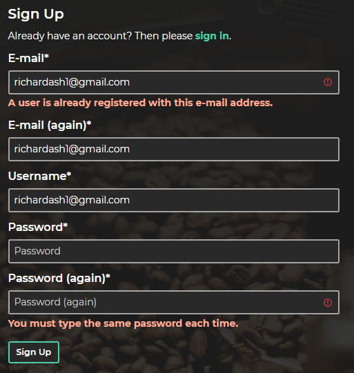
</p>
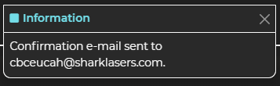  

* **Confirm Email Address**, displayed when verification email link is clicked. Enables unauthenticated **Users** to complete **Sign Up**, by pressing the **Confirm** button.  
Button and email address link include hover styling.  
A **Toast Message** is shown to provide feedback to the user that the email address has been succesfully confirmed.  
The **User** is redirected to the **Sign In** page: 
<p float="left">
    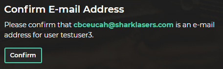
    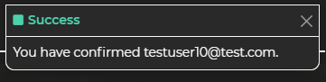
</p>

* **Password Reset**, enables **User** to reset password. **User** may reset password by typing their email address in and hitting the **Reset My Password** button. Button includes hover styling. Any form errors are displayed below the email field. A link is sent to the **User's** email address.
When the **User** clicks on the reset link, the **Change Password** page is shown: 
<p float="left"> 
    
    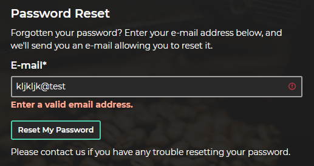
</p>
  

* **Change Password**, displayed when password reset email link is clicked.  
**User** may reset their password by typing the same new password in twice and hitting the **Change Password** button. Button includes hover styling.  
Any form errors are displayed below the form fields.  
The **Change Password** page is displayed to confirm to the **User** that their passsword has been changed and a **Toast Message** is shown: 
<p float="left">
    
    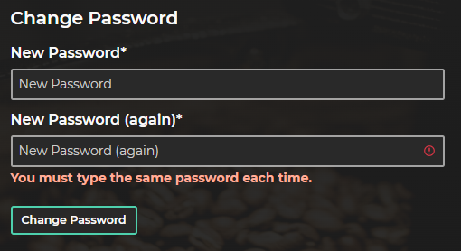
</p>
<p float="left">
    
    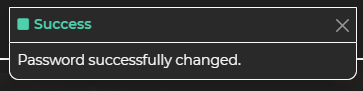
</p>

#### Products #### 

 * **Products**, displays all products. Products can be searched using the **Product Search**. If more **Product Categories** are added in a future development phase, **Products** will 
 automatically be able to be filtered by **Category**, by selecting the **Category** from the **Navigation Menu**.
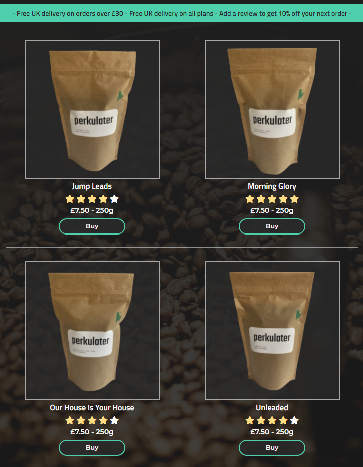 

* **Offer Banner**, display offers read in from the **Offer** model, if the *display_in_banner* field is set to `True`:  
    

 * **Product Image**, links to **Product Detail** page if clicked. Includes hover styling:  
   

 * **Product Summary**, includes **Product Name** (read from **Product** model *friendly_name* field), **Product Rating** (read from **Product** model *rating* field), and **Price** (read from **Product** model *friendly_price* field):  
   

 * **Buy Button**, links to **Product Detail** page, includes hover styling:  
 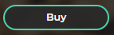 

* **Product Detail**, displays product details:  
  

 * **Product Image**, opens **Information Modal** for **Product** if clicked. **Information Modal** title is set to **Product** model *friendly_name* field. 
**Information Modal** content is read from the **Product** model *description_full* field, and is split into paragraphs using the delimiter specified in the *description_delimeter* field. 
Includes hover styling:  
   

* **Product Detail Summary**, includes **Product Name**, **Coffee Flavour Profile** if the **Product** is a **Coffee** (or **Short Description** otherwise), **Product Rating** and **Price**:  
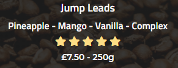  

* **Keep Shopping Button**, links to **Products** page. Includes hover styling:  
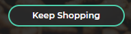 

* **Coffee Details**, if the product if a **Coffee**:  
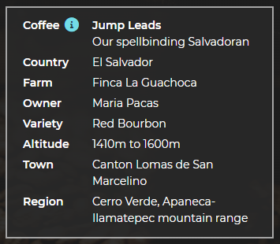 

* **Product Information Button**, displays **Information Modal** for **Product**.  
Detailed **Product** information will make give the **User** a much better understanding of the **Products** available, and make the **User** more comfortable making a purchase.  
**Product Information Button** name is set to **Category** model *friendly_name* field. **Information Modal** title is set to **Product** model *friendly_name* field. 
**Information Modal** content is read from the **Product** model *description_full* field, and is split into paragraphs using the delimiter specified in the *description_delimeter* field. 
Includes hover styling:  
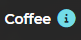  
  

* **Size Information Button**, displays **Information Modal**.  
Detailed **Size** information will make give the **User** a much better understanding of the **Product Sizes** available, and make the **User** more comfortable making a purchase.  
**Size Information Button** name and **Information Modal** title are set to **Category** model *size_description* field. 
**Information Modal** content is read from the **Category** model *size_information* field, and is split into paragraphs using the delimiter specified in the *information_delimeter* field. 
Includes hover stlying:  
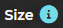  
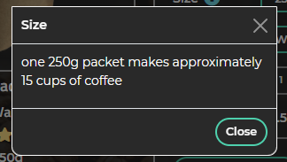  

* **Size Selector**, allows **Size** read from the **Size** model to be selected, includes hover styling:  
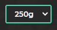  

* **Type Selector**, allows **Type** read from the **Type** model to be selected, includes hover styling:  
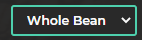  

* **Type Information Button**, displays **Information Modal**.  
Detailed **Type** information will give the **User** a much better understanding of the **Product Types** available, and make the **User** more comfortable making a purchase.  
**Type Information Button** name and **Information Modal** title are set to **Category** model *type_description* field. 
**Information Modal** content is read from the **Category** model *type_information* field, and is split into paragraphs using the delimiter specified in the *information_delimeter* field. 
Includes hover stlying:  
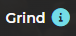  
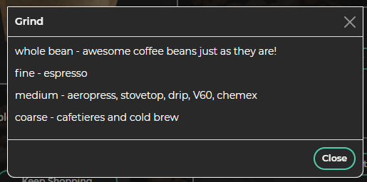  

* **Product Quantity**, allows product quantity to be selected. Minus button is greyed out and disabled when quantity is 1, Plus button is greyed out and disabled when quantity is 99. Includes hover styling:  
  

* **Product Price**, automatically updated on change of **Size**. Includes **Edit** link to edit prices if user is a **Super User**.
  

* **Add To Basket**, adds **Product** with selected Size, Type and Quantity to basket, and displays a **Toast** message. Includes hover styling.
  
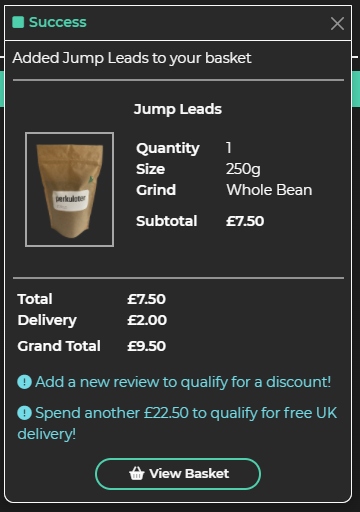  

* **Create Plan**, displays **Information Modal** explaining that **Create Plan** feature is coming soon.  
Note that **Create Plan** feature has not been implemented as part of the phase 1 development. Button includes hover styling:  
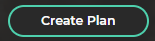  
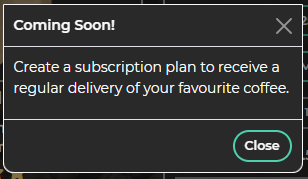  

* **Edit**, links to **Product Edit** page. Only visible to **Super Users**. Includes hover styling:  
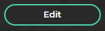  

* **Delete**, opens **Confirm Modal**, asking user to confirm deletion of **Product**. Restricted to **Super Users**. Button includes hover styling:  
  
  

* **Customer Reviews**, displays **Reviews** for the **Product**, read from the **Review** model. **Add Review** link is shown if the **User** has not reviewed the **Product**.
 If the **User** is not signed in, **Add Review** links to the **Sign In** page. If the user is signed in, links to the **Add Review** page. If the user has reviewed the **Product** before, 
 **Edit** link is shown to allow the **User** to edit their **Review**.
 If the **User** is signed in as a **Super User**, **Delete** link is also shown. If **Delete** link is clicked, **Review Delete Confirm** modal is shown. All links include hover styling:  
  
  

* **Product Add**, restricted to **Super Users**. Enables a new **Product** to be added. **Select Image** button optionally allows an image to be selected. **View Products** button links back to **Products** page. **Add Product** button adds the new **Product** to the database. All form inputs include focus styling and validation, and all buttons include hover styling.  
Displays **Toast Message** if product is added succesfully:   
<p float="left">
    
    
</p>

* **Product Edit**, restricted to **Super Users**. Enables an existing **Product** to be edited: **Select Image** button optionally allows an image to be selected. **Back To Product** button links back to **Product Detail** page. **Update Product** button updates the **Product** in the database.  All form inputs include focus styling and validation, and all buttons include hover styling.  
Displays **Toast Message** if product is updated succesfully:
<p float="left">   
    
    
</p> 

* **Product Review**, enables the **User** to rate and review a **Product**. **Back To Product** button links to **Product Detail** page. 
**Submit Review** adds or updates the **Review** in the database.  
If a **User** adds a new **Review**, the **Discount** specified in the **Offer** model object with *description* field set to *Review* (expressed as a percentage) is applied and a **Toast Message** is displayed. All buttons include hover styling:  
<p float="left">
    
    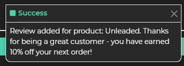
</p>

#### Messaging System #### 

* **Toast Messages** have been implemented using the [django messages framework](https://docs.djangoproject.com/en/3.2/ref/contrib/messages/) and 
[**Bootstrap Toasts**](https://getbootstrap.com/docs/5.0/components/toasts/). **Toast Messages** provide feedback to the user, displayed at the 
top right of the screen underneath the **Product Search**.  
If a **Product** has been added to the **Basket**, the **Toast Message** also displays a 
preview of the basket. The **View Basket** button links to the **Basket**. Button includes hover styling:  
<p float="left">
    
    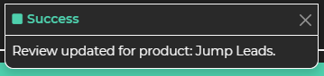
</p>
<p float="left">
    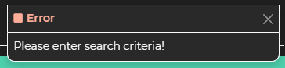
    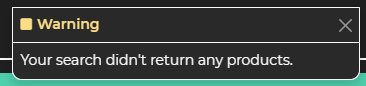
</p>


#### Basket #### 

* **Basket**, accessed from **Basket** icon in navigation menu. Shows the **User** their curreent **Basket**. Includes a preview image of the **Product** which links to the **Product Detail** 
page and includes hover styling. Also includes **Quantity Selector**, **Update** and **Remove** links to enable the **User** to update **Product** quantity in the basket, or remove the **Product** from the **Basket**. **Toast Message** is shown on update or removal of **Products** from **Basket**. **Quantity Selector**, **Update** and **Remove** links include hover styling. **Size** description, **Type** description and **Subtotal** are also shown for each **Product** in the **Basket**. **Total**, **Delivery** and **Grand Total** are shown below.  
If the **User** has a **Reward** to be applied at checkout, the **Discount** is also shown. 
If the **User** is not signed in, information text is displayed encouraging the **User** to sign in and add a new review to qualify for a discount. If the **User** is signed in but does not currently have a **Reward** to be applied, information text is displayed encouraging the **User** to add a new review to qualify for a discount. 
If delivery charges are going to be applied at checkout, another information message explains how much more the user needs to spend in order to qualify for free UK delivery. **Keep Shopping** button links back to **Product** page, and **Checkout** button links to **Checkout** page. Buttons include hover styling:  
<p float="left">
    
    
</p>
  


#### Checkout #### 

* **Checkout**, accessed from **Checkout** button on **Basket** page. Form to enable checkout using **Stripe**. **Your Details** and **Delivery** fields are automatically populated from **UserProfile** model for signed in users. All input fields include focus styling and validation.  
Non authenticated **Users** are also permitted to check out, as from a business perspective it could dissuade potential customers from making a purchase if they are required to **Sign Up** for a **User** account in order to complete a purchase.  
Non authenticated **Users** are encouraged to **Sign Up** or **Sign In** with text and links shown under the **Country** field.  
If **Save this delivery information to my profile** is checked, valid information given in the **Checkout** form is saved to the **User** and  **UserProfile** models on checkout.  
**Payment** allows credit card number to be input. Any card errors are displayed below **Payment** input.  
Information text is displayed below **Payment** input explaining how much the **User's** card will be charged. **Total**, **Delivery** and **Grand Total** are shown at the bottom of the page.  
If the **User** has a **Reward**, the **Discount** is also shown.  
If the **User** is not autheticated, information text is displayed encouraging the **User** to sign in and add a new review to qualify for a discount. If the **User** is signed in but does not currently have a **Reward** to be applied, information text is displayed encouraging the **User** to add a new **Review** to qualify for a discount.  
If delivery charges have been applied, another information message explains how much more the user needs to spend in order to qualify for free UK delivery. **Edit Basket** button links back to **Basket** page, and **Pay** button submits the payment via **Stripe**. Buttons include hover styling.  
A **Product Summary** including **Product** name, preview image, quantity, size and type is also shown. The **Product** image links to the **Product Detail** page and includes hover styling. 
After the **Pay** button is clicked, a the **Payment Form** is faded out and a **Loading Overlay** is shown while the payment is processed.  
If **Checkout** is succesful, **Checkout Success** page is displayed:  
<p float="left">
    
    
</p>
<p float="left">
    
    
</p>
<p float="left">
    
    
</p>

* **Checkout Success**, shown on successful checkout.  Lets the **User** know that an email has been sent to their email address confirming their order. Gives the **User** their **Order** number and date and confirms the **User's** details and delivery details.  
A **Product Summary** including **Product** name, preview image, quantity, size, type and subtotal is also shown. The **Product** image links to the **Product Detail** page and includes hover styling.  
**Total**, **Discount** (if **Reward** has been applied), **Delivery** and **Grand Total** are shown at the bottom of the screen.  
**Keep Shopping** button links to **Products** page and includes hover styling.  A **Toast** message is also shown, confirming the **User's** email address and the **Order** number:  
<p float="left">
    
    
</p>

#### User Profile #### 

* **User Profile** may be accessed from **User Menu** if the **User** is signed in. Enables the **User** to update their default delivery information, and displays the **User's** **Order** history in a **Bootstrap** accordion to the right of the screen.  
**Update Profile** button saves any valid updated information to the **User** and **UserProfile** models in the database and displays a **Toast** message. Button includes hover styling.  
**Orders** are shown by date, and expand when clicked. The **Order Number** links to the **Order History** page when clicked and includes hover styling.  
A table showing **Product** name and quantity and **Order** grand total is also shown.  
A **Review** link is displayed next to the **Product** name, enabling the **User** to **Review** the product using the **Product Review** functionality.  
If **Product Review** is accessed from **User Profile**, back button text is changed to **Back To Profile** and link is updated to route user back to **User Profile**.  
  

* **Order History** may be accessed from **User Profile** if the **User** is signed in, and has previously made an **Order**. 
Enables the **User** to view a past order confirmation. A modified version of the **Checkout Success** page is displayed, showing the **Order** information for the relevant **Order** number. Title is changed to **Past Order Confirmation**, confirmation email text is updated, **Keep Shopping** button is hidden and **Back To Profile** and **Contact** buttons are displayed.  
**Back To Profile** links to the **User Profile** page. **Contact** button links to **Order Contact**. Buttons include hover styling:  
  

**Order Contact** may be accessed from **Order History** if the **User** is signed in, and has previously made an **Order**.  
Enables the **User** to contact **perkulater** about a specific **Order**.  
The **Order** number and date are presented to the user, along with a form enabling a message to be submitted.  
**View Order** button links back to **Order History**, and **Send Message** button submits message. Buttons include hover styling.  
If message is sent succesfully, a toast message is displayed: 
<p float="left">
    
    
</p>

#### Features To Be Implemented In Future Development Phases ####
The following features have beend identified to add in **Future Development Phases**:  
* **Create Plan** - to enable **Users** to subscribe to a regular delivery of their favourite coffee(s). 
* **Create Customised Plan** - to enable **Users** to customise their **Plan** so that they can try a different coffee 
each time their subscription is fulfilled, tailored to their specific taste preferences.  
* **Gift Cards** - to enable **Users** to purchase **perkulater** gift cards for friends and family.
* **Add Category** - to enable the **perkulater** store administrator to add new **Product** **Categories**.
* **Edit Category** - to enable the **perkulater** store administrator to edit esiting **Product** **Categories**.
* **Delete Category** - to enable the **perkulater** store administrator to delete existing **Product** lines.
* **Track Sales Data** - to enable the **perkulater** store administrator to export and analyse sales data from the database.


#### Design Changes During The Phase 1 Development ####
After initial early **User** feedback, the following design changes were made:
* **Add To Basket**, **Create Plan**, **Edit**, and **Delete** buttons on **Product Detail** page were re-sized to be consistent with the standard **perkulater** button size (*class "btn-lg"*).  
  

* Background colours on the **Size** and **Type** select elements on the **Product Detail** page were updated to the *--background-lvl2* colour:  
  

* **Sign In** and **Sign Out** functionality was updated to route the user to the page they were previously on after successful **Sign In** or **Sign Out**. The **User** was previously rerouted to the **Home** page. This improves the navigational flow and overall **User Experience**. 
* An additional view was added so that if the **User** is reviewing a product, then deletes the last part of the *review_product* url (resulting in a url of `products/review_product/`), they are redirected to the **Products** view.  

### Responsive Styling ###
* The Navigation Menu is collapsible, and collapses to an icon on small devices less than 576 pixels wide. This is implemented using the **Bootstrap Navbar** component.  
* The **Products** page is shown as a 2 item wide grid, and stacks to a 1 item wide grid on devices less than 768 pixels wide. This is implemented using the **Bootstrap** grid system.  
* The **Product Detail** page stacks logically on devices less than 768 pixels wide. This is implemented using the **Bootstrap** grid system.  
* The **Product Summary** on the **Basket** page is shown as a 2 item wide grid, and stacks to a 1 item wide grid on devices less than 768 pixels wide. This is implemented using the **Bootstrap** grid system.  
* The **Product Summary** on the checkout page stacks underneath the **Payment Form** on devices less than 768 pixels wide. This is implemented using the **Bootstrap** grid system.  
* The **Product Summary** on the **Checkout Success** page is shown as as 2 items wide grid, and stacks to a 1 item wide grid on devices less than 768 pixels wide. This is implemented using the **Bootstrap** grid system.  
* The **Order History** on the **User Profile** page stacks underneath the **User Profile Form** on devices less than 768 pixels wide. This is implemented using the **Bootstrap** grid system.  
* The **Product Summary** on the **Order History** page is shown as as 2 items wide grid, and stacks to a 1 item wide grid on devices less than 768 pixels wide. This is implemented using the **Bootstrap grid** system.  
* Various **Text** elements, the **perkulater logo**, **Form Labels**, **Links**, **Toast Messages**, **Containers** and extra large **Button** elements are re-sized on very small devices less than 370px wide. This is achieved using CSS media queries located in the **perkulater Custom CSS**.

See **Responsive Design** section in [TESTING.md](TESTING.md) for further information and [Responsive Testing](/static/testing/responsive) screen prints.

### Python Code Logic ###
The high level **Python** code logic for each **Django App** is explained in the [UML Logic Diagrams](media/wireframes/logic/python) below: 

[Home](media/wireframes/logic/python/home-logic.png)  


[Products Part 1](media/wireframes/logic/python/products-1-logic.png)  
  

[Products Python Logic Part 2](media/wireframes/logic/python/products-2-logic.png)  
  

[Products Python Logic Part 3](media/wireframes/logic/python/products-3-logic.png)  
  

[Products Python Logic Part 4](media/wireframes/logic/python/products-4-logic.png)  
  

[Basket Python Logic](media/wireframes/logic/python/basket-logic.png)  
  

[Checkout Python Logic](media/wireframes/logic/python/checkout-logic.png)  
  

[Checkout Webhooks Python Logic](media/wireframes/logic/python/checkout-webhooks-logic.png)  
 

[Profiles Python Logic](media/wireframes/logic/python/profiles-logic.png)  
  


### Form Validation ###
Form validation is achieved using [Django Forms](https://docs.djangoproject.com/en/3.2/topics/forms/).
Custom **Django Form Classes** are defined within the **Checkout**, **Home**, **Product** and **Profile** **Apps** in the 
relevant *forms.py* modules in each **App**. 
See below table for **perkulater** form validation requirements:  

App|Model|Form|Field|Django Field Type|Required|Maximum Length|Notes
---|-----|----|-----|------------------|-------|--------------|-----
Checkout|Order|OrderForm|full_name|CharField|Yes|50|-
Checkout|Order|OrderForm|email|EmailField|Yes|254|-
Checkout|Order|OrderForm|phone_number|CharField|Yes|20|-
Checkout|Order|OrderForm|address_1|CharField|Yes|80|-
Checkout|Order|OrderForm|address_2|CharField|No|80|-
Checkout|Order|OrderForm|town_or_city|CharField|Yes|40|-
Checkout|Order|OrderForm|county|CharField|No|80|-
Checkout|Order|OrderForm|postcode|CharField|No|20|-
Checkout|Order|OrderForm|country|CountryField|Yes|-
Home|-|ContactForm|from_email|EmailField|Yes|254|-
Home|-|ContactForm|subject|CharField|Yes|100|-
Home|-|ContactForm|message|CharField|Yes|-|TextArea widget
Products|Product|ProductForm|category|ChoiceField|Yes|-|-
Products|Product|ProductForm|name|CharField|Yes|254|-
Products|Product|ProductForm|friendly_name|CharField|Yes|254|-
Products|Product|ProductForm|friendly_price|CharField|Yes|100|-
Products|Product|ProductForm|description_full|TextField|Yes|-|-
Products|Product|ProductForm|description_short|CharField|Yes|254|-
Products|Product|ProductForm|description_delimiter|CharField|Yes|3|-
Products|Product|ProductForm|image|ImageField|No|-|CustomClearableFileInput widget
Products|Coffee|CoffeeForm|country|CharField|Yes|100|-
Products|Coffee|CoffeeForm|farm|CharField|Yes|100|-
Products|Coffee|CoffeeForm|owner|CharField|Yes|100|-
Products|Coffee|CoffeeForm|variety|CharField|Yes|100|-
Products|Coffee|CoffeeForm|altitude|CharField|Yes|100|-
Products|Coffee|CoffeeForm|town|CharField|Yes|100|-
Products|Coffee|CoffeeForm|region|CharField|Yes|100|-
Products|Coffee|CoffeeForm|flavour_profile|CharField|Yes|254|-
Products|Price|PriceForm|size|ChoiceField|Yes|-|-
Products|Price|PriceForm|price|DecimalField|Yes|-|max_digits=6, decimal_places=2
Products|Review|ReviewForm|rating|IntegerField|Yes|-|Min=0, Max=5
Products|Review|ReviewForm|review|TextField|Yes|-|-
Profiles|User|UserForm|first_name|CharField|No|150|-
Profiles|User|UserForm|last_name|CharField|No|150|-
Profiles|UserProfile|UserProfileForm|phone_number|CharField|No|20|-
Profiles|UserProfile|UserProfileForm|address_1|CharField|No|80|-
Profiles|UserProfile|UserProfileForm|address_2|CharField|No|80|-
Profiles|UserProfile|UserProfileForm|town_or_city|CharField|No|40|-
Profiles|UserProfile|UserProfileForm|county|CharField|No|80|-
Profiles|UserProfile|UserProfileForm|postcode|CharField|No|20|-
Profiles|UserProfile|UserProfileForm|country|CountryField|No|-|-
Profiles|-|OrderContactForm|message|CharField|Yes|-|TextArea widget

### JavaScript Code Logic ###
[JavaScript](https://developer.mozilla.org/en-US/docs/Web/JavaScript) has been used to implement the following features:

* [Base JavaScript Library](static/js/base.js) - inititlaise bootstrap toasts, build re-usable information and confirm modals, set select colour.

* [Home JavaScript Library](home/static/home/js/home.js) - fade in animation on **perkulater** logo, achieved using **JQuery**.

* [Basket JavaScript Library](basket/static/basket/js/basket.js) - Product quantity plus and minus buttons and update link.

* [Checkout JavaScript Library](basket/static/checkout/js/checkout.js) - Stripe card element and payment form submission.

* [Products JavaScript Library](products/static/products/js/products.js) - Product rating stars, Product review rating stars, 
Product quantity plus and minus buttons, Product price set, on-click event handlers to build information and confirm modals,
on change event handler to update image filename of custom clearable file input.

* [Profiles JavaScript Library](profiles/static/profiles/js/profiles.js) - Set country selector to correct placeholder colour.

The high level **JavaScript** code logic for each **JavaScript Library** is explained in the [UML Logic Diagrams](media/wireframes/logic/js) below: 

[Base JavaScript Library](media/wireframes/logic/js/base-js-logic.png)  
  

[Home, Profiles and Basket JavaScript Libraries](media/wireframes/logic/js/home-profiles-basket-js-logic.png)  
  

[Checkout JavaScript Library](media/wireframes/logic/js/checkout-js-logic.png)  
  

[Products JavaScript Library](media/wireframes/logic/js/products-js-logic.png)  
  


## Testing ##

Further testing information and screen prints can be found in [TESTING.md](TESTING.md).

## Deployment ##
The project has been developed using [Gitpod](https://www.Gitpod.io/) and [GitHub](https://github.com/). 
The project was regularly commited to [GitHub](https://github.com/) during the initial development phase.  
The website resides as a repository in [GitHub](https://github.com/), and has been been deployed 
using [Heroku](https://dashboard.heroku.com/).  
Static files are stored using [Amazon AWS](https://aws.amazon.com/) in an **Amazon Web Services S3 Bucket**.

In order to make a *Fork* or *Clone* of the project, a [GitHub](https://www.Gitpod.io/) account is required. 
The [Gitpod Browser Extension](https://www.Gitpod.io/docs/browser-extension/) is also recommended.  


<details>
<summary>To Fork the project:</summary>

* Go to the [Project Code Repository Location](https://github.com/richardhenyash/perkulater) on [GitHub](https://github.com/).
* In the top-right corner of the page, click *Fork*.  

For further information on *Forking* a [GitHub](https://github.com/) repository, 
see the [GitHub Documentation](https://docs.github.com/en/github/getting-started-with-github/fork-a-repo).
</details>

<details>
<summary>To Clone the project:</summary>

* Go to the [Project Code Repository Location](https://github.com/richardhenyash/perkulater) on [GitHub](https://github.com/).
* Select the *Code* dropdown and choose *GitHub CLI* under *Clone*. This will give you a *URL* that may be copied into the clipboard. 
* Open the Git Bash command line interface in [Gitpod](https://www.Gitpod.io/).
* Change the current working directory to the location where you would like the cloned directory to reside.
* Type `git clone`, and then paste the *URL* copied earlier, eg:  
`$ git clone https://github.com/richardhenyash/perkulater`
* Press Enter to create the local clone.
* Any required **Python** dependencies should be installed locally using `$ pip install -r requirements.txt`.

For further information on *Cloning* a [GitHub](https://github.com/) repository, see the 
[GitHub Documentation](https://docs.github.com/en/github/creating-cloning-and-archiving-repositories/cloning-a-repository).
</details>


<details>
<summary>To Download the project:</summary>

* Go to the [Project Code Repository Location](https://github.com/richardhenyash/perkulater) on [GitHub](https://github.com/).
* Select the *Code* dropdown and choose the *Download ZIP* option.
* This will download a copy of the entire project locally as a .zip file. 
* Any required **Python** dependencies should be installed locally using the terminal command `$ pip install -r requirements.txt`.
</details>

<details>
<summary>To set up the local testing environment:</summary>

To set up the local testing environment once the code has been *Cloned* or *Forked*, 
the following *environment variables* should be added to the [Gitpod](https://www.Gitpod.io/) *environment variables*.   
[Gitpod](https://www.Gitpod.io/) *environment variables* can be accessed from the top right of the [Gitpod](https://www.Gitpod.io/) home screen, 
by clicking on the *User* icon and selecting *Settings*, then *Variables* from the left hand menu.  

Variable|Value|
--------|-----|
DVELOPMENT|True|
SECRET_KEY|`your_django_secret_key`
STRIPE_PUBLIC_KEY|`your_stripe_public_key`
STRIPE_SECRET_KEY|`your_stripe_secret_key`
STRIPE_WH_SECRET|`your_stripe_webhook_secret_key`

Note that the *Scope* for each variable should be set to the correct repositiry name, e.g. `richardhenyash/perkulater`.
</details>

<details>
<summary>To deploy the website to Heroku:</summary>

* To dump the data from your mysql development database to a json file, use following command at the terminal *note - manage.py must be connected to your local mysql development database*:
`python3 manage.py dumpdata --exclude auth.permission --exclude contenttypes > db.json`
* Log in to **Heroku**, and create a new **App** by clicking the *New* button in the top right of 
your *Dashboard* and selecting *Create new app*. Give the new **App** a name and set the region to your closest geographical region, 
then click *Create app*.
* Provision a new **POSTGRES** database from the *Resources* tab.
* Confirm that the **App** is connected to the correct **GitHub** repository.
* Install `dj_database_url` and  `psycopg2-binary`.
* Use the `pip3 freeze > requirements.txt` terminal command to to create a `requirements.txt` file, 
which lists all the **Python** dependencies.
* Import dj_database_url in settings.py.
* Connect the **POSTGRES** database by setting `DATABASES` in settings.py to the following, where `database_url` is as per the config vars in Heroku settings:
```
    DATABASES = {
        'default': dj_database_url.parse(database_url)
    }
```

* Run `python3 manage.py showmigrations` at the terminal to show migrations to be applied to the new POSTGRES database.
* Run `python3 manage.py migrate --plan` at the terminal to check the migrations.
* Run `python3 manage.py migrate` at the terminal to apply the migrations to the new POSTGRES database.
* Note - if you encounter `error: django.db.utils.OperationalError: FATAL:  role "xxxxxxxxxxx" during configuration of POSTGRESQL`, run `unset PGHOSTADDR` at the terminal.
* Run `python3 manage.py loaddata db.json` at the terminal to load the data from the local json created earlier. 
* Install `gunicorn` and re-run `pip freeze > requirements.txt` at the terminal.
* Create a `Procfile`, declaring the process type in the root of the project. 
* The `Procfile` should have only one line that reads `web: gunicorn appname.wsgi:application`, with no empty white space or lines, where `appname` is the application name.
* Login to **Heroku** at the terminal using `heroku login -i`
* Run the command `heroku config:set DISABLE_COLLECTSTATIC=1 --app appname` at the terminal, where `appname` is the application name.
* Add `ALLOWED_HOSTS = ['appname.herokuapp.com', 'localhost']` to `settings.py` where where `appname` is the application name.
* Add, commit and push the newly created `requirements.txt` and `Procfile` files to the the **GitHub**
repository using the `git add`, `git commit` and `git push` commands.
* Set the git remote using `heroku git:remote -a appname`, where `appname` is the application name.
* Deploy the app to heroku using `git push heroku branchname`, where `branchname` is the github branch name.
* In the *Dashboard* for the new application, click on *Settings* menu > *Reveal Config Vars*.
* Generate a Django secret key and add it to the environment variables, using [miniwebtool.com](https://miniwebtool.com/django-secret-key-generator/).
* The following **Config Vars** should be set.

Variable|Value|
--------|-----|
DISABLE_COLLECTSTATIC|1
SECRET_KEY|`your_django_secret_key`

* From your **App** *Dashboard*, click on the *Deploy* menu > *Deployment method* 
section and select *GitHub*.
* Search for your **GitHub** repository then click *Connect* to connect.
* Confirm that the **App** is connected to the correct **GitHub** repository.
* Enable **Automatic Deploys** from the correct **GitHub** branch.
* Update, commit and push the code to **GitHub** and **Heroku** using the 
`git add`, `git commit` and `git push` commands.
* **Heroku** will receive the code from **GitHub** and build the **App** with the required packages and dependencies.
* Once complete, you should see the message *Your app was succesfully deployed*.
* Confirm that the application is automatically deploying to **Heroku** by checking the *Build Log* in the *Activity* tab.
* **Heroku** is now succesfully connected to **GitHub** and any changes made in the **GitHub** repository 
will be automatically pushed to **Heroku**.
</details>

<details>
<summary>To deploy static files to Amazon AWS, and configure Heroku to read static files from Amazon AWS:</summary>

* Create an **Amazon Web Services** account.
* Sign in and go to the **AWS Management Console**.
* Open S3 and create a bucket in S3 (select region closest to your location) - note, uncheck *Block Public Access* and acknowledge that the bucket will be public.
* Open the bucket settings.
* On *Properties* tab, turn on static website hosting (use index.html for Index document and error.html for Error document).
* On *Permissions* tab, paste the following Cross-origin resource sharing (CORS) cofiguration:
```
    [
        {
            "AllowedHeaders": [
                "Authorization"
            ],
            "AllowedMethods": [
                "GET"
            ],
            "AllowedOrigins": [
                "*"
            ],
            "ExposeHeaders": []
        }
    ]
```
* On *Bucket Policy* tab, go to *Policy Generator* and use the following settings:
Type of Policy: *S3 Bucket Policy*
Effect: *Allow*
Principal: *
AWS Service: *Amazon S3*
Actions: *GetObject*
Amazon Resource Name (ARN): *Use ARN from bucket policy tab*
* Generate the policy, copy the policy into the bucket policy editor, and add `/*`
onto the end of the *Resource* line, as per the example below, where `bucketname` is the Amazon S3 bucket name:
`"Resource": "arn:aws:s3:::bucketname/*`.
* Save the policy.
* Go to the `Access Control List` tab and set the *Objects* permissions to `List` for *Everyone (public access)*.
* The bucket is now set up.
* To set user permissions, go to IAM (Identity and Access Management).
* Create a group by selecting *Create Group* in *User Groups* under *Access Management*.
* Create a policy by selecting *Create Policy* in *Policies* under *Access Management*.
* Go to the *JSON* tab, select *Import Managed Policy* and import the *AmazonS3FullAccess* policy.
* Edit the *Resource* section as per the example below, where `bucketname` is the Amazon S3 bucket name:
```
    "Resource": [
        "arn:aws:s3:::bucketname",
        "arn:aws:s3:::bucketname/*"
    ]
```
* Click `Review Policy`, give the policy a name and decription amd click *Create Policy*.
* Attach the policy to the group created earlier by selecting the group in *Groups* under *Access Management*, 
clicking *Attach Policy* in the *Permissions* tab and selecting the policy created in the previous step.
* Create a user by selecting *Add User* in *Policies* under *Access Management* and select *Programmatic access*.
* Assign the user to the use group created eralier, and check that the group has the policy created earlier attached.
* Download the .csv file containing the `AWS_ACCESS_KEY_ID` and `AWS_SECRET_ACCESS_KEY`.
* Install `boto3` and  `django-storages`.
* Freeze requirements using `pip3 freeze > requirements.txt`.
* Add `'storages'` to `INSTALLED_APPS` in `settings.py`.
* Add the following settings to `settings.py`, where `bucketname` is the Amazon S3 bucket name (e.g. `perkulater`) and `region` is the bucket region name (e.g. `'eu-west-2'` for the currently deployed perkulater site):
```
    if 'USE_AWS' in os.environ:
        # Cache control
        AWS_S3_OBJECT_PARAMETERS = {
            'Expires': 'Thu, 31 Dec 2099 20:00:00 GMT',
            'CacheControl': 'max-age=94608000',
        }

        # Bucket Config
        AWS_STORAGE_BUCKET_NAME = 'bucketname'
        AWS_S3_REGION_NAME = 'region'
        AWS_ACCESS_KEY_ID = os.environ.get('AWS_ACCESS_KEY_ID')
        AWS_SECRET_ACCESS_KEY = os.environ.get('AWS_SECRET_ACCESS_KEY')
        AWS_S3_CUSTOM_DOMAIN = f'{AWS_STORAGE_BUCKET_NAME}.s3.amazonaws.com'

        # Static and media files
        STATICFILES_STORAGE = 'custom_storages.StaticStorage'
        STATICFILES_LOCATION = 'static'
        DEFAULT_FILE_STORAGE = 'custom_storages.MediaStorage'
        MEDIAFILES_LOCATION = 'media'

        # Override static and media URLs in production
        STATIC_URL = f'https://{AWS_S3_CUSTOM_DOMAIN}/{STATICFILES_LOCATION}/'
        MEDIA_URL = f'https://{AWS_S3_CUSTOM_DOMAIN}/{MEDIAFILES_LOCATION}/'
```

* **Important** - make sure that the amazon access key and secret access keys are kept secret, as these keys could be used to charge amazon services to your account!
* In the *Dashboard* for the new application, click on *Settings* menu > *Reveal Config Vars*.
* Set the following **Config Vars**, and remove the preiously set `DISABLE_COLLECTSTATIC` variable:

Variable|Value|
--------|-----|
AWS_ACCESS_KEY_ID|`your_aws_access_key`
AWS_SECRET_ACCESS_KEY|`your_aws_secret_access_key`
USE_AWS|`True`

* Create a file called `custom_storages.py` in the project root. Add the following code to the file:
```
    from django.conf import settings
    from storages.backends.s3boto3 import S3Boto3Storage


    class StaticStorage(S3Boto3Storage):
        location = settings.STATICFILES_LOCATION


    class MediaStorage(S3Boto3Storage):
        location = settings.MEDIAFILES_LOCATION

```

* Update, commit and push the code to **GitHub** and **Heroku** using the 
`git add`, `git commit` and `git push` commands.
* **Heroku** will receive the code from **GitHub** and build the **App** with the required packages and dependencies.
* Once complete, you should see the message *Your app was succesfully deployed* inm **Heroku**.
* Confirm that the static files have been collected succesfully by checking the *Build Log* in the *Activity* tab in **Heroku**.
* Open go to the **Amazon S3** management console and open the bucket.
* The static files should now be present in the directory `static/`.
* Create a new folder in the bucket called `media/`.
* Click *Upload* and select all of the required images.
* Under *Permissions* set *Grant Public Read Access* and confirm.
* Click *Next* and then *Upload* to complete upload of images.
</details>

<details>
<summary>To Configure Stripe for the deployed site :</summary>

* Go to the [Webhook Admin](https://dashboard.stripe.com/test/webhooks) area within **Stripe**.
* Click *Add Endpoint*, and enter the deployed **Heroku** site url followed by `/checkout/wh/`, e.g. `https//appname.herokuapp.com/checkout.wh/` where `appname` is the application name, and add all events.
* Click on the endpoint, and click *Reveal* to reveal the *Webhook Secret Key*. Add the key to the **Heroku** environment variables as per the table below.
* Add stripe keys to environment variables as per the table below. **Stripe** keys can be found in the [Developer Dashboard](https://dashboard.stripe.com/test/apikeys) area within **Stripe**.

Variable|Value|
--------|-----|
STRIPE_PUBLIC_KEY|`your_stripe_public_key`
STRIPE_SECRET_KEY|`your_stripe_secret_key`
STRIPE_WH_SECRET|`your_stripe_webhook_secret_key`

* In the **Webhook Admin** area of **Stripe**, select the new *Webhook Endpoint* and test it by hitting the *Send Test Event* button and selecting the `payment_intent.created` event. Stripe should display messgae `Webhook received from Stripe: payment_intent.created`.
* The deployment to **Heroku** and **Amazon Web Services S3** is now complete.
</details>

## Credits ##

* Thanks to **Shaun** at **Code Institute** and the following links for assistance in getting **Toast Messages** configured and working with **Bootstrap 5**:  
[Bootstrap 5 Toasts Documentation](https://getbootstrap.com/docs/5.0/components/toasts/#usage)  
[Bootstrap 5 Toasts Stack Overflow Link](https://stackoverflow.com/questions/63515279/how-to-initialize-toasts-with-javascript-in-bootstrap-5)
* Thanks to **Chris Zeilinski** at **Code Institute** for your dedicated assistance with helping me to get **Django Automated Testing** set up. The following links were also very helpful:  
[Django Testing Stack Overflow Link 1](https://stackoverflow.com/questions/45533539/django-test-client-get-returns-404-instead-of-200)  
[Django Testing Stack Overflow Link 2](https://stackoverflow.com/questions/29425256/django-test-client-gets-404-but-browser-works)  
[Django Testing Stack Overflow Link 3](https://stackoverflow.com/questions/23447685/false-404-from-django-test)
* Thanks to **John** at **Code Institute** for his determination in helping me to fix an issue with the image field on the **Product Add** and **Product Edit** forms.  
* Information, help and example code for accepting a payment in **Stripe**: [Stripe Documentation Link](https://stripe.com/docs/payments/accept-a-payment).  
* Stripe **Webhook** code was referenced from: [Stripe Webhook Example Code](https://stripe.com/docs/payments/handling-payment-events) and modified to suit the specific project needs.  
* Using **Google Fonts** with **Stripe**: [Stripe Stack Overflow Link](https://stackoverflow.com/questions/43824382/custom-font-src-with-stripe/56985340).
* CSS loader implemented using [loading.io](https://loading.io/css/).
* Django signals, used to automatically update order totals and calculate product average ratings: [Django Signal Tutorial Link](https://simpleisbetterthancomplex.com/tutorial/2016/07/28/how-to-create-django-signals.html).
* Django aggregate, used to calculate product average ratings and order total: [Django Aggregate Documentation Link](https://docs.djangoproject.com/en/3.2/topics/db/aggregation/).
* Django contact form implementation: [Django Contact Form Tutorial Link]([https://hellowebbooks.com/news/tutorial-setting-up-a-contact-form-with-django/).
* Using Django extensions to visualise the Django data model: [Django Extensions Medium Link](https://medium.com/@yathomasi1/1-using-django-extensions-to-visualize-the-database-diagram-in-django-application-c5fa7e710e16).  
* [Google Fonts](https://fonts.google.com/) for the attractive fonts used on the site, which enabled me to get started quickly.
* [hex 2 rgba](http://hex2rgba.devoth.com/) for the hex to RGBA conversion tool.
* The excellent [Code Institute](https://codeinstitute.net/) course material which enabled me to succefully implement the project. I have lent on the **Boutique Ado** example project for guidance on how to implement the **Basket**, **Checkout** and **Stripe** payment system including **Webhooks**.  
* [Coolors](https://coolors.co/) for the colour ideas generated using the colour pallete generator.
* [favicon.io](https://favicon.io/favicon-converter/) for the favicon conversion tool.
* [Multi Device Website Mockup Generator](https://techsini.com/multi-mockup/index.php) for the responsive mock-up.

## Acknowledgements ##

Many thanks to the following for help and inspiration during this project:
* My mentor [Reuben Ferrante](https://github.com/arex18) for helping to get me started off on the right footing, for the insightful
review and comments on the site and for the help with using **Django Extensions** to visualise the data model.  
* [Neringa Bickmore](https://github.com/neringabickmore) for your encouragement with my project idea.  
* [Ben Kavanagh](https://github.com/BAK2K3) for the very helpful comments on the site and general encouragement.  
* The [Code Institute](https://codeinstitute.net/) [slack](https://slack.com/intl/en-gb/) community, for all your encouragement and help.  