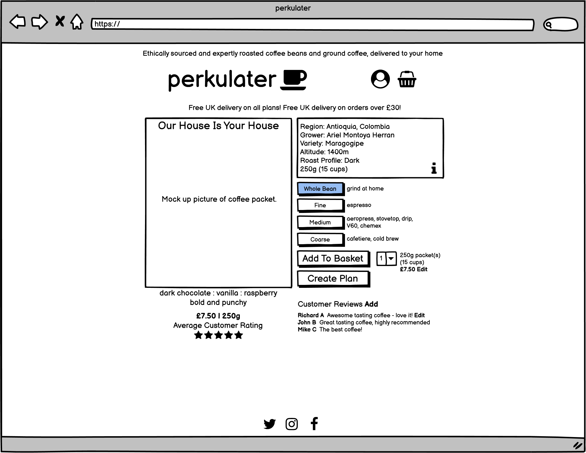
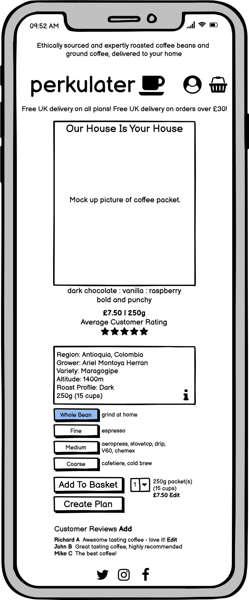

# perkulater #
[perkulater Live Site](https://perkulater.herokuapp.com/)  

## Contents ##
- [Background](#background)
- [Mission Statement](#mission-statement)
- [Target Audience](#target-audience)
- [Business Objectives](#business-objectives)
- [User Objectives](#user-objectives)
- [UX](#ux)
    - [Project Strategy](#project-strategy)
        - [Opportunities Matrix](#opportunities-matrix)
    - [Project Scope](#project-scope)
        - [User Demographics](#user-demographics)
        - [User Requirements](#user-requirements)
        - [Functional Requirements](#functional-requirements)
        - [User Stories](#user-stories)
        - [Constraints](#constraints)
        - [Business Rules](#business-rules)
        - [Key Features](#key-features)
    - [Site Map](#site-map)
    - [Wireframes](#wireframes)
    - [Design Choices](#design-choices)
        - [Fonts](#fonts)
        - [Colours](#colours)
- [Technologies](#technologies)
    - [Integrated Development Environment](#integrated-development-environment)
    - [Database](#database)
    - [Languages](#languages)
    - [Frameworks Libraries and Tools](#frameworks-libraries-and-tools)
    - [Browser Support](#browser-support)
- [Structure](#structure)
    - [Information Architecture](#information-architecture)
    - [Features Implemented](#features-implemented)
        - [Features Implemented in Phase 1](#features-implemented-in-phase-1)
        - [Features To Be Implemented In Future Development Phases](#features-to-be-implemented-in-future-development-phases)
        - [Design Changes During The Phase 1 Development](#design-changes-during-the-phase-1-development)
    - [Responsive Styling](#responsive-styling)
    - [Python Code Logic](#python-code-logic)
        - [Products](#products)
        - [Categories](#categories)
        - [Allergens](#allergens)
        - [User Authentication](#user-authentication)
        - [Mail](#mail)
    - [Python Code Refactoring](#python-code-refactoring)
    - [Form Validation](#form-validation)
    - [JavaScript Code Logic](#javascript-code-logic)
- [Testing](#testing)
- [Deployment](#deployment)
- [Credits](#credits)
- [Acknowledgements](#acknowledgements)

## Background ##
With the rise in home working seen in 2020 and 2021 due to the coronavirus pandemic, many former commuters now miss out on a the joy of drinking a high quality morning coffee made with the finest quality ingredients. Specialist, small batch coffee roasters and coffee subscription services have been a significant growth market in 2020 and 2021, as the links below show:  
[CNN Business](https://edition.cnn.com/2020/06/21/business/people-signing-up-for-coffee-subscriptions/index.html)  
[World Coffee Portal](https://www.worldcoffeeportal.com/Latest/InsightAnalysis/2020/November/Home-Is-Where-the-Coffee-Is)  
[BBC News](https://www.bbc.com/future/bespoke/made-on-earth/how-the-coffee-trade-survived-Covid-19.html)  

**Perkulater** aims to provide great quality, ethically sourced and expertly roasted coffee beans and ground coffee, delivered to your home. The business will initially focus on providing a just a handful of lovingly curated, high quality coffees. If the initial business proves to be successful, the future growth strategy would be to begin to expand into offering **cold brew**, **coffee making equipment** e.g. V60 drippers, stove top espresso pots, AeroPress coffee makers etc., **coffee pods** and eventually **branded merchandise**.

Please note that at this stage, **perkulater** is a ficticious store which has been created for the purposes of satisfying the requirements for the **Code Institute** Full Stack Development Course Milestone Project 4.

## Mission Statement ##
To provide great quality, ethically sourced and expertly roasted coffee beans and ground coffee, delivered to your home.

## Target Audience ##
The target audience for **perkulater** are consumers who love great quality coffee, are concerned at how the coffee beans are sourced, and would like to be able to make coffee shop quality coffee at home. **Perkulater** will be aimed at the higher end of the market, where consumers prioritise high quality and responsibly sourced coffee over low prices.

## Stakeholder Interviews
Short interviews were carried out with potential customers.

"What information would you need in order to make a purchase from an online coffee beans and ground coffee website?"
* "What variety are the coffee beans?"
* "Are the beans roasted by perkulater?"
* "Are the coffee beans responsibly sourced?"
* "Are the coffee beans available in whole beans and ground?"
* "Which coffee machines are the ground coffees and coffe beans suitable for?"
* "What is the price?"
* "What are the delivery costs?"
* "Is there positive feedback from happy customers?"
* "How do I know that the coffee will be tailored to my taste?"

"Are there any particular features you would like to see in an online coffee beans and ground coffee website?"
* "I would like to be able to subscribe to get a regular delivery of my favourite coffee beans."
* "I would like to be able to subscribe to get a regular delivery of different coffee beans selected based on my taste preferences."
* "I would like to be able to purchase a gift card for friends or family."

## Business Objectives ##
Although the business is ficticous at this stage, the following business objectives have been considered as part of the overall development strategy:  
* Provide a high quality, well designed online shop that enables secure purchases, inspires confidence in the quality of the product, and increases the likelyhood of repeat purchases and subscriptions.
* Provide the ability and incentivise customers to leave positive feedback and reviews on the products, to inspire confidence in new customers.
* Grow the brand over time, starting with coffee beans and ground coffee and scaling up to add more products as the brand grows.
* Track sales data to inform future business strategy.

## User Objectives ##
* Purchase high quality, great tasting coffee beans or ground coffee for home delivery.
* Subscribe for a regular delivery of high quality, great tasting coffee beans or ground coffee.
* Purchase a gift card.
* See other user's positive reviews and feedback to inspire confidence in making a purchase.
* Review and recommend products.
* Contact the business about an order.
* Customise my subscription service so that I can try different coffees specifically tailored to my taste preferences.
* Purchase high quality cold brew coffee in a can (this product line could potentially be added in a future development phase).
* Purchase high quality coffee making equipment (this product line could potentially be added in a future development phase).
* Purchase high quality, great tasting coffee pods (this product line could potentially be added in a future development phase).
* Purchase branded merchadise (this product line could potentially be added in a future development phase).

## UX ##

### Project Strategy ###

#### Opportunities Matrix ####
The following opportunities were identified and ranked using a score of 1 - 5 for importance and viability:

Opportunity|Description|Importance|Viability|Opportunity ID|Development Phase
-----------|-----------|----------|---------|--------------|-----------------
Engage with suppliers|Engage directly with coffee farmers in order to source high quality ethically grown coffee directly from source|5|3|Op-1|1
Coffee beans and ground coffee|Develop an online store to sell high quality, ethically sourced coffee beans and ground coffee|5|4|Op-2|1
Showcase developer skills|The site will serve as a showcase for the developer's skills, and increase the developer's standing within the tech community|5|4|Op-3|1
Subscriptions|Provide a subscription service so customers can have coffee delivered on a regular basis|5|3|Op-4|1
Customer reviews|Provide the facility for customers to add reviews to products|5|4|Op-5|1
Gift cards|Sell gift cards and/or the ability to gift a subscription|3|2|Op-6|2
Customised subscription service|Customise the subscription service so that customers can try different coffee each time their subscription is fulfilled tailored to their specific taste preferences|3|2|Op-7|2
Cold brew|Add cold brew to the product line|3|2|Op-8|2
Coffee making equipment|Add coffee making equipment e.g. V60 drippers, filters, stove top espresso pots, AeroPresses, espresso machines etc to the product line|2|2|Op-9|2
Pods|Add coffee pods compatible with popular coffee machines to the product line|3|2|Op-10|2
Merchandise|Add company branded merchadise to the product line|1|1|Op-11|3

See **perkulater** strategy chart below. Opportunities to be included for phase 1 are shown in *Red*, and opportunities to be deferred to a future development phase are shown in *Grey*: 

### Project Scope ###
#### User Demographics ####
* The primary users of the site will be consumers who are looking for high quality, etically sourced coffee beans and ground coffee for home delivery. 
* A simple, clean and modern looking, well layed out site with the key information being easy to find and purchases being easy to make in a few clicks would suit this demographic.

#### User Requirements ####
* Simple and well layed out.
* Visually appealing.
* Intuitive.
* Clean and modern looking.
* Easy to find key information.
* Easy to make a purchase in just a few clicks.
* The site should inspire the consumer with the confidence to make a purchase.
* The site should be secure as the consumer is handing over credit card information.
* Responsive design is required as users may be viewing the site on Mobile, Tablet or Desktop.

#### Functional Requirements ####
In order to determine the functional requirements of the site, the following user stories have been developed.

#### User Stories ####
As a **Potential Customer**, I would like to be able to:
* Immediately understand the intent of the site.
* View and navigate the site on all devices.
* Learn about the coffees on offer, including a description of the flavours, so I can make an informed purchasing decision.
* Learn about where the coffee beans are sourced from, so I can make an informed purchasing decision.
* Understand the delivery charges, and how much I need to spend to get free delivery, so I can make an informed purchasing decision.
* Add products to my cart, so I can make a purchase.
* Subscribe for a regular purchase of a product.
* Receive confirmation of my purchase via email, so I can be confident that the purchase has been made succesfully.
* Register on the site, so I can make a repeat purchase more easily.
* Contact the business with a general query.

As a **Registered User**, I would like to be able to:
* Sign in to my account.
* Sign out of my account.
* Recover a forgotten password.
* View and update my personal profile, including default delivery details.
* See a summary of my previous orders.
* Contact the business about a specific order.
* Add reviews to products, to help other customers make informed purchasing decisions.

As a **Business Owner**, I would like to be able to:
* Incentivise customers to add reviews to products, so that other customers will feel more confident about making a purchase.
* Add, edit and delete products.
* Add, edit and delete product categories.
* Track sales data, to inform future purchasing decisions.

#### Constraints #####
* Developer skill set - the Developer is currently learning **Python** and **Django**. 
This may impact on which features can be succesfully implemented during the phase 1 development.
* Developer's available time - the developer is working full time whilst studying.
This coupled with the developer's current skills constraints may impact which features 
can be succesfully implemented during the phase 1 development.

#### Business Rules ####
It is not envisaged at this stage that the **perkulater** will become a real business. The site has been created for the purposes of satisfying the criteria for the **Code Institute** Full Stack Development Course Milestone Project 4.

#### Key Features ####
The following key features have been identified for development and scored from 1 - 5 for importance and viability. 
Each feature is mapped back to the [Opportunities Matrix](#opportunities-matrix). 
The proposed development phase has also been indicated:

Feature ID|Feature|Description|Importance|Viability|Opportunity ID|Development Phase|
----------|-------|-----------|----------|---------|--------------|-----------------|
F01|Product Detail|Description of the products on offer, including a description of the coffee flavours and a description of where the coffee beans are sourced from, sizes etc|5|5|Op-2|1
F02|Purchase Products|Enables users to purchase a product, including secure card verification and confirmation email|5|4|Op-2|1
F03|Registration Form|User registration form|5|4|Op-2|1
F04|Sign In|Sign in to User Profile|5|4|Op-2|1
F05|Sign Out|Sign out of User Profile|5|4|Op-2|1
F06|Update Profile|Update user profile|5|4|Op-2|1
F07|Recover Password|Recover a forgotten user profile password|5|4|Op-2|1
F08|Order Summary|See a summary of previous orders|5|4|Op-2|1
F09|Order Contact|Contact the business owner about a specific order|5|4|Op-2|1
F10|Review Product|Review a product I have purchased|5|4|Op-2|1
F11|Reward for Reviewing Product|Give a customer a reward for reviewing a product, to incentivise reviews|5|4|Op-2|1
F12|Subscribe|Enables users to subscribe for regular coffee delivery|5|3|Op-4|1
F13|Add Product|Enables users with required privelages to add a product|5|4|Op-2|1
F14|Edit Product|Enables users with required privelages to edit a product|5|4|Op-2|1
F15|Delete Product|Enables users with required privelages to delete a product|5|4|Op-2|1
F16|Add Category|Enables users with required privelages to add a category|2|4|Op-2|2
F17|Edit Category|Enables users with required privelages to edit a category|2|4|Op-2|2
F18|Delete Category|Enables users with required privelages to delete a category|2|4|Op-2|2
F19|Purchase Gift Card|Enables users to purchase a gift card|2|3|Op-4|2
F20|Track sales data|Enables users with required privelages to export sales data from the database|3|2|Op-2|2
F21|Customised Subscription Service|Customise the subscription service so that customers can try different coffee each time their subscription is fulfilled tailored to their specific taste preferences|3|2|Op-6|2

See **perkulater** scope chart below. Opportunities to be included for phase 1 are shown in *Red*, and opportunities to be deferred to a future development phase are shown in *Grey*: 

### Site Map ###
A preliminary [Site Map](media/wireframes/perkulater-site-map.png) was produced for the **Phase 1** development, and is shown below:  

### Wireframes ### 
[Initial Wireframes](media/wireframes/rev0) were produced showing the **Home**, **Product Detail**, **Create Plan**, **Basket**, **Basket (Plan)**, **Sign In**, **Register**, **Checkout**, **User Profile**, **Orders**, **Order Detail**, **Contact** and **Review** page layouts.  
The **Home** and **Product Detail** page layouts are shown below:  

  

[Responsive design wireframes](media/wireframes/rev1) were then produced showing the **Home**, **Product Detail**, **Create Plan**, **Basket**, **Checkout** and **Order Detail** page layouts on **Tablet** and **Phone**. 
The [Responsive design wireframes](media/wireframes/rev1) for the **Home** and **Product Detail** page layouts are shown below: 

  
 

  

### Design Choices ###

#### Fonts ####
[Teko](https://fonts.google.com/specimen/Teko) has been chosen as the logo font for the [perkulater logo](static/testing/logo.png).  
[Teko](https://fonts.google.com/specimen/Teko) looks modern and, attractive and chunky and fits well with the overall theme of the site.  
* font-family: "Teko", sans-serif;

[Titillium Web](https://fonts.google.com/specimen/Titillium+Web) has been chosen as the title font for headings and sub headings.  
[Titillium Web](https://fonts.google.com/specimen/Titillium+Web) has a simple, clear, chunky look and pairs well with the logo font.  
[Titillium Web](https://fonts.google.com/specimen/Titillium+Web) is also available in a good selection of weights.
* font-family: "Tittilium Web", sans-serif;

[Montserrat](https://fonts.google.com/specimen/Montserrat) has been chosen as the body font.  
[Montserrat](https://fonts.google.com/specimen/Montserrat) has a simple, clean, rounded look and is available in a good selection of weights.
* font-family: "Montserrat", sans-serif;

#### Colours ####
A "Dark Theme" was chosen for the site, to enable a simple, modern and clear design to be implemented.
A very dark grey was chosen as the background colour. Various dark grey shades are layered over the background to convey depth, and highlighting colours are used for foreground elements. Colour ideas were generated using the 
using the [Coolors](https://coolors.co/) **Colour Palette** generator. The final **Colour Palette** selected 
is shown below: 

  

* #FFFFFF - "White" - used for the background.
* #009EA3 - "Vividian Green" - used for results and review table links.
* #E97C72 - "Salmon" - used for form control borders and results and review table next and previous buttons.
* #E35B4F - "Fire Opal" - used for navbar background, buttons, results table header backround, inputs and footer links.
* #C22C1E - "Venetian Red" - used as a higlighting colour for items coloured with "Fire Opal".
* #F5B800 - "Orange Yellow" - used for alerts, buttons, results and review table row borders and stars.
* #CC9900 - "Lemon Curry" - used as a higlighting colour for items coloured with "Orange Yellow".

## Technologies ##

### Integrated Development Environment ##
* [GitHub](https://github.com/)

### Database ###
* [Mongo DB](https://www.mongodb.com/)

### Languages ###
* [HTML](https://developer.mozilla.org/en-US/docs/Web/HTML)
* [CSS](https://www.w3.org/Style/CSS/Overview.en.html)
* [JavaScript](https://developer.mozilla.org/en-US/docs/Web/JavaScript)
* [Python](https://www.python.org/)

### Frameworks Libraries and Tools ###
* [Bootstrap](https://getbootstrap.com/docs/5.0/getting-started/introduction/) - to assist with responsive design.
* [Font Awesome](https://fontawesome.com/) - for icons.
* [Google Fonts](https://fonts.google.com/) - for fonts.
* [jQuery](https://jquery.com/) - to assist with JavaScript coding and DOM manipulation.
* [PyMongo](https://pypi.org/project/pymongo/) - to enable interaction with [Mongo DB](https://www.mongodb.com/).
* [Flask](https://flask.palletsprojects.com/en/2.0.x/) - to render and display web pages.
* [DataTables](https://datatables.net/) - to enable easy display of data tables.
* [WTForms](https://wtforms.readthedocs.io/en/2.3.x/) - for **Form Validation**.
* [wftorms-validators](https://pypi.org/project/wtforms-validators/) - for additional form validators.
* [Jinja](https://jinja.palletsprojects.com/en/3.0.x/) - to enable easy display of database information using templating.
* [Werkzeug](https://werkzeug.palletsprojects.com/en/2.0.x/) - to enable generation and checking of secure password hashes.
* [SMTPLib](https://docs.python.org/3/library/smtplib.html) - to enable contact emails to be sent.
* [unittest](https://docs.python.org/3/library/unittest.html#) - framework for **Python Unit Testing**.
* [mongomock](https://pypi.org/project/mongomock/) - used to create a "mock" of the **Mongo DB** for **Python Unit Testing**.

### Browser Support ###
The following browsers are all supported by **FreeFrom**.
* [Google Chrome](https://www.google.com/intl/en_uk/chrome/)
* [Microsoft Edge](https://www.microsoft.com/en-us/edge)
* [Safari](https://www.apple.com/uk/safari/)
* [Firefox](https://www.mozilla.org/en-GB/firefox/new/)
* [Opera](https://www.opera.com/)

For further information please see  the **Browser Compatibility** section in [TESTING.md](TESTING.md).  

## Structure ##

### Information Architecture ###
[Mongo DB](https://www.mongodb.com/) has been selected to host the back end database for [FreeFrom](https://freefrom.herokuapp.com/). 
[Mongo DB](https://www.mongodb.com/) is a non relational [NoSQL](https://www.mongodb.com/nosql-explained) database hosting platform, 
which provides an easily scalable platform to base the [FreeFrom](https://freefrom.herokuapp.com/) site on.  

The project data schema has modelled using [dbdiagram.io](https://dbdiagram.io/home), and is shown below:  

 

As shown in the schema diagram, there are four collections, **Users**, **Products**, **Categories** and **Allergens**.  

Please note that the field **allergens_suitability** in the **Products** collection was renamed to **free_from_allergens**. 
This change was not picked up in the note below the "products" collection in the schema diagram shown above 
and unfortunately the free 14 day trial for the software ended. 

[FreeFrom](https://freefrom.herokuapp.com/) is deployed using [Heroku](https://dashboard.heroku.com/). 
For further information see [Deployment](#deployment).

### Features Implemented ###
Please note that an account with **Admin** privileges has been created for testing purposes. This will facilitate testing of 
features which require **Admin** privileges. The username is *testadmin1* and the password is *testadmin1*.

#### Features Implemented in Phase 1 ####
* **Home Page**, enables users to search for products which are free from one or more allergens:  
 

* **FreeFrom** logo, links to home page if selected:  
 

* **Home Page Alert**, explains the purpose of the site, shows user name if signed in:  
 

* **Navigation Menu**, enables navigation to the **Home** and **Sign In** pages if the user is not **Signed In**. 
If the user is **Signed In**, enables **Sign Out**. If the user is signed in with **Admin** privileges, 
displays the **Allergens** and **Categories** menus:  

 

* **Search Input**, allows the user to optionally input product search criteria to filter search results:  
  

* **Category Selector**, allows the user to optionally select category to filter search results:  
  

* **Search Button**, searches the database and returns matched products in the **Product Results Table**. 
Resizes if the user is not signed in and add button is not displayed:  
  

* **Add Button**, links to the **Product Add** form. Only shown if the user is signed in:  
  

* **Allergen Selector**, allows the user to optionally select allergens to filter search results:  
  

* **Product Results Table**, displays product search results. Product name links to **Product View** page:
 

* **Sign In**, displays form allowing the user to sign in. Includes link to **Register**:  
 

* **Register**, displays form allowing the user to register:  
 

* **Product View**, displays **Product** details. If the user is signed in, allows review and rating to 
be added or updated.   
**Add** button enables the user to review and rate **Product**.  
**Add** button text is changed to **Update** if the user has already reviewed the **Product**.  
**Update** button updates review and rating if **Product** has already been reviewed by the user.  
**Product Edit** button links to **Product Edit** page.  
User reviews are shown below in the **User Reviews Table**:  
  

* **Product Edit**, displays form allowing **Product** to be edited. If the **Product** has been added by the 
signed in **User**, or if the signed in **User** has **Admin** privileges, **Delete** button is shown:  
  

* **Product Delete Confirm**, displays form confirming **Product** should be deleted:  
  

* **Product Add**, displays form allowing **Product** to be added:  
  

* **Allergen Add**, displays form allowing **Allergen** to be added:  
  

* **Allergen Edit**, displays form allowing **Allergen** to be edited:  
  

* **Allergen Delete**, displays form allowing **Allergen** to be deleted:  
  

* **Allergen Delete Confirm**, displays form confirming **Allergen** should be deleted:  
  

* **Category Add**, displays form allowing **Category** to be added:  
  

* **Category Edit**, displays form allowing **Category** to be edited:  
  

* **Category Delete**, displays form allowing **Category** to be deleted:  
  

* **Category Delete Confirm**, displays form confirming **Category** should be deleted:  
  

* **Footer Contact Developer Link**, links to **Contact Developer** form:  
  

* **Footer GitHub Link**, links to developer page on [GitHub](https://github.com/richardhenyash):  
  

* **Contact Developer**, enables developer to be contacted by email:  
  

* **Error Page**, returns a customised error message and link to the **Home** page if an error is encountered:  
  

#### Features To Be Implemented In Future Development Phases ####
* Currently, when the user navigates back to the **Home** page from the **Product View** page, 
the previous search results are not displayed. Adding this functionality was investigated and
is likely to involve significant restructuring and re-testing of the python code. This feature 
is recommended to be implemented in a **Future Development Phase**.
* Functionality for deleting user accounts should be added. Currently this has to be done in the 
[Mongo DB](https://www.mongodb.com/) back end.
* Functionality for enabling the user to change their password should be added.
* Functionality to enable an **Admin** user to assign **Admin** rights to another user, which would allow the user to edit **Categories** and **Allergens**. Currently **Admin** rights have to be assigned in the [Mongo DB](https://www.mongodb.com/) back end.
* Functionality to enable pictures of **Products** to be uploaded.
* Functionality to enable **Products** to be added by scanning barcodes.

#### Design Changes During The Phase 1 Development ####
The following design changes were implemented following initial user feedback:
* The **Home** and **Product View** page alerts were updated to include links to **Sign In** and **Register** 
if the user is not signed in:  

* The **Home** page search button was updated to take up the space of the search and add buttons 
if the user is not signed in:  
  

* The **Register** form was updated to include a link to **Sign In**:  
  

* The **Product Add** route was updated to redirect to the **Product View** of the 
successfully added product.  

* The **Product View** form was updated to include an **Add Product** button:  
 

* **Form Validation** for the **Product** form was updated to allow special characters 
(e.g. "&", "-" etc) in product names, and to allow **Product** and **Manufacturer** 
names to be a minumum of 3 characters long.

* Selection highlighting was turned off on the **Product View** form fields.

* Font sizes were increased slightly.

* Additional error checking was implemented.

### Responsive Styling ###
* The **Navigation Menu** is collapsible, and collapses to an icon on small devices less than 768 pixels wide. 
This is implemented using the [Bootstrap Navbar](https://getbootstrap.com/docs/5.0/components/navbar/) component.  
* The **Search Input**, **Category Selector**, **Search Button** and **Add Button** are responsively styled, 
and stack on small devices less than 768 pixels wide.  
* The **Product Results Table** and **User Reviews Table** are responsively styled, so that columns are collapsed 
on smaller devices. This is implemented using the [DataTables](https://datatables.net/) 
[Responsive Extension](https://datatables.net/extensions/responsive/). The class **responsive** is added to the 
**table** html classes. Table columns are assigned a **prioirity** by adding the **data-priority** attribute to 
the **table header** html.

See **Responsive Design** section in [TESTING.md](TESTING.md) for further information and [Responsive Testing](/static/testing/responsive) screen prints.

### Python Code Logic ###
The **Python Code** for the project has been split into the following modules, using the 
[Flask Blueprint](https://flask.palletsprojects.com/en/2.0.x/blueprints/) function:

* [Application](/app.py) - Flask routes and functions related to the **Flask Application** and **Error Handling**.
* [Database](/database.py) - Functions related to the **Mongo Database**.
* [Products](/products.py) - Flask routes and functions related to **Products**.
* [Allergens](/allergens.py) - Flask routes and functions related to **Allergens**.
* [Categories](/categories.py) - Flask routes and functions related to **Categories**.
* [Forms](/forms.py) - [WTForms](https://wtforms.readthedocs.io/en/2.3.x/) form class definitions.
* [User Authentication](userauth.py) - Flask routes and functions related to **User Authentication**.
* [Mail](/mail.py) - Flask routes and functions related to sending an email via the **Contact Developer** form.

The high level code logic is explained in the [UML Diagrams](/media/wireframes/uml/) below: 

#### [Products](/media/wireframes/uml/products-logic.png) ####
  

#### [Allergens](/media/wireframes/uml/allergens-logic.png) ####
  

#### [Categories](/media/wireframes/uml/categories-logic.png) ####
  

#### [User Authentication](/media/wireframes/uml/userauth-logic.png) ####
  

#### [Mail](/media/wireframes/uml/mail-logic.png) ####
 

### Python Code Refactoring ###
After attending an online [Code Institute](https://codeinstitute.net/) seminar on [Python Classes](https://www.w3schools.com/python/python_classes.asp) 
given by [Ben Kavanagh](https://github.com/BAK2K3), consideration was given to refactoring the code using an object orientated approach. 
A new [Class](https://github.com/richardhenyash/freefrom/tree/class) branch was created on in the 
[Project Code Repository](https://github.com/richardhenyash/freefrom). Classes and class methods were created in the 
**products**, **allergens**, **categories** and **userauth** python code modules. The class orientated approach was succesfully 
implemented as a test on the **Product View** route, which resulted in a significant simplification of the code. Unfortunately, 
due to time constraints, it was not possible to implement the object orientated approach across the project, but this should 
definitely be considered for a future project development phase, and as a better method of working for future projects.

Due to time constraints, the developer decided to refactor the **Python Code** using **Procedural Programming**. The code was reviewed at a high level, and functions that could be split out and re-used were identified. A [Refactor](https://github.com/richardhenyash/freefrom/tree/refactor) branch was created in the [Project Code Repository](https://github.com/richardhenyash/freefrom). The **Products**, **Categories**, **Allergens**, **User Authentication** and **Mail** modules were refactored, the site was re-tested and the **Refactor** branch was merged into the **Master** branch in the [Project Code Repository](https://github.com/richardhenyash/freefrom). The refactoring has greatly improved the readability of the code 
and will make any further future development and bug fixes much easier to incorporate.

### Form Validation ###
Form validation is achieved in [Python](https://www.python.org/) using [WTForms](https://wtforms.readthedocs.io/en/2.3.x/). 
Custom **Form Classes** are defined within the [Forms](/forms.py) module for each required form. 
Additional custom validators have been imported from [wftorms-validators](https://pypi.org/project/wtforms-validators/) and implemented.
See below table for form validation implemented using WTForms:  

Form|Field|WTForms Field Type|Required|Minimum Length|Maximum Length|Notes
----|-----|------------------|--------|--------------|--------------|-----
Sign In|User Name|StringField|Yes|5|25|May only contain letters or numbers
Sign In|Password|PasswordField|Yes|5|25|
Register|User Name|StringField|Yes|5|25|Inherits field from Sign In form class
Register|Password|PasswordField|Yes|5|25|Inherits field from Sign In form class
Register|Email|PasswordField|Yes|5|None|Inherits field from Sign In form class
Register|Confirm Password|PasswordField|Yes|None|None|Must match Password
Contact|Name|StringField|Yes|3|100|May only contain letters or spaces
Contact|Email|StringField|Yes|5|None|
Contact|Message|TextAreaField|Yes|10|500|
Product Add|Name|StringField|Yes|3|50|
Product Add|Manufacturer|StringField|Yes|3|50|
Product Add|FreeFrom|StringField|No|None|None|Automatically populated from check boxes
Product Add|Review|TextAreaField|Yes|5|50|
Product Add|Rating|StringField|No|1|1|Automatically populated using JavaScript event handlers
Product View|Name|StringField|No|None|None|Read Only
Product View|Manufacturer|StringField|No|None|None|Read Only
Product View|FreeFrom|StringField|No|None|None|Read Only
Product View|Review|TextAreaField|Yes|5|250|
Product View|Rating|StringField|No|1|1|Automatically populated using JavaScript event handlers
Product Edit|Name|StringField|Yes|3|50|
Product Edit|Manufacturer|StringField|Yes|3|50|
Product Edit|FreeFrom|StringField|No|None|None|Automatically populated from check boxes
Allergen Add|Name|StringField|Yes|3|20|May only contain letters or spaces
Allergen Edit|Name|StringField|Yes|3|20|May only contain letters or spaces
Category Add|Name|StringField|Yes|3|30|May only contain letters or spaces
Category Edit|Name|StringField|Yes|3|30|May only contain letters or spaces

### JavaScript Code Logic ###
[JavaScript](https://developer.mozilla.org/en-US/docs/Web/JavaScript) has been used to implement the following features:  

* Initialisation of [DataTables](https://datatables.net/), which are used to display the **Product** search results on the **Home** 
page and the **Reviews** on the **Product View** page in a searchable, sortable, paginated data table format using a plug in.

* Clickable **Rating** stars on the **Product View** and **Product Add** forms. When the star icons are clicked on the 
**Product View** and **Product Add** forms, a hidden form input with the id of "Rating" is updated to the correct "star" rating 
between 1 and 5 using the **JavaScript** on click event handlers defined in the [Events](/static/js/events.js) module.

* When the **Product View** form is ready, the hidden form input with id "Rating" is read and the **Rating** star icons 
are updated to reflect the correct rating value.

See [UML Diagram](/media/wireframes/uml/) below:  

  

## Testing ##

Further testing information and screen prints can be found in [TESTING.md](TESTING.md).

## Deployment ##
The project has been developed using [Gitpod](https://www.Gitpod.io/) and [GitHub](https://github.com/). 
The project was regularly commited to [GitHub](https://github.com/) during the initial development phase.
The website resides as a repository in [GitHub](https://github.com/), and has been been deployed 
using [Heroku](https://dashboard.heroku.com/).

In order to make a *Fork* or *Clone* of the project, a [GitHub](https://www.Gitpod.io/) account is required. 
The [Gitpod Browser Extension](https://www.Gitpod.io/docs/browser-extension/) is also recommended.  

The project may be *Forked* by following these steps:
* Go to the [Project Code Repository Location](https://github.com/richardhenyash/freefrom) on [GitHub](https://github.com/).
* In the top-right corner of the page, click *Fork*.  

For further information on *Forking* a [GitHub](https://github.com/) repository, 
see the [GitHub Documentation](https://docs.github.com/en/github/getting-started-with-github/fork-a-repo).

The project may be *Cloned* by following these steps:
* Go to the [Project Code Repository Location](https://github.com/richardhenyash/freefrom) on [GitHub](https://github.com/).
* Select the *Code* dropdown and choose *GitHub CLI* under *Clone*. This will give you a *URL* that may be copied into the clipboard. 
* Open the Git Bash command line interface in [Gitpod](https://www.Gitpod.io/).
* Change the current working directory to the location where you would like the cloned directory to reside.
* Type `git clone`, and then paste the *URL* copied earlier, eg:  
`$ git clone https://github.com/richardhenyash/free-from`
* Press Enter to create the local clone.
* Any required **Python** dependencies should be installed locally using `$ pip install -r requirements.txt`.

The code may also be downloaded to a local computer by following these steps:
* Go to the [Project Code Repository Location](https://github.com/richardhenyash/freefrom) on [GitHub](https://github.com/).
* Select the *Code* dropdown and choose the *Download ZIP* option.
* This will download a copy of the entire project locally as a .zip file. 
* Any required **Python** dependencies should be installed locally using the terminal command `$ pip install -r requirements.txt`.

For further information on *Cloning* a [GitHub](https://github.com/) repository, see the 
[GitHub Documentation](https://docs.github.com/en/github/creating-cloning-and-archiving-repositories/cloning-a-repository).

To set up the local testing environment once the code has been *Cloned* or *Forked*, an [env.py](/static/testing/deployment/example_env.py) file should be created in the root directory. The [env.py](/static/testing/deployment/example_env.py) file should be included in the *gitignore* file, as it contains sensitive information and should not be committed to a public **GitHub** repository. The [env.py](/static/testing/deployment/example_env.py) file should include the following *environment* variables:  

Variable|Value|
--------|-----|
IP|0.0.0.0|
PORT|5000
SECRET_KEY|`your_secret_key`
MONGO_DBNAME|The Mongo database name, currently set to `freefrom`
MONGO_URI|The Mongo connection string, currently set to `mongodb+srv://<username>:<password>@<clustername>.z6xjx.mongodb.net/<database_name>?retryWrites=true&w=majority`
MAIL_USERNAME|The mail account that **Contact** emails will be sent to. Currently set to `freefrom.contact@gmail.com`
MAIL_PASSWORD|The mail password associated with the mail account that **Contact** emails will be sent to.  

Please see [Example env.py file](/static/testing/deployment/example_env.py).

The steps required to deploy the website to [Heroku](https://dashboard.heroku.com/) are as follows:
* To dump the data from your mysql development database to a json file, use following command at the terminal *note - manage.py must be connected to your local mysql development database*:
`python3 manage.py dumpdata --exclude auth.permission --exclude contenttypes > db.json`
* Log in to **Heroku**, and create a new **App** by clicking the *New* button in the top right of 
your *Dashboard* and selecting *Create new app*. Give the new **App** a name and set the region to your closest geographical region, 
then click *Create app*.
* Provision a new **POSTGRES** database from the *Resources* tab.
* Confirm that the **App** is connected to the correct **GitHub** repository.
* Install `dj_database_url` and  `psycopg2-binary`.
* Use the `pip3 freeze > requirements.txt` terminal command to to create a `requirements.txt` file, 
which lists all the **Python** dependencies.
* Import dj_database_url in settings.py.
* Connect the **POSTGRES** database by setting `DATABASES` in settings.py to the following, where `database_url` is as per the config vars in Heroku settings:
    `DATABASES = {`
        `'default': dj_database_url.parse(database_url)`
    `}`

* Run `python3 manage.py showmigrations` at the terminal to show migrations to be applied to the new POSTGRES database.
* Run `python3 manage.py migrate --plan` at the terminal to check the migrations.
* Run `python3 manage.py migrate` at the terminal to apply the migrations to the new POSTGRES database.
* Note - if you encounter `error: django.db.utils.OperationalError: FATAL:  role "xxxxxxxxxxx" during configuration of POSTGRESQL`, run `unset PGHOSTADDR` at the terminal.
* Run `python3 manage.py loaddata db.json` at the terminal to load the data from the local json created earlier. 
* Install `gunicorn` and re-run `pip freeze > requirements.txt` at the terminal.
* Create a `Procfile`, declaring the process type in the root of the project. 
* The `Procfile` should have only one line that reads `web: gunicorn appname.wsgi:application`, with no empty white space or lines, where `appname` is the application name.
* Login to **Heroku** at the terminal using `heroku login -i`
* Run the command `heroku config:set DISABLE_COLLECTSTATIC=1 --app appname` at the terminal, where `appname` is the application name.
* Add `ALLOWED_HOSTS = ['appname.herokuapp.com', 'localhost']` to `settings.py` where where `appname` is the application name.
* Add, commit and push the newly created `requirements.txt` and `Procfile` files to the the **GitHub**
repository using the `git add`, `git commit` and `git push` commands.
* Set the git remote using `heroku git:remote -a appname`, where `appname` is the application name.
* Deploy the app to heroku using `git push heroku branchname`, where `branchname` is the github branch name.
* In the *Dashboard* for the new application, click on *Settings* menu > *Reveal Config Vars*.
* Generate a Django secret key and add it to the environment variables, using [miniwebtool.com](https://miniwebtool.com/django-secret-key-generator/).
* The following **Config Vars** should be set.

Variable|Value|
--------|-----|
DISABLE_COLLECTSTATIC|1
SECRET_KEY|`your_django_secret_key`

* From your **App** *Dashboard*, click on the *Deploy* menu > *Deployment method* 
section and select *GitHub*.
* Search for your **GitHub** repository then click *Connect* to connect.
* Confirm that the **App** is connected to the correct **GitHub** repository.
* Enable **Automatic Deploys** from the correct **GitHub** branch.
* Update, commit and push the code to **GitHub** and **Heroku** using the 
`git add`, `git commit` and `git push` commands.
* **Heroku** will receive the code from **GitHub** and build the **App** with the required packages and dependencies.
* Once complete, you should see the message *Your app was succesfully deployed*.
* Confirm that the application is automatically deploying to **Heroku** by checking the *Build Log* in the *Activity* tab.
* **Heroku** is now succesfully connected to **GitHub** and any changes made in the **GitHub** repository 
will be automatically pushed to **Heroku**.

Static files are stored in an **Amazon Web Services S3 Bucket**. The process followed to deploy static files to **Amazon S3** was as follows:
* Create an **Amazon Web Services** account.
* Sign in and go to the **AWS Management Console**.
* Open S3 and create a bucket in S3 (select region closest to your location) - note, uncheck *Block Public Access* and acknowledge that the bucket will be public.
* Open the bucket settings.
* On *Properties* tab, turn on static website hosting (use index.html for Index document and error.html for Error document).
* On *Permissions* tab, paste the following Cross-origin resource sharing (CORS) cofiguration:
`[`
  `{`
      `"AllowedHeaders": [`
          `"Authorization"`
      `],`
      `"AllowedMethods": [`
          `"GET"`
      `],`
      `"AllowedOrigins": [`
          `"*"`
      `],`
      `"ExposeHeaders": []`
  `}`
`]`
* On *Bucket Policy* tab, go to *Policy Generator* and use the following settings:
Type of Policy: *S3 Bucket Policy*
Effect: *Allow*
Principal: *
AWS Service: *Amazon S3*
Actions: *GetObject*
Amazon Resource Name (ARN): *Use ARN from bucket policy tab*
* Generate the policy, copy the policy into the bucket policy editor, and add `/*`
onto the end of the *Resource* line, as per the example below, where `bucketname` is the Amazon S3 bucket name:
`"Resource": "arn:aws:s3:::bucketname/*`.
* Save the policy.
* Go to the `Access Control List` tab and set the *Objects* permissions to `List` for *Everyone (public access)*.
* The bucket is now set up.
* To set user permissions, go to IAM (Identity and Access Management).
* Create a group by selecting *Create Group* in *User Groups* under *Access Management*.
* Create a policy by selecting *Create Policy* in *Policies* under *Access Management*.
* Go to the *JSON* tab, select *Import Managed Policy* and import the *AmazonS3FullAccess* policy.
* Edit the *Resource* section as per the example below, where `bucketname` is the Amazon S3 bucket name:
`"Resource": [`
    `"arn:aws:s3:::bucketname",`
    `"arn:aws:s3:::bucketname/*"`
`]`
* Click `Review Policy`, give the policy a name and decription amd click *Create Policy*.
* Attach the policy to the group created earlier by selecting the group in *Groups* under *Access Management*, 
clicking *Attach Policy* in the *Permissions* tab and selecting the policy created in the previous step.
* Create a user by selecting *Add User* in *Policies* under *Access Management* and select *Programmatic access*.
* Assign the user to the use group created eralier, and check that the group has the policy created earlier attached.
* Download the .csv file containing the `AWS_ACCESS_KEY_ID` and `AWS_SECRET_ACCESS_KEY`.
* Install `boto3` and  `django-storages`.
* Freeze requirements using `pip3 freeze > requirements.txt`.
* Add `'storages'` to `INSTALLED_APPS` in `settings.py`.
* Add the following settings to `settings.py`, where `bucketname` is the Amazon S3 bucket name (e.g. `perkulater`) and `region` is the bucket region name (e.g. `'eu-west-2'` for the currently deployed perkulater site):
`if 'USE_AWS' in os.environ:`
    `# Cache control`
    `AWS_S3_OBJECT_PARAMETERS = {`
        `'Expires': 'Thu, 31 Dec 2099 20:00:00 GMT',`
        `'CacheControl': 'max-age=94608000',`
    `}`    
    `# Bucket Config`
    `AWS_STORAGE_BUCKET_NAME = 'bucketname'`
    `AWS_S3_REGION_NAME = 'bucketregion'`
    `AWS_ACCESS_KEY_ID = os.environ.get('AWS_ACCESS_KEY_ID')`
    `AWS_SECRET_ACCESS_KEY = os.environ.get('AWS_SECRET_ACCESS_KEY')`
    `AWS_S3_CUSTOM_DOMAIN = f'{AWS_STORAGE_BUCKET_NAME}.s3.amazonaws.com'`
    `# Static and media files`
    `STATICFILES_STORAGE = 'custom_storages.StaticStorage'`
    `STATICFILES_LOCATION = 'static'`
    `DEFAULT_FILE_STORAGE = 'custom_storages.MediaStorage'`
    `MEDIAFILES_LOCATION = 'media'`
    `# Override static and media URLs in production`
    `STATIC_URL = f'https://{AWS_S3_CUSTOM_DOMAIN}/{STATICFILES_LOCATION}/'`
    `MEDIA_URL = f'https://{AWS_S3_CUSTOM_DOMAIN}/{MEDIAFILES_LOCATION}/'`

* **Important** - make sure that the amazon access key and secret access keys are kept secret, as these keys could be used to charge amazon services to your account!
* In the *Dashboard* for the new application, click on *Settings* menu > *Reveal Config Vars*.
* Set the following **Config Vars**, and remove the preiously set `DISABLE_COLLECTSTATIC` variable:

Variable|Value|
--------|-----|
AWS_ACCESS_KEY_ID|`your_aws_access_key`
AWS_SECRET_ACCESS_KEY|`your_aws_secret_access_key`
USE_AWS|`True`

* Create a file called `custom_storages.py` in the project root. Add the following code to the file:

`from django.conf import settings`
`from storages.backends.s3boto3 import S3Boto3Storage`

`class StaticStorage(S3Boto3Storage):`
    `location = settings.STATICFILES_LOCATION`

`class MediaStorage(S3Boto3Storage):`
    `location = settings.MEDIAFILES_LOCATION`

* Update, commit and push the code to **GitHub** and **Heroku** using the 
`git add`, `git commit` and `git push` commands.
* **Heroku** will receive the code from **GitHub** and build the **App** with the required packages and dependencies.
* Once complete, you should see the message *Your app was succesfully deployed* inm **Heroku**.
* Confirm that the static files have been collected succesfully by checking the *Build Log* in the *Activity* tab in **Heroku**.
* Open go to the **Amazon S3** management console and open the bucket.
* The static files should now be present in the directory `static/`.
* Create a new folder in the bucket called `media/`.
* Click *Upload* and select all of the required images.
* Under *Permissions* set *Grant Public Read Access* and confirm.
* Click *Next* and then *Upload* to complete upload of images.
* Go to the [Webhook Admin](https://dashboard.stripe.com/test/webhooks) area within **Stripe**.
* Click *Add Endpoint*, and enter the deployed **Heroku** site url followed by `/checkout/wh/`, e.g. `https//appname.herokuapp.com/checkout.wh/` where `appname` is the application name, and add all events.
* Click on the endpoint, and click *Reveal* to reveal the *Webhook Secret Key*. Add the key to the **Heroku** environment variables as per the table below.
* Add stripe keys to environment variables as per the table below. **Stripe** keys can be found in the [Developer Dashboard](https://dashboard.stripe.com/test/apikeys) area within **Stripe**.

Variable|Value|
--------|-----|
STRIPE_PUBLIC_KEY|`your_stripe_public_key`
STRIPE_SECRET_KEY|`your_stripe_secret_key`
STRIPE_WH_SECRET|`your_stripe_webhook_secret_key`

* In the **Webhook Admin** area of **Stripe**, select the new *Webhook Endpoint* and test it by hitting the *Send Test Event* button and selecting the `payment_intent.created` event. Stripe should display messgae `Webhook received from Stripe: payment_intent.created`.
* The deployment to **Heroku** and **Amazon Web Services S3** is now complete.

## Credits ##

* [Pin Clip Art](https://www.pinclipart.com/) for the coffee bean logo.

* Thanks to help from Shaun at code instutute, [https://getbootstrap.com/docs/5.0/components/toasts/#usage], and [https://stackoverflow.com/questions/63515279/how-to-initialize-toasts-with-javascript-in-bootstrap-5]
* Accepting a payment in Stripe: https://stripe.com/docs/payments/accept-a-payment.
* Using google fonts with stripe: https://stackoverflow.com/questions/43824382/custom-font-src-with-stripe/56985340.
* CSS loader - loading.io https://loading.io/css/
* loading overlay - boutique ado project.
* Stripe webhook handler - code referenced from: https://stripe.com/docs/payments/handling-payment-events
* Django test client issues:
https://stackoverflow.com/questions/45533539/django-test-client-get-returns-404-instead-of-200
https://stackoverflow.com/questions/29425256/django-test-client-gets-404-but-browser-works
https://stackoverflow.com/questions/23447685/false-404-from-django-test

* Django signals [https://simpleisbetterthancomplex.com/tutorial/2016/07/28/how-to-create-django-signals.html]
* Django aggregate (used to calculate product average ratings)[https://docs.djangoproject.com/en/3.2/topics/db/aggregation/].

* John CI for his determination in helping me to fix an issue with the image field on my product edit form.

* [Vector Stock](https://www.vectorstock.com/) for the attractive dove logo.
* [DataTables](https://datatables.net/) for the brilliant tables plug in.
* [WTForms](https://wtforms.readthedocs.io/en/2.3.x/) for the excellent form validation library and 
[Crash Course](https://wtforms.readthedocs.io/en/2.3.x/crash_course/) which I followed to implement the **Form Validation**.
* [wftorms-validators](https://pypi.org/project/wtforms-validators/) for the awesome additional form validation library.
* My mentor [Reuben Ferrante](https://github.com/arex18) for the examples which helped me implement the **Form Validation**, [Flask Blueprints](https://flask.palletsprojects.com/en/2.0.x/blueprints/) and **Python Unit Testing**.
* [Google Fonts](https://fonts.google.com/) for the attractive fonts used on the site, which enabled me to get started quickly.
* [hex 2 rgba](http://hex2rgba.devoth.com/) for the hex to RGBA conversion tool.
* The excellent [Code Institute](https://codeinstitute.net/) course material which enabled me to succefully implement the project.
* [ColorSpace](https://mycolor.space/) for the colour ideas generated using the colour pallete generator.
* [favicon.io](https://favicon.io/favicon-converter/) for the favicon conversion tool.
* The following [link](https://datatables.net/forums/discussion/51763/page-paging-number-color-styles) for information on **DataTables** 
page and page number styling.
* The following [link](https://docs.python.org/3/library/unittest.html#) for information on **unittest**, used for **Python Unit Testing**.
* The following [link](http://docs.mongoengine.org/guide/mongomock.html) for information on **mongomock**, used to create a "mock" of 
the **Mongo DB** for **Python Unit Testing**.

## Acknowledgements ##

Many thanks to the following for help and inspiration during this project:
* My mentor [Reuben Ferrante](https://github.com/arex18) for helping to get me started off on the right footing, for the insightful
review and comments on the site and for the help with **Form validation**, [Flask Blueprints](https://flask.palletsprojects.com/en/2.0.x/blueprints/), **Python Code Refactoring** and **Python Unit Testing**.  
* [Neringa Bickmore](https://github.com/neringabickmore) for your encouragement with my project idea.
* [Ben Kavanagh](https://github.com/BAK2K3) for the very helpful comments on the site and general 
 encouragement, and for the excellent online seminar on **Python Classes**.
* The [Code Institute](https://codeinstitute.net/) [slack](https://slack.com/intl/en-gb/) community, for all your encouragement and help.