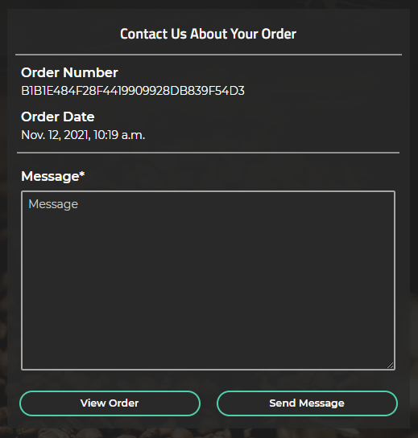
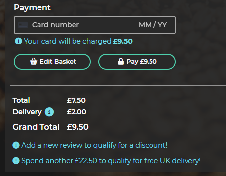
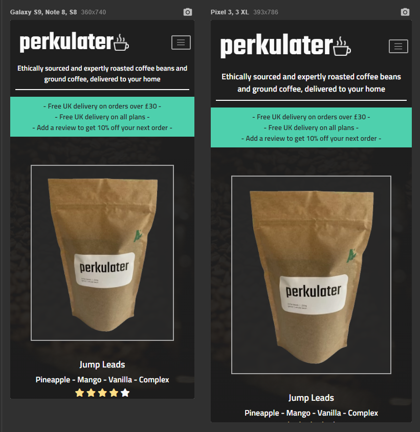
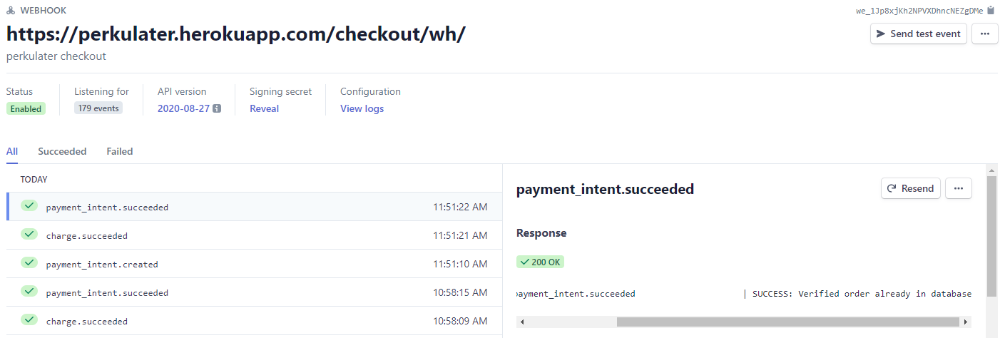

# perkulater - Testing #

## Contents ##
- [Automated Testing](#automated-testing)
    - [HTML](#html)
    - [Custom CSS Styling](#custom-css-styling)
    - [JavaScript Code Testing](#javascript-code-testing)
    - [Python Code Testing](#python-code-testing)
    - [Automated Performance And Quality Testing](#automated-performance-and-quality-testing)
- [User Stories Testing](#user-stories-testing)
- [Manual Testing](#manual-testing)
    - [Features](#features)
        - [Home](#home)
        - [Base Template](#base-template)
        - [User Authentication](#user-authentication)
        - [Contact](#contact)
        - [Products](#products)
        - [Basket](#basket)
        - [Checkout](#checkout)
        - [User Profile](#user-profile)
    - [Form Validation](#form-validation)
    - [Responsive Design Testing](#responsive-design-testing)
    - [Browser Compatibility Testing](#browser-compatibility-testing)
    - [Stripe Webhook Handler Testing](#stripe-webhook-handler-testing)
    - [Restricted Features Security Testing](#restricted-features-security-testing)
- [Bugs Fixed During Testing](#bugs-fixed-during-testing)
- [Bugs Remaining](#bugs-remaining)

## Automated Testing ##

### HTML ###
All **HTML** code was validated using the [W3C Markup Validation Service](https://validator.w3.org/) 
regularly during the development process. **The HTML Source Code** was regularly viewed for each page 
using **Google Chrome** (right click, *View page source*) and passed through the 
[W3C Markup Validation Service](https://validator.w3.org/).  
Various minor errors were encountered and corrected during the final **HTML** validation check. 
All HTML code now passes validation with no errors or warnings. See [HTML Validation Reports](media/testing/validation/html).

### Custom CSS Styling ###
**Custom CSS Styling** from [base.css](static/css/base.css), [basket.css](basket/static/basket/css/basket.css), 
[checkout.css](checkout/static/checkout/css/checkout.css), [home.css](home/static/home/css/home.css), 
[products.css](products/static/products/css/products.css), and [profiles.css](profiles/static/profiles/css/profiles.css)
was validated using the [W3C CSS Validation Service](https://jigsaw.w3.org/css-validator/).  
No errors were generated. Some *"Due to their dynamic nature, CSS variables are currently not statically checked"* 
warnings were generated. See [CSS Validation Reports](media/testing/validation/css).  
These warnings are related to the global variables declared at the top of [base.css](/static/css/base.css). 
The warnings are generated because the [W3C CSS Validation Service](https://jigsaw.w3.org/css-validator/) 
does not currently support CSS global variable declaration, and are not considered to be an issue. 
See [Github Link](https://github.com/w3c/css-validator/pull/173).
Some additional *"vendor extension"* warnings were also generated in **base.css**. These warnings are not considered to be an issue - 
the vendor extensions are to enable correct display of the **Background Image** linear gradient and various **Form** elements in different browsers.  

### JavaScript Code Testing ##
The custom [base.js](static/js/base.js), [basket.js](basket/static/basket/js/basket.js), [checkout.js](checkout/static/checkout/js/checkout.js), 
[home.js](home/static/home/js/home.js), [products.js](products/static/products/js/products.js), and [profiles.js](profiles/static/profiles/js/profiles.js) 
**JavaScript Code Libraries** were validated using the [JSHint](https://jshint.com/about/) static code analysis tool, and passed without errors or warnings.
See [JavaScript Validation Reports](media/testing/validation/js). 
Due to the lack of complexity of **JavaScript** code implemented on the project, **Automated Unit Testing** 
of the **JavaScript** code was considered unecessary. All **JavaScript** functions and event handlers in the custom **JavaScript Code Libraries** 
have been thoroughly manually de-bugged and tested in the console as part of the [Manual Testing](#manual-testing) process.  

### Python Code Testing ##
All **Python Code** was thoroughly de-bugged and tested at the command line during the development process, and has been validated 
using [Flake 8](https://pypi.org/project/flake8/). [flake8-django](https://pypi.org/project/flake8-django/) was installed to assist with validation.  
**Flake 8** was configured for **perkulater** by creating a `setup.cfg` file in the root of the project, which contains the following settings:
```
[flake8]
exclude = */migrations/*.py, *__init__.py, *_pychache_*
per-file-ignores = *apps.py:F401, *settings.py:E501
```
The settings exclude **django** migrations, `__init__.py`, and `_pychache_` files, as these are system generated files and do not need to be checked.  
*F401* (imported but unused) errors are ignored for *apps.py, as **Flake8** was generating an error on **Django** signals being imported but unused. 
Signals need to be imported into the **app** config files to ensure correct operation of the code.  
*E501* (line too long) errors are ignored for `settings.py` as it is not possible to shorten the affected lines of code without causing application errors.  

**Flake 8** output is shown here [Python Code Automated Testing And Flake8 Output](media/testing/validation/python/python-automated-testing-output.png).

Python **Automated Unit Testing** was implemented using the [Django Unit Testing](https://docs.djangoproject.com/en/3.2/topics/testing/overview/) framework.  
**Unit Tests** have been written for all **Forms**, **Model Methods**, **Signals** and **Views**, for each **Django App** in  the **perkulater** project. 
A total of **138** **Unit Tests** have been written. After **Unit Testing** was implemented, **Unit Tests** were run each time a feature was added or changed.  
All **138** tests run successfully without errors or warnings, see [Python Code Automated Testing And Flake8 Output](media/testing/validation/python/python-automated-testing-output.png).  

### Automated Performance And Quality Testing ###
Performance and Quality was tested with the [Lighthouse](https://chrome.google.com/webstore/detail/lighthouse/blipmdconlkpinefehnmjammfjpmpbjk?hl=en) 
extension for [Google Chrome](https://www.google.com/intl/en_uk/chrome/). 

Initial [Lighthouse](https://chrome.google.com/webstore/detail/lighthouse/blipmdconlkpinefehnmjammfjpmpbjk?hl=en) scores are tabulated below:  

Page|Performance|Accessiblity|Best Practices|SEO|
----|-----------|------------|--------------|---|
Home|98|100|100|100
Products|81|100|100|92
Product Detail|85|91|100|92

See [Initial Lighthouse Reports](media/testing/validation/performance/initial).

To improve **Accesibility** and **SEO**, missing *href tags* and *aria-label* atttributes were added to the some of the buttons and links in the **HTML Templates**.

To improve **Best Practices** and **Performance**, the **Product** images were resized to 317px x 422px (this is the maximum size the image is displyed at), 
and compressed using the [RIOT](https://riot-optimizer.com/) image optimisation tool.  
The **Background** image was also re-sized to 2400px x 1600px and compressed using the [RIOT](https://riot-optimizer.com/) image optimisation tool.  
[WebP](https://developers.google.com/speed/webp) versions of the **Product** and **Background** images were created, resulting in much smalller image files.  
*Webp* images are implemented for the **Product** images with *png* fallback for browsers that do not support *Webp* using the html *picture* tag.  
An additional field, *image_alt* was added to the **Product** model to enable the fallback image to be specified for each product.  
The **Product Add** and **Product Edit** pages were updated to include image file selectors for the new *image_alt* field.  
This will enable the **perkulater** store administrator to add a *Webp* image with *png* or *jpg* fallback for any future **Products**. 
A *Webp* image with *png* fallback was also implemented for the **Background** image using the [Modernizr](https://modernizr.com/) browser detector tool.  
A custom configuration of [Modernizr](https://modernizr.com/), customized to detect *WebP* image support has been added to the **perkulater** [code base](static/js/libraries).  
This detects if the browser has *Webp* support, and adds a css class (either *webp* or *no-webp*) to the *html* element.  
The [base.css](static/css/base.css) was updated to test for *WebP* image support, and load the correct **Background Image**.  

Loading of **Stripe JavaScript** was moved from the **base** template to the **checkout** template, to reduce the **JavaScript** overhead on pages where **Stripe** is not required.  

These changes resulted in a significant increase in **Performance**.  

Final [Lighthouse](https://chrome.google.com/webstore/detail/lighthouse/blipmdconlkpinefehnmjammfjpmpbjk?hl=en) scores are tabulated below:  

Page|Performance|Accessiblity|Best Practices|SEO|
----|-----------|------------|--------------|---|
Home|99|100|100|100
Products|97|100|100|100
Product Detail|98|100|100|100
Product Add|98|100|100|100
Product Edit|99|100|100|100
Product Review|98|100|100|100
Basket|98|100|100|100
Checkout|92|100|100|100
Checkout Success|97|100|100|100
Contact|99|100|100|100
Sign In|99|100|100|100
Sign Up|99|100|100|100
User Profile|98|100|100|100
Order Details|98|100|100|100
Order Contact|98|100|100|100


See [Final Lighthouse Reports](media/testing/validation/performance/final).

To further improve performance, consideration should be given in a **Future Development Phase** to optimising **Bootstrap** by only importing the required components. 
See this [Link](https://getbootstrap.com/docs/5.0/customize/optimize/) for further information.

## User Stories Testing ###
As a **Potential Customer**, I would like to be able to:  
<br>
* Immediately understand the intent of the site.  
The **Home Page** explains the purpose of the **perkulater** site, in a simple and elegant way.  
Functionality has been tested and works as expected:   
  


* View and navigate the site on all devices.  
**Responsive Design** using **Bootstrap** has been implemented on the **perkulater** site, to enable the site to be viewed and navigated on all devices.  
See [Responsive Design Testing](#responsive-design-testing) section.  

* Learn about the coffees on offer, including a description of the flavours, so I can make an informed purchasing decision.  
The **Product Detail** page includes detailed information about the **Coffees** on offer.  
Functionality has been tested and works as expected:   
  

* Learn about where the coffee beans are sourced from, so I can make an informed purchasing decision.  
The **Product Information Modal**, accessed from the **Product Information Button** on the **Product Detail Page** contains further detailed information about the **Product** on offer.  
Functionality has been tested and works as expected:  
  

* Understand the delivery charges, and how much I need to spend to get free delivery, so I can make an informed purchasing decision.  
Information on the **Delivery Charges** can be found in the **Delivery Information Modal**, accessed from **Delivery Information Button** on the **Basket** and **Checkout** pages, 
and the **Free Delivery** offer is also shown in the **Offer Banner**.  
Functionality has been tested and works as expected:  
  
  

* Add products to my cart, so I can make a purchase.  
Products can be added to the **Basket** using the **Add To Basket** button on the **Product Detail** page.  
Functionality has been tested and works as expected:  
  

* Receive confirmation of my purchase via email, so I can be confident that the purchase has been made successfully.  
A confirmation email is sent to the **User** when they make a purchase.  
Functionality has been tested and works as expected:  
  

* Register on the site, so I can make a repeat purchase more easily and get access to any rewards on offer.  
The **Sign Up** page allows an unauthenticated user to register for an account.  
**Form Validation** and functionality have been tested and work as expected:  
  

* Contact the business with a general query.  
The **Contact** page allows any **User** of the site to contact the business.  
**Form Validation** and functionality have been tested and work as expected:  
  

* Subscribe for a regular purchase of a product.  
This feature does not form part of the **Phase 1 Development**, and will be added in a future development phase.  

As a **Registered User**, I would like to be able to:  
<br>
* Sign in to my account. 
The **Sign In** page allows a registered user to **Sign In** to their account.  
**Form Validation** and functionality have been tested and work as expected:  
  

* Sign out of my account.  
The **Sign Out** page allows a signed in user to **Sign Out** of their account.  
Functionality has been tested and works as expected:    
  

* Recover a forgotten password.
The **Forgot Password** page allows a registered user to reset their password.  
**Form Validation** and functionality have been tested and work as expected:  
<p float="left">
    
    
</p>
<p float="left">
    
    
    
</p>

* View and update my personal profile, including default delivery details.  
The **User Profile** page allows a registered **User** to update their personal profile and default delivery information.  
**Form Validation** and functionality have been tested and work as expected:  
  

* See a summary of my previous orders.  
The **User Profile** page allows a registered **User** to see a summary of their **Order History**.  
Detailed information about each **Order** can be found on the **Order History** page, accessed by clicking on the **Order Number**.  
Functionality has been tested and works as expected:  
  
  

* Contact the business about a specific order.  
The business can be contacted about a specific order using the **Order Contact** page, accessed from the **Order History** page.  
**Form Validation** and functionality have been tested and work as expected:  
<p float="left">
    
    
</p>

* Add reviews to products, to help other customers make informed purchasing decisions.  
Customers can add a new **review** using the **Add Review** link in the **Customer Review** section of the **Product Detail** page.  
**Reviews** may also be added using the **Review** links in the **Order History** section of the **User Profile** page.  
**Form Validation** and functionality have been tested and work as expected:  
  
<p float="left">
     
    
</p>

* Edit previous reviews.  
Customers can edit existing reviews using the **Edit** link in the **Customer Review** section of the **Product Detail** page.  
**Reviews** may also be edited using the **Review** links in the **Order History** section of the **User Profile** page.  
**Form Validation** and functionality have been tested and work as expected:  
  
<p float="left">
     
    
</p>

As a **Business Owner**, I would like to be able to:
* Incentivise customers to add reviews to products, so that other customers will feel more confident about making a purchase.  
A **Reward** system has been implemented, where a registered **User** can get 10% off their next **Order** by adding a new **Review**. 
This is communicated to the **User** in the **Offer Banner**, and on the **Basket** and **Checkout** pages.  
The functionality has been tested and works as expected:  
  
<p float="left">
     
    
</p>
<p float="left">
     
    
</p>

* Add, edit and delete products.  
**Products** may be added using the **Product Add** page, accessed from the **User Menu** if the **User** is signed in as a **Super User**.  
**Products** may be edited using the **Product Edit** page, accessed from the **Product Detail** page if the **User** is signed in as a **Super User**.  
**Products** may be discontinued using the **Discontinued** check box on the **Product Add** and **Product Edit** page if the **User** is signed in as a **Super User**. 
**Products** may be deleted using the **Product Delete** button, accessed from the **Product Detail** page if the **User** is signed in as a **Super User**.  
**Form Validation** and functionality have been tested and work as expected:  
<p float="left">
    
    
     
</p>
<p float="left">
    
    
     
</p>
<p float="left">
    
    
</p>

* Edit product prices.  
**Product** **Prices** can be edited using the **Edit Prices** page, accessed from the **Product Detail** page **Price Edit** link if the **User** is signed in as a **Super User**.  
**Form Validation** and functionality have been tested and work as expected:  
<p float="left">
    
    
</p>

* Delete user reviews, in case malicious reviews are added.  
**User** reviews may be deleted by selecting the **Delete Review** links in the **Customer Reviews** section of the **Product Detail** page, if the **User** is signed in as a **Super User**.  
The functionality has been tested and works as expected:  
  
 


* Add, edit and delete product categories.  
This feature does not form part of the **Phase 1 Development**, and will be added in a future development phase.  
* Track sales data, to inform future purchasing decisions.  
This feature does not form part of the **Phase 1 Development**, and will be added in a future development phase.  


## Manual Testing ##
The site has been manually tested thoroughly over a 3 week period. See [Bugs Fixed During Testing](#bugs-fixed-during-testing) 
for bugs uncovered and fixed during the manual testing process.  
Please note that an account with **Super User** privileges has been created for testing purposes. This will facilitate testing of 
features which require **Super User** privileges. The *username* and *password* will be supplied on submission of the project.

### Features ###
The following **Features** have been explicitly tested:

#### Home ####
Page or Section|Feature|Style Check|Hover, Focus Style Check|Functionality Check|Pass, Fail|Notes
---------------|-------|-----------|------------------------|-------------------|----------|-----
Home|Fade-in Animation|Yes|-|Yes|Pass|-
Home|Logo|Yes|-|-|Pass|-
Home|Horizontal Rule|Yes|-|-|Pass|-
Home|Tagline|Yes|-|Yes|Pass|-
Home|Shop Button|Yes|Yes|Yes|Pass|Links to **Products**

#### Base Template ####
Page or Section|Feature|Style Check|Hover, Focus Style Check|Functionality Check|Pass, Fail|Notes
---------------|-------|-----------|------------------------|-------------------|----------|-----
Navigation Menu|Logo|Yes|-|Yes|Pass|-
Navigation Menu|Tagline|Yes|-|-|Pass|-
Navigation Menu|Search Input|Yes|Yes|Yes|Pass|-
Navigation Menu|Search Button|Yes|Yes|Yes|Pass|Returns search results
Navigation Menu|Basket Icon|Yes|Yes|Yes|Pass|-
Navigation Menu|User Dropdown Menu - Contact|Yes|Yes|Yes|Pass|-
Navigation Menu|User Dropdown Menu - Sign In|Yes|Yes|Yes|Pass|-
Navigation Menu|User Dropdown Menu - Profile|Yes|Yes|Yes|Pass|Only shown if signed-in
Navigation Menu|User Dropdown Menu - Sign Out|Yes|Yes|Yes|Pass|Only shown if signed-in
Navigation Menu|User Dropdown Menu - Add Product|Yes|Yes|Yes|Pass|Only shown if signed-in as super-user
Navigation Menu|Horizontal Rule|Yes|-|-|Pass|-
Footer|Horizontal Rule|Yes|-|-|Pass|-
Footer|Tagline|Yes|-|Yes|Pass|-
Footer|Horizontal Rule|Yes|-|-|Pass|-
Footer|Social Media Links|Yes|Yes|Yes|Pass|perkulater social media accounts not created at this stage

#### User Authentication ####
Page or Section|Feature|Style Check|Hover, Focus Style Check|Functionality Check|Pass, Fail|Notes
---------------|-------|-----------|------------------------|-------------------|----------|-----
Sign Up|Title|Yes|-|-|Pass|
Sign Up|Sign In Link|Yes|Yes|Yes|Pass|Links to **Sign In** page.
Sign Up|Field Labels|Yes|-|-|Pass|Required fields denoted with *.
Sign Up|Field Placeholders|Yes|-|-|Pass|
Sign Up|E-mail|Yes|Yes|Yes|Pass|Field required. Must be a valid email address.
Sign Up|E-mail (again)|Yes|Yes|Yes|Pass|Field required. Must match E-mail.
Sign Up|Username|Yes|Yes|Yes|Pass|Field required. Must be fewer than 150 characters. Must be unique.
Sign Up|Password|Yes|Yes|Yes|Pass|Must at least 8 characters.
Sign Up|Password (again)|Yes|Yes|Yes|Pass|Must match password.
Sign Up|Sign Up Button|Yes|Yes|Yes|Pass|Sends confirmation email to **User**.
Sign Up - Verify Email|Title|Yes|-|-|Pass|
Sign Up - Verify Email|Test|Yes|-|-|Pass|
Sign Up - Confirm Email|Title|Yes|-|-|Pass|
Sign Up - Confirm Email|Text|Yes|-|-|Pass|Correct email address shown in green.
Sign Up - Confirm Email|Confirm Button|Yes|Yes|Yes|Pass|Links to Sign In page, with username and password populated.
Sign In|Title|Yes|-|-|Pass|
Sign In|Text|Yes|-|-|Pass|
Sign In|Sign Up Link|Yes|Yes|Yes|Pass|Links to **Sign Up** page.
Sign In|Field Labels|Yes|-|-|Pass|Required fields denoted with *.
Sign In|Field Placeholders|Yes|-|-|Pass|
Sign In|Login|Yes|Yes|Yes|Pass|Field required. Must match username or email address stored in database
Sign In|Password|Yes|Yes|Yes|Pass|Field required. Must match password stored in database.
Sign In|Remember Me Checkbox|Yes|Yes|Yes|Pass|Autofills Login and Password if checked.
Sign In|Sign In Button|Yes|Yes|Yes|Pass|Signs **User** in, links to the page the **User** was on previously.
Sign In|Forgot Password Button|Yes|Yes|Yes|Pass|Links to the **Password Reset** page.
Sign Out|Title|Yes|-|-|Pass|
Sign Out|Text|Yes|-|-|Pass|
Sign Out|Sign Out Button|Yes|Yes|Yes|Pass|Signs out **User**, links to the **Products** page.
Password Reset|Title|Yes|-|-|Pass|
Password Reset|Text|Yes|-|-|Pass|
Password Reset|Field Labels|Yes|-|-|Pass|Required fields denoted with *.
Password Reset|Field Placeholders|Yes|-|-|Pass|
Password Reset|E-mail|Yes|Yes|Yes|Pass|Field required. Must be a valid, registered email address.
Password Reset - Email Sent|Title|Yes|-|-|Pass|
Password Reset - Email Sent|Text|Yes|-|-|Pass|
Password Reset - Change Password|Title|Yes|-|-|Pass|
Password Reset - Change Password|New Password|Yes|Yes|Yes|Pass|Must be at least 8 characters.
Password Reset - Change Password|Mew Password (again)|Yes|Yes|Yes|Pass|Must match password.
Password Reset - Success|Title|Yes|-|-|Pass|
Password Reset - Success|Text|Yes|-|-|Pass|

#### Contact ####
Page or Section|Feature|Style Check|Hover, Focus Style Check|Functionality Check|Pass, Fail|Notes
---------------|-------|-----------|------------------------|-------------------|----------|-----
Contact|Title|Yes|-|-|Pass|
Contact|Horizontal Rule|Yes|-|-|Pass|-
Contact|Field Labels|Yes|-|-|Pass|Required fields denoted with *.
Contact|Field Placeholders|Yes|-|-|Pass|
Contact|Email|Yes|Yes|Yes|Pass|Field required. Must be a valid email address.
Contact|Subject|Yes|Yes|Yes|Pass|Field required.
Contact|Message|Yes|Yes|Yes|Pass|Field required.
Contact|Keep Shopping Button|Yes|Yes|Yes|Pass|Links to the **Products** page.
Contact|Send Message Button|Yes|Yes|Yes|Pass|Sends contact message. Message received in **perkulater** email account inbox.

#### Products ####
Page or Section|Feature|Style Check|Hover, Focus Style Check|Functionality Check|Pass, Fail|Notes
---------------|-------|-----------|------------------------|-------------------|----------|-----
Products|Offer Banner|Yes|-|-|Pass|-
Products|Product Image Link|Yes|Yes|Yes|Pass|Links to **Product Detail**
Products|Product Name|Yes|-|-|Pass|-
Products|Product Rating Stars|Yes|-|Yes|Pass|-
Products|Product Price|Yes|-|-|Pass|-
Products|Buy Button|Yes|Yes|Yes|Pass|-
Product Detail|Product Image Link|Yes|Yes|Yes|Pass|Links to **Product Information Modal**
Product Detail|Product Name|Yes|-|-|Pass|
Product Detail|Coffee Flavour Profile|Yes|-|-|Pass|
Product Detail|Product Rating Stars|Yes|-|Yes|Pass|Correctly updated from *product_rating* field.
Product Detail|Product Price|Yes|-|-|Pass|
Product Detail|Keep Shopping Button|Yes|Yes|Yes|Pass|Links to **Products**.
Product Detail|Coffee Information Link|Yes|Yes|Yes|Pass|Links to **Product Information Modal**
Product Detail|Product Information Modal|Yes|Yes|Yes|Pass|Information correctly split into paragraphs with delimiter.
Product Detail|Coffee Details - Container|Yes|-|-|Pass
Product Detail|Coffee Details - Text|Yes|-|-|Pass|-
Product Detail|Coffee Options - Container|Yes|-|-|Pass
Product Detail|Size Information Link|Yes|Yes|Yes|Pass|Links to **Size Information Modal**.
Product Detail|Size Information Modal|Yes|Yes|Yes|Pass|Title and content of modal correctly set.
Product Detail|Size Select|Yes|Yes|Yes|Pass|Options correctly populated
Product Detail|Type Information Link|Yes|Yes|Yes|Pass|Links to **Type Information Modal**.
Product Detail|Type Information Modal|Yes|Yes|Yes|Pass|Title and content of modal correctly set.
Product Detail|Type Select|Yes|Yes|Yes|Pass|Options correctly populated.
Product Detail|Quantity Buttons|Yes|Yes|Yes|Pass|Buttons update price on click, disabled correctly when quantity is 1 or 99.
Product Detail|Quantity Input|Yes|-|Yes|Pass|Quantity input is greyed out and automatically updated by quantity buttons.
Product Detail|Price|Yes|-|Yes|Pass|Price automatically updated by quantity buttons.
Product Detail|Price Edit Link|Yes|Yes|Yes|Pass|Only shown if signed-in as super-user, links to **Edit Price**.
Product Detail|Add To Basket Button|Yes|Yes|Yes|Pass|
Product Detail|Create Plan Button|Yes|Yes|Yes|Pass|Links to Information Modal, explains that feature is coming soon.
Product Detail|Edit Button|Yes|Yes|Yes|Pass|Only shown if signed-in as super-user. Links to **Product Edit**.
Product Detail|Delete Button|Yes|Yes|Yes|Pass|Only shown if signed-in as super-user. Links to **Confirm Modal**, to confirm deletion of **Product**.
Product Detail|Confirm Modal|Yes|Yes|Yes|Pass|Title and content correctly populated. Close and Delete buttons function as expected.  
Product Detail|Customer Reviews - Container|Yes|-|-|Pass|
Product Detail|Customer Reviews - User name|Yes|-|Yes|Pass|
Product Detail|Customer Reviews - Rating Stars|Yes|-|Yes|Pass|
Product Detail|Customer Reviews - Review|Yes|-|Yes|Pass|
Product Detail|Customer Reviews - Review Add Link|Yes|Yes|Yes|Pass|Only shown if User has not reviewed Product. Liks to **Sign In** if not signed in. Otherwise links to **Product Review**.
Product Detail|Customer Reviews - Review Delete Link|Yes|Yes|Yes|Pass|If not signed in, not shown. if signed in as standard User, Only shown for User's own reviews. If signed in as Super User, shown on all reviews. Links to **Confirm Modal**.
Product Detail|Customer Reviews - Review Edit Link|Yes|Yes|Yes|Pass|If not signed in, not shown. If signed in, only shown for User's own reviews. Links to **Product Review**.
Add Product|Title|Yes|-|-|Pass|
Add Product|Horizontal Rule|Yes|-|-|Pass|
Add Product|Fieldset Labels|Yes|-|-|Pass|
Add Product|Field Labels|Yes|-|-|Pass|Required fields denoted with *.
Add Product|Field Placeholders|Yes|-|-|Pass|Required fields denoted with *.
Add Product|Category|Yes|Yes|Yes|Pass|Dropdown populated correctly.
Add Product|Name|Yes|Yes|Yes|Pass|Field required.
Add Product|Display Name|Yes|Yes|Yes|Pass|Field required.
Add Product|Display Price|Yes|Yes|Yes|Pass|Field required.
Add Product|Full Description|Yes|Yes|Yes|Pass|Field required. Delimiter can be used to split into paragraphs in **Information Modal**.
Add Product|Short Description|Yes|Yes|Yes|Pass|Field required.
Add Product|Description Delimeter|Yes|Yes|Yes|Pass|Field required. Limited to 3 characters.
Add Product|Image|Yes|Yes|Yes|Pass|Custom clearable file input widget correctly displayed. Image filename text displayed after selection.
Add Product|Alternative Image|Yes|Yes|Yes|Pass|Custom clearable file input widget correctly displayed. Image filename text displayed after selection.
Add Product|Coffee Details - Country Of Origin|Yes|Yes|Yes|Pass|Field required.
Add Product|Coffee Details - Farm|Yes|Yes|Yes|Pass|Field required.
Add Product|Coffee Details - Owner|Yes|Yes|Yes|Pass|Field required.
Add Product|Coffee Details - Variety|Yes|Yes|Yes|Pass|Field required.
Add Product|Coffee Details - Altitude|Yes|Yes|Yes|Pass|Field required.
Add Product|Coffee Details - Town|Yes|Yes|Yes|Pass|Field required.
Add Product|Coffee Details - Region|Yes|Yes|Yes|Pass|Field required.
Add Product|Coffee Details - Flavour Profile|Yes|Yes|Yes|Pass|Field required.
Add Product|View Products Button|Yes|Yes|Yes|Pass|Links to **Products** page.
Add Product|Add Product Button|Yes|Yes|Yes|Pass|Add new **Product** to the database.
Edit Product|Title|Yes|-|-|Pass|
Edit Product|Horizontal Rule|Yes|-|-|Pass|
Edit Product|Fieldset Labels|Yes|-|-|Pass|
Edit Product|Field Labels|Yes|-|-|Pass|Required fields denoted with *.
Edit Product|Field Placeholders|Yes|-|-|Pass|Required fields denoted with *.
Edit Product|Category|Yes|Yes|Yes|Pass|Dropdown populated correctly.
Edit Product|Name|Yes|Yes|Yes|Pass|Field required.
Edit Product|Display Name|Yes|Yes|Yes|Pass|Field required.
Edit Product|Display Price|Yes|Yes|Yes|Pass|Field required.
Edit Product|Full Description|Yes|Yes|Yes|Pass|Field required. Delimiter can be used to split into paragraphs in **Information Modal**.
Edit Product|Short Description|Yes|Yes|Yes|Pass|Field required.
Edit Product|Description Delimeter|Yes|Yes|Yes|Pass|Field required. Limited to 3 characters.
Edit Product|Image|Yes|Yes|Yes|Pass|Custom clearable file input widget correctly displayed. Image filename text displayed after selection.
Edit Product|Alternative Image|Yes|Yes|Yes|Pass|Custom clearable file input widget correctly displayed. Image filename text displayed after selection.
Edit Product|Coffee Details - Country Of Origin|Yes|Yes|Yes|Pass|Field required.
Edit Product|Coffee Details - Farm|Yes|Yes|Yes|Pass|Field required.
Edit Product|Coffee Details - Owner|Yes|Yes|Yes|Pass|Field required.
Edit Product|Coffee Details - Variety|Yes|Yes|Yes|Pass|Field required.
Edit Product|Coffee Details - Altitude|Yes|Yes|Yes|Pass|Field required.
Edit Product|Coffee Details - Town|Yes|Yes|Yes|Pass|Field required.
Edit Product|Coffee Details - Region|Yes|Yes|Yes|Pass|Field required.
Edit Product|Coffee Details - Flavour Profile|Yes|Yes|Yes|Pass|Field required.
Edit Product|Back To Product Button|Yes|Yes|Yes|Pass|Links to **Product Detail** page.
Edit Product|Update Product Button|Yes|Yes|Yes|Pass|Updates **Product** in the database.
Edit Prices|Title|Yes|-|-|Pass|
Edit Prices|Horizontal Rule|Yes|-|-|Pass|
Edit Prices|Product Name|Yes|-|-|Pass|
Edit Prices|Field Labels|Yes|-|-|Pass|Required fields denoted with *.
Edit Prices|Size Dropdown|Yes|Yes|Yes|Pass|Populated with correct options.
Edit Prices|Price|Yes|Yes|Yes|Pass|Decimal required.
Edit Prices|Back To Product Button|Yes|Yes|Yes|Pass|Links to **Product Detail** page. Shown If accessed from **Product Detail** page.
Edit Prices|Update Price Button|Yes|Yes|Yes|Pass|Updates **Price** in the database for the relevant **Product**.  
Review Product|Title|Yes|-|-|Pass|
Review Product|Horizontal Rule|Yes|-|-|Pass|
Review Product|Field Labels|Yes|-|-|Pass|Required fields denoted with *.
Review Product|Rating Stars|Yes|-|Yes|Pass|
Review Product|Review|Yes|Yes|Yes|Pass|Field required.
Review Product|Back To Product Button|Yes|Yes|Yes|Pass|Links to **Product Detail** page. Shown If accessed from **Product Detail** page.
Review Product|Back To Profile Button|Yes|Yes|Yes|Pass|Links to **Product Detail** page. Shown If accessed from **User Profile** page.
Review Product|Submit Review Button|Yes|Yes|Yes|Pass|Updates **Review** in the database. Calculates average **Product** rating automatically.

#### Basket ####
Page or Section|Feature|Style Check|Hover, Focus Style Check|Functionality Check|Pass, Fail|Notes
---------------|-------|-----------|------------------------|-------------------|----------|-----
Basket|Title|Yes|-|-|Pass|
Basket|Horizontal Rule|Yes|-|-|Pass|
Basket|Product Name|Yes|-|-|Pass|
Basket|Product Image Link|Yes|Yes|Yes|Pass|Links to **Product Detail** page.
Basket|Quantity Buttons|Yes|Yes|Yes|Pass|Buttons update price on click, disabled correctly when quantity is 1 or 99.
Basket|Quantity Input|Yes|-|Yes|Pass|Quantity input is greyed out and automatically updated by quantity buttons.
Basket|Update Link|Yes|Yes|Yes|Pass|Updates Subtotal, Total, Discount, Deliver and Grand Total.
Basket|Remove Link|Yes|Yes|Yes|Pass|Removes **Product** from **Basket**. Updates Subtotal, Total, Discount, Delivery and Grand Total.
Basket|Size|Yes|-|-|Pass|
Basket|Type|Yes|-|-|Pass|
Basket|Subtotal|Yes|-|-|Pass|Updated correctly by **Update Link**.
Basket|Horizontal Rule|Yes|-|-|Pass|
Basket|Total|Yes|-|-|Pass|Updated correctly by **Update Link** and **Remove Link**.
Basket|Discount|Yes|-|-|Pass|Updated correctly by **Update Link** and **Remove Link**. Only shown if **Discount** applied.
Basket|Delivery|Yes|-|-|Pass|Updated correctly by **Update Link** and **Remove Link**.
Basket|Delivery Information Button|Yes|Yes|Yes|Pass|Opens **Information Modal** explaining delivery charges. 
Basket|Grand Total|Yes|-|-|Pass|Updated correctly by **Update Link** and **Remove Link**.
Basket|Review Discount Information Text|Yes|-|-|Pass|Not shown if discount applied.
Basket|Free Delivery Information Text|Yes|-|-|Pass|Not shown if free delivery applied.
Basket|Keep Shopping Button|Yes|Yes|Yes|Pass|Links to **Products**.
Basket|Checkout Button|Yes|Yes|Yes|Pass|Links to **Checkout**.

#### Checkout ####
Page or Section|Feature|Style Check|Hover, Focus Style Check|Functionality Check|Pass, Fail|Notes
---------------|-------|-----------|------------------------|-------------------|----------|-----
Checkout|Title|Yes|-|-|Pass|
Checkout|Horizontal Rule|Yes|-|-|Pass|
Checkout|Fieldset Labels|Yes|-|-|Pass|
Checkout|Field Placeholders|Yes|-|-|Pass|Required fields denoted with *.
Checkout|Full Name|Yes|Yes|Yes|Pass|Field required.
Checkout|Email Address|Yes|Yes|Yes|Pass|Field required. Must be a valid email address.
Checkout|Phone Number|Yes|Yes|Yes|Pass|Field required.
Checkout|Street Address 1|Yes|Yes|Yes|Pass|Field required.
Checkout|Street Address 2|Yes|Yes|Yes|Pass|Field not required.
Checkout|Town Or City|Yes|Yes|Yes|Pass|Field required.
Checkout|County, State Or Locality|Yes|Yes|Yes|Pass|Field not required.
Checkout|Post Code|Yes|Yes|Yes|Pass|Field not required.
Checkout|Country|Yes|Yes|Yes|Fail|Dropdown populated correctly. If user is not signed in and auto-populates fields in Chrome, colour is changed to white. 
Checkout|Save Delivery Information Checkbox|Yes|Yes|Yes|Pass|Only shown if **User** is signed in. Information is saved to **User Profile** if checked.
Checkout|Sign Up Link|Yes|Yes|Yes|Pass|Only shown if **User** is not signed in. Links to **Sign Up**.
Checkout|Sign In Link|Yes|Yes|Yes|Pass|Only shown if **User** is not signed in. Links to **Sign In**.
Checkout|Payment Input|Yes|Yes|Yes|Pass|Card errors are shown below **Payment Input**.
Checkout|Card Charge Information Text|Yes|Yes|Yes|Pass|Card charge amount is updated correctly.
Checkout|Edit Basket Button|Yes|Yes|Yes|Pass|Links to **Basket**.
Checkout|Pay Button|Yes|Yes|Yes|Pass|Submits **Payment Form** and Links to **Checkout Success**.
Checkout|Product Summary Text|Yes|-|-|Pass|
Checkout|Horizontal Rule|Yes|-|-|Pass|
Checkout|Product Name|Yes|-|-|Pass|
Checkout|Product Image Link|Yes|Yes|Yes|Pass|Links to **Product Detail** page.
Checkout|Quantity|Yes|-|-|Pass|
Checkout|Size|Yes|-|-|Pass|
Checkout|Type|Yes|-|-|Pass|
Checkout|Subtotal|Yes|-|-|Pass|
Checkout|Horizontal Rule|Yes|-|-|Pass|
Checkout|Total|Yes|-|-|Pass|
Checkout|Discount|Yes|-|-|Pass|Only shown if **Discount** applied.
Checkout|Delivery|Yes|-|-|Pass|
Checkout|Delivery Information Button|Yes|Yes|Yes|Pass|Opens **Information Modal** explaining delivery charges. 
Checkout|Grand Total|Yes|-|-|Pass|
Checkout|Review Discount Information Text|Yes|-|-|Pass|Not shown if discount applied.
Checkout|Free Delivery Information Text|Yes|-|-|Pass|Not shown if free delivery applied.
Checkout Success|Title|Yes|-|-|Pass|
Checkout Success|Horizontal Rule|Yes|-|-|Pass|
Checkout Success|Order Information Text|Yes|-|-|Pass|Email, Order Number, Order Date are correct.
Checkout Success|Horizontal Rule|Yes|-|-|Pass|
Checkout Success|Your Details Text|Yes|-|-|Pass|name, email and phone number checked and correct.
Checkout Success|Delivery Details Text|Yes|-|-|Pass|Delivery Details checked and correct.
Checkout Success|Horizontal Rule|Yes|-|-|Pass|
Checkout Success|Product Name|Yes|-|-|Pass|
Checkout Success|Product Image Link|Yes|Yes|Yes|Pass|Links to **Product Detail** page.
Checkout Success|Size|Yes|-|-|Pass|
Checkout Success|Type|Yes|-|-|Pass|
Checkout Success|Quantity|Yes|-|-|Pass|
Checkout Success|Subtotal|Yes|-|-|Pass|
Checkout Success|Horizontal Rule|Yes|-|-|Pass|
Checkout Success|Total|Yes|-|-|Pass|
Checkout Success|Discount|Yes|-|-|Pass|Only shown if **Discount** applied.
Checkout Success|Delivery|Yes|-|-|Pass|
Checkout Success|Grand Total|Yes|-|-|Pass|
Checkout Success|Keep Shopping Button|Yes|Yes|Yes|Pass|Links to **Products**.

#### User Profile ####
Page or Section|Feature|Style Check|Hover, Focus Style Check|Functionality Check|Pass, Fail|Notes
---------------|-------|-----------|------------------------|-------------------|----------|-----
User Profile|Title|Yes|-|-|Pass|
User Profile|Horizontal Rule|Yes|-|-|Pass|
User Profile|Fieldset Labels|Yes|-|-|Pass|
User Profile|Field Placeholders|Yes|-|-|Pass|Required fields denoted with *.
User Profile|First Name|Yes|Yes|Yes|Pass|Field required.
User Profile|Last Name|Yes|Yes|Yes|Pass|Field required.
User Profile|Phone Number|Yes|Yes|Yes|Pass|Field required.
User Profile|Street Address 1|Yes|Yes|Yes|Pass|Field required.
User Profile|Street Address 2|Yes|Yes|Yes|Pass|Field not required.
User Profile|Town Or City|Yes|Yes|Yes|Pass|Field required.
User Profile|County, State Or Locality|Yes|Yes|Yes|Pass|Field not required.
User Profile|Post Code|Yes|Yes|Yes|Pass|Field not required.
User Profile|Country|Yes|Yes|Yes|Pass|Dropdown populated correctly.
User Profile|Update Profile Button|Yes|Yes|Yes|Pass|Updates **UserProfile** in database.
User Profile|Order History Title|Yes|-|-|Pass|
User Profile|Order History Title|Yes|-|-|Pass|
User Profile|Order History Accordion|Yes|-|Yes|Pass|Accordion items shown by date.
User Profile|Order History Accordion - Open Accordion Button|Yes|-|Yes|Pass|Expands accordion as expected.
User Profile|Order History Accordion - Order Number Link|Yes|Yes|Yes|Pass|Links to **Order History**.
User Profile|Order History Accordion - Product Name|Yes|-|-|Pass|
User Profile|Order History Accordion - Product Review Link|Yes|Yes|Yes|Pass|Links to **Product Review**. Back button text in **Product Review** changed to **Back To Profile**. 
User Profile|Order History Accordion - Product Quantity|Yes|-|-|Pass|
User Profile|Order History Accordion - Grand Total|Yes|-|-|Pass|
Order History|Title|Yes|-|-|Pass|
Order History|Horizontal Rule|Yes|-|-|Pass|
Order History|Order Information Text|Yes|-|-|Pass|Email, Order Number, Order Date are correct.
Order History|Horizontal Rule|Yes|-|-|Pass|
Order History|Your Details Text|Yes|-|-|Pass|name, email and phone number checked and correct.
Order History|Delivery Details Text|Yes|-|-|Pass|Delivery Details checked and correct.
Order History|Horizontal Rule|Yes|-|-|Pass|
Order History|Product Name|Yes|-|-|Pass|
Order History|Product Image Link|Yes|Yes|Yes|Pass|Links to **Product Detail** page.
Order History|Size|Yes|-|-|Pass|
Order History|Type|Yes|-|-|Pass|
Order History|Quantity|Yes|-|-|Pass|
Order History|Subtotal|Yes|-|-|Pass|
Order History|Horizontal Rule|Yes|-|-|Pass|
Order History|Total|Yes|-|-|Pass|
Order History|Discount|Yes|-|-|Pass|Only shown if **Discount** applied.
Order History|Delivery|Yes|-|-|Pass|
Order History|Grand Total|Yes|-|-|Pass|
Order History|Back To Profile Button|Yes|Yes|Yes|Pass|Links to **User Profile**.
Order History|Contact Button|Yes|Yes|Yes|Pass|Links to **Order Contact**.
Order Contact|Title|Yes|-|-|Pass|
Order Contact|Horizontal Rule|Yes|-|-|Pass|-
Order Contact|Order Number|Yes|-|-|Pass|Populated correctly from database.
Order Contact|Order Date|Yes|-|-|Pass|Populated correctly from database.
Order Contact|Field Labels|Yes|-|-|Pass|Required fields denoted with *.
Order Contact|Field Placeholders|Yes|-|-|Pass|
Order Contact|Message|Yes|Yes|Yes|Pass|Field required.
Order Contact|View Order Button|Yes|Yes|Yes|Pass|Links to the **Order History** page.
Order Contact|Send Message Button|Yes|Yes|Yes|Pass|Sends contact message. Message received in **perkulater** email account inbox.

#### Toast Messages ####
Page or Section|Feature|Style Check|Hover, Focus Style Check|Functionality Check|Pass, Fail|Notes
---------------|-------|-----------|------------------------|-------------------|----------|-----
Toast Message|Title|Yes|-|-|Pass|Title and colour shown correctly for Success, Warning, Information and Error Messages.
Toast Message|Test|Yes|-|-|Pass|
Toast Message|Horizontal Rule|Yes|-|-|Pass|
Toast Message|Product Name|Yes|-|-|Pass|
Toast Message|Product Image|Yes|-|-|Pass|
Toast Message|Quantity|Yes|-|-|Pass|
Toast Message|Size|Yes|-|-|Pass|
Toast Message|Type|Yes|-|-|Pass|
Toast Message|Subtotal|Yes|-|-|Pass|
Toast Message|Horizontal Rule|Yes|-|-|Pass|
Toast Message|Total|Yes|-|-|Pass|
Toast Message|Discount|Yes|-|-|Pass|Only shown if **Discount** applied.
Toast Message|Delivery|Yes|-|-|Pass|
Toast Message|Grand Total|Yes|-|-|Pass|
Toast Message|Review Discount Information Text|Yes|-|-|Pass|Not shown if discount applied.
Toast Message|Free Delivery Information Text|Yes|-|-|Pass|Not shown if free delivery applied.

### Form Validation ###
Validation for all **Forms** implemented using [Django Forms](https://docs.djangoproject.com/en/3.2/topics/forms/) has been 
thoroughly tested and documented as part of the [Manual Testing](#manual-testing) procedure.

### Responsive Design Testing ###
* Responsive design has been tested by using [Chrome DevTools](https://developers.google.com/web/tools/chrome-devtools) 
to emulate viewing the website on a number of devices with varying screen dimensions, 
including iPhone 5/SE, iPhone 6/7/8, iPhone 6/7/8 plus, iPhone 11, iPad, iPad Pro, Moto G4, Galaxy S5, Surface Duo, 
Galaxy Fold, Widescreen Laptop and Desktop PC. 
See [Responsive Design Testing](media/testing/responsive/) screen prints, a selection of which are shown below:  
<p float="left">
    
    
</p>
<p float="left">
    
</p>
<p float="left">
    
    
</p>
<p float="left">
    
</p>
<p float="left">
    
    
</p>
<p float="left">
    
</p>
<p float="left">
    
    
</p>
<p float="left">
    
</p>
<p float="left">
    
    
</p>
<p float="left">
    
</p>
<p float="left">
    
    
</p>
<p float="left">
    
</p>
<p float="left">
    
    
</p>
<p float="left">
    
</p>
<p float="left">
    
    
</p>
<p float="left">
    
</p>

* Responsive design was then further tested using the 
[Responsive Viewer](https://chrome.google.com/webstore/detail/responsive-viewer/inmopeiepgfljkpkidclfgbgbmfcennb?hl=en)
plug in for chrome. This emulates viewing the website on a large number of devices, 
including iPhone XR, iPhone XS Max, iPhone XS, iPhone X, Galaxy S9 Plus, Galaxy S8 Plus, Galaxy S9, Note 8, Note S8, Pixel 3 and Pixel 3XL.  
See [Responsive Design Testing](media/testing/responsive) screen prints, a selection of which are also shown below:  
<p float="left">
    
    
</p>
<p float="left">
    
    
</p>
<p float="left">
    
    
</p>
<p float="left">
    
    
</p>
<p float="left">
    
    
</p>
<p float="left">
    
    
</p>
<p float="left">
    
    
</p>
<p float="left">
    
    
</p>

The following **Responsive** features were specifically tested:
* The **Navigation Menu** collapses as intended to an icon on small devices less than 576 pixels wide. Checked:  
  

* The **Products** page is shown as a 2 item wide grid, and stacks to a 1 item wide grid on devices less than 768 pixels wide. Checked.
* The **Product Detail** page stacks logically on devices less than 768 pixels wide. Checked.
* The **Product Summary** on the **Basket** page is shown as a 2 item wide grid, and stacks to a 1 item wide grid on devices less than 768 pixels wide. Checked.
* **Delivery Details** on the **Checkout Success** page stacks underneath the **Your Details** on devices less than 768 pixels wide. Checked.
* The **Product Summary** on the **Checkout Success** page is shown as a 2 item wide grid, and stacks to a 1 item wide grid on devices less than 768 pixels wide. Checked. 
* **Delivery Details** on the **Order History** page stacks underneath the **Your Details** on devices less than 768 pixels wide. Checked.
* The **Order History** on the **User Profile** page stacks underneath the **User Profile Form** on devices less than 768 pixels wide. Checked. 
* The **Product Summary** on the **Order History** page is shown as a 2 item wide grid, and stacks to a 1 item wide grid on devices less than 768 pixels wide. Checked.
* Various **Text** elements, the **perkulater logo**, **Form Labels**, **Links**, **Toast Messages**, **Containers** and extra large **Button** elements are re-sized on very small devices less than 370px wide. Checked.

### Browser Compatibility Testing ###
The website was tested on the following browsers and operating systems, 
using a combination of manual testing across various devices and the [Browserstack](https://www.browserstack.com/) emulator:
* [Google Chrome](https://www.google.com/intl/en_uk/chrome/) ([Windows 10](https://www.microsoft.com/en-us/windows), [Android 11](https://www.android.com/android-11/) and [Mac OS Big Sur](https://www.apple.com/uk/macos/big-sur/)).
* [Microsoft Edge](https://www.microsoft.com/en-us/edge) ([Windows 10](https://www.microsoft.com/en-us/windows) and [Mac OS Big Sur](https://www.apple.com/uk/macos/big-sur/)).
* [Microsoft Internet Explorer 11](https://support.microsoft.com/en-us/topic/internet-explorer-downloads-d49e1f0d-571c-9a7b-d97e-be248806ca70#ID0EBBD=Windows_10) ([Windows 10](https://www.microsoft.com/en-us/windows)).
* [Safari](https://www.apple.com/uk/safari/) ([Mac OS Big Sur](https://www.apple.com/uk/macos/big-sur/) and [iOS](https://www.apple.com/uk/ios/ios-14/)).
* [Firefox](https://www.mozilla.org/en-GB/firefox/new/) ([Windows 10](https://www.microsoft.com/en-us/windows) and [Mac OS Big Sur](https://www.apple.com/uk/macos/big-sur/)).
* [Opera](https://www.opera.com/) ([Windows 10](https://www.microsoft.com/en-us/windows) and [Mac OS Big Sur](https://www.apple.com/uk/macos/big-sur/)).  

One minor issue was uncovered during **Browser Compatibility Testing**.  
Placeholder text for the *textarea* input on the **Contact** and **Order Contact** was not displaying in the correct colour. Vendor specific placeholder styling was added to the **base** css to rectify the issue. 

### Stripe Webhook Handler Testing ###
The following tests have been run on the **Stripe** webhook handler:  
* Checkout a purchase succesfully, and check the **Stripe** *Webhook* panel. The *Response* is shown as *200 OK* and the *webhook* has correctly returned `SUCCESS: Verified order already in database`.
* Comment out **Payment Form** submission in [checkout.js](checkout/static/checkout/js/checkout.js) to simulate a form submission error, and checkout a purchase.
Within the **Stripe** *Webhook* panel, the *Response* is shown as *200 OK* and the *webhook* has correcty returned `SUCCESS: Created order in webhook`. The database was also checked to confirm that the **Order** has been added correctly by the *webhook*.  
  


### Restricted Features Security Testing ###
* **Product Add**, **Product Edit**, **Product Delete**, **Edit Prices** and **Delete Review** are all restricted to **Super Users**. If an unauthenticated **User** attemps to navigate to any of these pages by manually typing the *url* into the search bar, they are redirected to the **Sign In** page. This is accomplished by applying the **django** `@login_required` decorater on the **View** functions.  If an authenticated **User** who is not a **Super User** attemps to navigate to any of these pages by manually typing the *url* into the search bar, they are redirected to the **Products** page and a **Toast Message** is shown. This functionality has been checked and is working as expected. 
* **Review Product**, **User Profile**, **Order History** and **Order Contact** are all restricted to authenticated **Users**. If an unauthenticated **User** attemps to navigate to any of these pages by manually typing the *url* into the search bar, they are redirected to the **Sign In** page. This is accomplished by applying the **django** `@login_required` decorater on the **View** functions. This functionality has been checked and is working as expected.  

### Bugs Fixed During Testing ###
* **Product Image** template logic was updated so that if **Product** *image_alt* is not specified, **Product Image** display defaults to the image specified in the **Product** *image* field.
* Placeholders were added to **Contact Form** and **Order Contact Form**, and *textarea* placeholder styling was added to **base** css.
* Vendor specific *input* and *textarea* placeholder styling was added to the **base** css.
* Custom container minumum height values and media queries were updated to calculated values, equal to the screen real estate available. This ensures that the footer is placed at the bottom of the screen with no overflow on pages where less information is displayed. 
* The background colour of the **Country Selector** on the **Checkout** page was incorrectly showing as white when the form was auto-populated by **Google Chrome** for unauthenticated **Users**. Additional vendor specific css was added to the **base** css to fix the problem. 
* It was noted during testing that if a **Product** is deleted, the **Order History** page will not display the **Product**, as it no longer exists in the database.  This is due to the relational design of the database. Past **Orders** are linked to the **Products** model. In order to fix this without a considerable redesign of the **Data Schema**, a *discontinued* field has been added to the **Product**, to indicate whether the product has been discontinued. Products on the **Products** page are now filtered to only display **Products** that are currently available for sale. The **Product Detail** template logic was also updated to hide the **Add To Basket** and **Create Plan** buttons for discontinued **Products**, and to display infomation text to inform the **User** that the **Product** has been discontinued. The *discontinued* field has been added to the **Product Add** and **Product Edit** forms as a checkbox, and is unticked as a default.  
This change has enabled historical **Products** to remain in the database and to be viewed via the **Order History**, but not to be available to purchase:  
  


### Bugs Remaining ###
* **Select** hover colour is showing as the default *blue* colour in **Google Chrome**. After extensive searching on **Google**, it currently appears to require quite a 
complex work-around to style the *blue* hover colour on a *select* element in **Google Chrome**, see this [link](https://stackoverflow.com/questions/52467570/how-to-remove-blue-highlight-on-hover-in-select-option-inputs-html-for-chrome/54107955). It was decided not to implement this work around at this stage due to time constraints, and to leave 
the hover colour as the default *blue*:  
  
