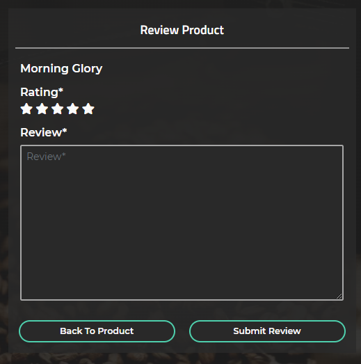
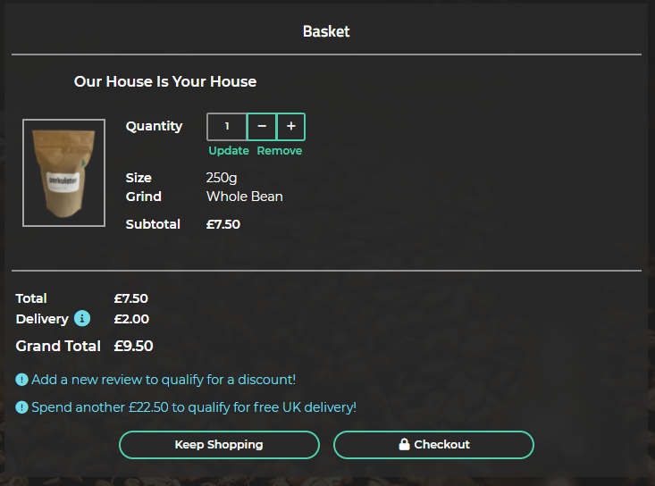
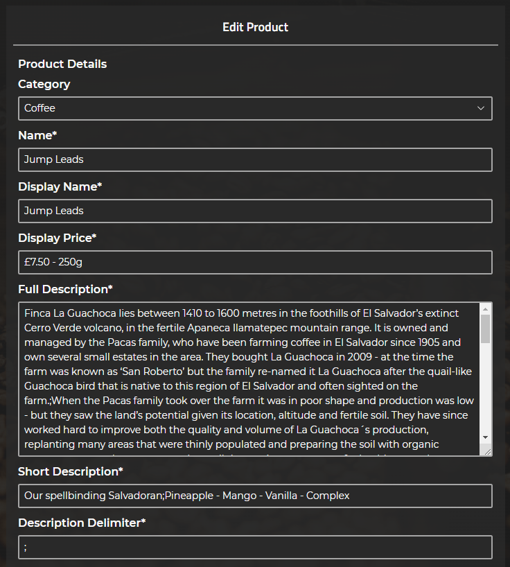

# perkulater - Testing #

## Contents ##
- [Automated Testing](#automated-testing)
    - [HTML](#html)
    - [Custom CSS Styling](#custom-css-styling)
    - [JavaScript Code Testing](#javascript-code-testing)
    - [Python Code Testing](#python-code-testing)
    - [Automated Performance And Quality Testing](#automated-performance-and-quality-testing)
- [User Stories Testing](#user-stories-testing)
- [Manual Testing](#manual-testing)
    - [Features](#form-validation)
    - [Form Validation](#form-validation)
    - [Responsive Design](#responsive-design)
    - [Browser Compatibility Testing](#browser-compatibility-testing)
- [Bugs Fixed During Testing](#bugs-fixed-during-testing)
- [Bugs Remaining](#bugs-remaining)

## Automated Testing ##

### HTML ###
All **HTML** code was validated using the [W3C Markup Validation Service](https://validator.w3.org/) 
regularly during the development process. **The HTML Source Code** was regularly viewed for each page 
using **Google Chrome** (right click, *View page source*) and passed through the 
[W3C Markup Validation Service](https://validator.w3.org/).  
Various minor errors were encountered and corrected during the final **HTML** validation check. 
All HTML code now passes validation with no errors or warnings. See [HTML Validation Reports](media/testing/validation/html).

### Custom CSS Styling ###
**Custom CSS Styling** from [base.css](static/css/base.css), [basket.css](basket/static/basket/css/basket.css), 
[checkout.css](checkout/static/checkout/css/checkout.css), [home.css](home/static/home/css/home.css), 
[products.css](products/static/products/css/products.css), and [profiles.css](profiles/static/profiles/css/profiles.css)
was validated using the [W3C CSS Validation Service](https://jigsaw.w3.org/css-validator/).  
No errors were generated. Some *"Due to their dynamic nature, CSS variables are currently not statically checked"* 
warnings were generated. See [CSS Validation Reports](/static/testing/validation/css).  
These warnings are related to the global variables declared at the top of [base.css](/static/css/base.css). 
The warnings are generated because the [W3C CSS Validation Service](https://jigsaw.w3.org/css-validator/) 
does not currently support CSS global variable declaration, and are not considered to be an issue. 
See [Github Link](https://github.com/w3c/css-validator/pull/173).
Some additional *"vendor extension"* warnings were also generated in **base.css**. These warnings are not considered to be an issue - 
the vendor extensions are to enable correct display of the **Background Image** linear gradient and various **Form** elements.  

### JavaScript Code Testing ##
The custom [base.js](static/js/base.js), [basket.js](basket/static/basket/js/basket.js), [checkout.js](checkout/static/checkout/js/checkout.js), 
[home.js](home/static/home/js/home.js), [products.js](products/static/products/js/products.js), and [profiles.js](profiles/static/profiles/js/profiles.js) 
**JavaScript Code Libraries** were validated using the [JSHint](https://jshint.com/about/) static code analysis tool, and passed without errors or warnings.
See [JavaScript Event Handler Module Validation](/static/testing/validation/js/events-jshint-validation.pdf). 
Due to the lack of complexity of **JavaScript** code implemented on the project, **Automated Unit Testing** 
of the **JavaScript** code was considered unecessary. All **JavaScript** functions and event handlers in the custom **JavaScript Code Libraries** 
have been thoroughly manually de-bugged and tested in the console as part of the [Manual Testing](#manual-testing) process.  

### Python Code Testing ##
All **Python Code** was thoroughly de-bugged and tested at the command line during the development process, and has been validated 
using [Flake 8](https://pypi.org/project/flake8/). [flake8-django](https://pypi.org/project/flake8-django/) was installed to assist with validation.  
**Flake 8** was configured for **perkulater** by creating a `setup.cfg` file in the root of the project, which contains the following settings:
```
[flake8]
exclude = */migrations/*.py, *__init__.py, *_pychache_*
per-file-ignores = *apps.py:F401, *settings.py:E501
```
The settings exclude **django** migrations, `__init__.py`, and `_pychache_` files, as these are system generated files and do not need to be checked.  
*F401* (imported but unused) errors are ignored for *apps.py, as flake8 was generating an error on **Django** signals being imported but unused. 
Signals need to be imported into the **app** config files to ensure correct operation of the code.  
*E501* (line too long) errors are ignored for `settings.py` as it is not possible to shorten the effected lines of code without causing application errors.  

**Flake 8** output is shown here [Python Code Automated Testing And Flake8 Output](media/testing/validation/python/python-automated-testing-output.png).

Python **Automated Unit Testing** was also implemented using the [Django Unit Testing](https://docs.djangoproject.com/en/3.2/topics/testing/overview/) framework.  
. **Unit Tests** have been written for all **Forms**, **Model Methods**, **Signals** and **Views**, for each **Django App** in  the **perkulater** project. 
A total of **137** **Unit Tests** have been written. Afetr **Unit Testing** was implemented, **Unit Tests** were run each time a feature was added or changed.  
All **137** tests run successfully without errors or warnings, see [Python Code Automated Testing And Flake8 Output](media/testing/validation/python/python-automated-testing-output.png).  

### Automated Performance And Quality Testing ###
Performance and Quality was tested with the [Lighthouse](https://chrome.google.com/webstore/detail/lighthouse/blipmdconlkpinefehnmjammfjpmpbjk?hl=en) 
extension for [Google Chrome](https://www.google.com/intl/en_uk/chrome/). 

Initial [Lighthouse](https://chrome.google.com/webstore/detail/lighthouse/blipmdconlkpinefehnmjammfjpmpbjk?hl=en) scores are tabulated below:  

Page|Performance|Accessiblity|Best Practices|SEO|
----|-----------|------------|--------------|---|
Home|98|100|100|100
Products|81|100|100|92
Product Detail|85|91|100|92

See [Initial Lighthouse Reports](media/testing/validation/performance/initial).

To improve **Accesibility** and **SEO**, missing *href tags* and *aria-label* atttributes were added to the some of the buttons and links in the **HTML Templates**.

To improve **Best Practices** and **Performance**, the **Product** images were resized to 317px x 422px (the maximum size the image is displyed at), 
and compressed using the [RIOT](https://riot-optimizer.com/) image optimisation tool.  
The **Background** image was also re-sized to 2400px x 1600px and compressed using the [RIOT](https://riot-optimizer.com/) image optimisation tool.  
[WebP](https://developers.google.com/speed/webp) versions of the **Product** and **Background** images were created, resulting in much smalller image files.  
*Webp* images are implemented for the **Product** images with *png* fallback for browsers that do not support *Webp* using the html *picture* tag.  
An additional field, *image_alt* was added to the **Product** model to enable the fallback inage to be specified for each product.  
The **Product Add** and **Product Edit** pages were uopdated to include image file selectors for the new *image_alt* field.  
This will enable the **perkulater** strore administrator to add a *Webp* image with *png* or *jpg* fallback for any future **Products**. 
A *Webp* image with *png* fallback was also implemented for the **Background** image using the [Modernizr](https://modernizr.com/) browser detector tool.  
A custom comfiguration of [Modernizr](https://modernizr.com/), customized to detect *WebP* image support, has been added to the **perkulater** code base: [libraries](static/js/libraries).  
This detects if the browser has *Webp* support, and adds a css class (either *webp* or *no-webp*) to the *html* element.  
The [base.css](static/css/base.css) was updated to test for *WebP* image support, and load the correct **Background Image**.  

Loading of **Stripe JavaScript** was moved from the **base** template to the **checkout** template, to reduce overhead on pages where **Stripe** is not required.  

These changes resulted in a significant increase in **Performance**.  

Final [Lighthouse](https://chrome.google.com/webstore/detail/lighthouse/blipmdconlkpinefehnmjammfjpmpbjk?hl=en) scores are tabulated below:  

Page|Performance|Accessiblity|Best Practices|SEO|
----|-----------|------------|--------------|---|
Home|99|100|100|100
Products|97|100|100|100
Product Detail|98|100|100|100
Product Add|98|100|100|100
Product Edit|99|100|100|100
Product Review|98|100|100|100
Basket|98|100|100|100
Checkout|92|100|100|100
Checkout Success|97|100|100|100
Contact|99|100|100|100
Sign In|99|100|100|100
Sign Up|99|100|100|100
User Profile|98|100|100|100
Order Details|98|100|100|100
Order Contact|98|100|100|100


See [Final Lighthouse Reports](media/testing/validation/performance/final).

To further improve performance, consideration should be given in a **Future Development Phase** to optimising **Bootstrap** by only importing the required components. 
See this [Link](https://getbootstrap.com/docs/5.0/customize/optimize/) for further information.

## User Stories Testing ###
As a **Potential Customer**, I would like to be able to:  
<br>
* Immediately understand the intent of the site.  
The **Home Page** explains the purpose of the **perkulater** site, in a simple and elegant way:    
  


* View and navigate the site on all devices.  
**Responsive Design** using **Bootstrap** has been implemented on the **perkulater** site, to enable the site to be viewed and navigated on all devices.  
See [Responsive Design](#responsive-design) section.  

* Learn about the coffees on offer, including a description of the flavours, so I can make an informed purchasing decision.  
The **Product Detail** page includes detailed information about the **Coffees** on offer:  
  

* Learn about where the coffee beans are sourced from, so I can make an informed purchasing decision.  
The **Product Information Modal**, accessed from the **Product Information Button** on the **Product Detail Page** contains further detailed information about the **Product** on offer.  
Functionality has been tested and works as expected:  
  

* Understand the delivery charges, and how much I need to spend to get free delivery, so I can make an informed purchasing decision.  
Information on the **Delivery Charges** can be found in the **Delivery Information Modal**, accessed from **Delivery Information Button** on the **Basket** and **Checkout** pages, 
and the **Free Delivery** offer is also shown in the **Offer Banner**.  
Functionality has been tested and works as expected:  
  
  

* Add products to my cart, so I can make a purchase.  
Products can be added to the **Basket** using the **Add To Basket** button on the **Product Detail** page.  
Functionality has been tested and works as expected:  
  

* Receive confirmation of my purchase via email, so I can be confident that the purchase has been made successfully.  
A confirmation email is sent to the **User** when they make a purchase.  
Functionality has been tested and works as expected:  
  

* Register on the site, so I can make a repeat purchase more easily and get access to any rewards on offer.  
The **Sign Up** page allows an unautheticated user to register for an account.  
**Form Validation** and functionality has been tested and works as expected:  
  

* Contact the business with a general query.  
The **Contact** page allows any **User** of the site to contact the business.  
**Form Validation** and functionality has been tested and works as expected:  
  

* Subscribe for a regular purchase of a product.  
This feature does not form part of the **Phase 1 Development**, and will be added in a future development phase.  

As a **Registered User**, I would like to be able to:  
<br>
* Sign in to my account. 
The **Sign In** page allows a registered user to **Sign In** to their account.  
**Form Validation** and functionality has been tested and works as expected:  
  

* Sign out of my account.  
The **Sign Out** page allows a signed in user to **Sign Out** of their account.  
Functionality has been tested and works as expected:    
  

* Recover a forgotten password.
The **Forgot Password** page allows a registered user to reset their password.  
**Form Validation** and functionality has been tested and works as expected:  
<p float="left">
    
    
</p>
<p float="left">
    
    
    
</p>

* View and update my personal profile, including default delivery details.  
The **User Profile** page allows a registered **User** to update their personal profile and default delivery information.  
**Form Validation** and functionality has been tested and works as expected:  
  

* See a summary of my previous orders.  
The **User Profile** page allows a registered **User** to see a summary of their **Order History**.  
Detailed information about each **Order** can be found on the **Order History** page, accessed by clicking on the **Order Number**.  
The functionality has been tested and works as expected:  
  
  

* Contact the business about a specific order.  
The business can be contacted about a specific order using the **Order Contact** page, accessed from the **Order History** page.  
**Form Validation** and functionality has been tested and works as expected:  
<p float="left">
    
    
</p>

* Add reviews to products, to help other customers make informed purchasing decisions.  
Customers can add a new **review** using the **Add Review** link in the **Customer Review** section of the **Product Detail** page.  
**Reviews** may also be added using the **Review** links in the **Order History** section of the **User Profile** page.  
**Form Validation** and functionality has been tested and works as expected:  
  
<p float="left">
     
    
</p>

* Edit previous reviews.  
Customers can edit existing reviews using the **Edit** link in the **Customer Review** section of the **Product Detail** page.  
**Reviews** may also be edited using the **Review** links in the **Order History** section of the **User Profile** page.  
**Form Validation** and functionality has been tested and works as expected:  
  
<p float="left">
     
    
</p>

As a **Business Owner**, I would like to be able to:
* Incentivise customers to add reviews to products, so that other customers will feel more confident about making a purchase.  
A **Reward** system has been implemented, where a registered **User** can get 10% off their next **order** by adding a new **Review**. 
This is communicated to the **User** in the **Offer Banner**, and on the **Basket** and **Checkout** pages.  
The functionality has been tested and works as expected:  
  
<p float="left">
     
    
</p>
<p float="left">
     
    
</p>

* Add, edit and delete products.  
**Products** may be added using the **Product Add** page, accessed from the **User Menu** if the **User** is signed in as a **Super User**.  
**Products** may be edited using the **Product Edit** page, accessed from the **Product Detail** page if the **User** is signed in as a **Super User**.  
**Products** may be edited using the **Product Delete** button, accessed from the **Product Detail** page if the **User** is signed in as a **Super User**.  
**Form Validation** and functionality has been tested and works as expected:  
<p float="left">
    
     
</p>
<p float="left">
    
     
</p>
<p float="left">
    
    
</p>

* Edit product prices.  
**Product** **Prices** can be edited using the **Edit Prices** page, accessed from the **Product Detail** page **Price Edit** link if the **User** is signed in as a **Super User**.  
**Form Validation** and functionality has been tested and works as expected:  
<p float="left">
    
    
</p>

* Delete user reviews, in case malicious reviews are added.  
**User** reviews may be deleted by selecting the **Delete Review** links in the **Customer Reviews** section of the **Product Detail** page, if the **User** is signed in as a **Super User**.  
The functionality has been tested and works as expected:  
  
 


* Add, edit and delete product categories.  
This feature does not form part of the **Phase 1 Development**, and will be added in a future development phase.  
* Track sales data, to inform future purchasing decisions.  
This feature does not form part of the **Phase 1 Development**, and will be added in a future development phase.  


## Manual Testing ##
The site has been manually tested thoroughly over a 3 week period. See [Bugs Fixed During Testing](#bugs-fixed-during-testing) 
for bugs uncovered and fixed during the manual testing process.  
Please note that an account with **Super User** privileges has been created for testing purposes. This will facilitate testing of 
features which require **Super User** privileges. The *username* and *password* will be supplied on submission of the project.

### Features ###
The following **Features** have been explicitly tested:

Page or Section|Feature|Style Check|Hover, Focus Style Check|Functionality Check|Pass, Fail|Notes
---------------|-------|-----------|------------------------|-------------------|----------|-----
Home|Fade-in Animation|Yes|-|Yes|Pass|-
Home|Logo|Yes|-|-|Pass|-
Home|Horizontal Rule|Yes|-|-|Pass|-
Home|Tagline|Yes|-|Yes|Pass|-
Home|Shop Button|Yes|Yes|Pass|Links to **Products**
Navigation Menu|Logo|Yes|-|Yes|Pass|-
Navigation Menu|Tagline|Yes|-|-|Pass|-
Navigation Menu|Search Input|Yes|Yes|Yes|Pass|-
Navigation Menu|Search Button|Yes|Yes|Yes|Pass|Returns search results
Navigation Menu|Basket Icon|Yes|Yes|Yes|Pass|-
Navigation Menu|User Droppdown Menu - Contact|Yes|Yes|Yes|Pass|-
Navigation Menu|User Droppdown Menu - Sign In|Yes|Yes|Yes|Pass|-
Navigation Menu|User Droppdown Menu - Profile|Yes|Yes|Yes|Pass|Only shown if signed-in
Navigation Menu|User Droppdown Menu - Sign Out|Yes|Yes|Yes|Pass|Only shown if signed-in
Navigation Menu|User Droppdown Menu - Add Product|Yes|Yes|Yes|Pass|Only shown if signed-in as super-user
Navigation Menu|Horizontal Rule|Yes|-|-|Pass|-
Footer|Horizontal Rule|Yes|-|-|Pass|-
Footer|Tagline|Yes|-|Yes|Pass|-
Footer|Horizontal Rule|Yes|-|-|Pass|-
Footer|Social Media Links|Yes|Yes|Yes|Pass|perkulater social media accounts not created at this stage
Products|Offer Banner|Yes|-|-|Pass|-
Products|Product Image Link|Yes|Yes|Yes|Pass|Links to **Product Detail**
Products|Product Name|Yes|-|-|Pass|-
Products|Product Rating Stars|Yes|-|Yes|Pass|-
Products|Product Price|Yes|-|-|Pass|-
Products|Buy Button|Yes|Yes|Yes|Pass|-
Product Detail|Product Image Link|Yes|Yes|Yes|Pass|Links to **Product Information Modal**
Product Detail|Product Name|Yes|-|-|Pass|
Product Detail|Coffee Flavour Profile|Yes|-|-|Pass|
Product Detail|Product Rating Stars|Yes|-|Yes|Pass|Correctly updated from *product_rating* field.
Product Detail|Product Price|Yes|-|-|Pass|
Product Detail|Keep Shopping Button|Yes|Yes|Yes|Pass|Links to **Products**.
Product Detail|Coffee Information Link|Yes|Yes|Yes|Pass|Links to **Product Information Modal**
Product Detail|Product Information Modal|Yes|Yes|Yes|Pass|Information correctly split into paragraphs with delimiter.
Product Detail|Coffee Details - Container|Yes|-|-|Pass
Product Detail|Coffee Details - Text|Yes|-|-|Pass|-
Product Detail|Coffee Options - Container|Yes|-|-|Pass
Product Detail|Size Information Link|Yes|Yes|Yes|Pass|Links to **Size Information Modal**.
Product Detail|Size Information Modal|Yes|Yes|Yes|Pass|Title and content of modal correctly set.
Product Detail|Size Select|Yes|Yes|Yes|Pass|Options correctly populated
Product Detail|Type Information Link|Yes|Yes|Yes|Pass|Links to **Type Information Modal**.
Product Detail|Type Information Modal|Yes|Yes|Yes|Pass|Title and content of modal correctly set.
Product Detail|Type Select|Yes|Yes|Yes|Pass|Options correctly populated.
Product Detail|Quantity Buttons|Yes|Yes|Yes|Pass|Buttons update price on click, disabled correctly when quantity is 1 or 99.
Product Detail|Quantity Input|Yes|-|Yes|Pass|Quantity input is greyed out and automatically updated by quantity buttons.
Product Detail|Price|Yes|-|Yes|Pass|Price automatically updated by quantity buttons.
Product Detail|Price Edit Link|Yes|Yes|Yes|Pass|Only shown if signed-in as super-user, links to **Edit Price**.
Product Detail|Add To Basket Button|Yes|Yes|Yes|Pass|
Product Detail|Create Plan Button|Yes|Yes|Yes|Pass|Links to Information Modal, explains that feature is coming soon.
Product Detail|Edit Button|Yes|Yes|Yes|Pass|Only shown if signed-in as super-user. Links to **Product Edit**.
Product Detail|Delete Button|Yes|Yes|Yes|Pass|Only shown if signed-in as super-user. Links to **Confirm Modal**.
Product Detail|Customer Reviews - Container|Yes|-|-|Pass|
Product Detail|Customer Reviews - User name|Yes|-|Yes|Pass|
Product Detail|Customer Reviews - Rating Stars|Yes|-|Yes|Pass|
Product Detail|Customer Reviews - Review|Yes|-|Yes|Pass|
Product Detail|Customer Reviews - Review Add Link|Yes|Yes|Yes|Pass|Only shown if User has not reviewed Product. Liks to **Sign In** if not signed in. Otherwise links to **Product Review**.
Product Detail|Customer Reviews - Review Delete Link|Yes|Yes|Yes|Pass|If not signed in, not shown. if signed in as standard User, Only shown for User's own reviews. If signed in as Super User, shown on all reviews. Links to **Confirm Modal**.
Product Detail|Customer Reviews - Review Edit Link|Yes|Yes|Yes|Pass|If not signed in, not shown. If signed in, only shown for User's own reviews. Links to **Product Review**.
Add Product|Category|Yes|Yes|Yes|Pass|Dropdown populated correctly
Add Product|Name|Yes|Yes|Yes|Pass|Field required
Add Product|Display Name|Yes|Yes|Yes|Pass|Field required
Add Product|Display Price|Yes|Yes|Yes|Pass|Field required
Add Product|Full Description|Yes|Yes|Yes|Pass|Field required. Delimiter can be used to split into paragraphs in **Information Modal**.
Add Product|Short Description|Yes|Yes|Yes|Pass|Field required.
Add Product|Description Delimeter|Yes|Yes|Yes|Pass|Field required. Limited to 3 characters.
Add Product|Image|Yes|Yes|Yes|Pass|Custom clearable file input widget correctly displayed. Image filename text displayed after selection.
Add Product|Alternative Image|Yes|Yes|Yes|Pass|Custom clearable file input widget correctly displayed. Image filename text displayed after selection.
Add Product|Coffee Details|Yes|Yes|Yes|Pass|All fields are required.


Product Detail|Confirm Modal|Yes|Yes|Yes|Pass|Close and Delete buttons work as expected.


* **FreeFrom** logo link has been tested and links to home page if selected:  
  

* **Home Page Alert Links** have been tested and function correctly including hover styling, linking to **Sign In** and **Register** pages:  
  

* **Navigation Menu** has been tested and works as intended. When user is not **Signed In**, **Home** and **Sign in** links are displayed and 
the links function correctly. If user is **Signed In** but does not have **Admin** privileges, **Home** and **Sign Out** links are displayed 
and function correctly. If user is **Signed In** and has **Admin** privileges, **Home**, **Allergens**, **Categories**, and **Sign Out** links 
are displayed and function correctly. **Allergens** and **Categories** drop down menus function correctly. 
**Navigation Menu Hover Styling** has been implemented and is working as intended:  


 

* **Search Input**, has been tested and functions correctly, allowing user to optionally input product search criteria to filter search results:  
  

* **Category Selector** has been tested and functions correctly, allowing user to optionally select category to filter search results:  
  

* **Search Button** functions correctly (including hover styling) and returns matched products in the **Product Results Table**. 
Resizes if user is not signed in and add button is not displayed:  
  

* **Add Button** functions correctly (including hover styling) and links to the **Product Add** form. Only shown if user is signed in:  
  

* **Allergen Selector** functions correctly and allows user to optionally select allergens to filter search results:  
  

* **Product Results Table** functions correctly and displays product search results as expected. 
**Product** name link has been tested and links to **Product View** page:
 

* **Sign In** functions correctly (including [Form Validation](#form-validation) and button **Hover Styling**) and enables user to sign in. 
Link to **Register** functions correctly (including hover styling):  
 

* **Register** form functions correctly (including [Form Validation](#form-validation) and button **Hover Styling**) and allows user to register:  
 

* **Product View** functions correctly and displays product details. If user is not **Signed In**, displays links to **Sign In** and 
**Register** forms. Links function correctly (including hover styling).
If user is signed in, **Review** and **Rating** inputs and buttons are displayed as intended and function 
correctly (including form validation and hover styling).   
**Add** button functions as intended (including [Form Validation](#form-validation) and hover styling), enabling user to review and rate product.  
**Add** button text functions as intended and is changed to **Update** if the user has already reviewed the product.  
**Update** button functions as intended (including form validation and hover styling) and updates review and rating if the product 
has already been reviewed by the user.  
**Edit Product** button is displayed if user is **Signed In** and functions correctly (including hover styling), linking to **Product Edit** page.  
**Add Product** button is displayed if user is **Signed In** and functions correctly (including hover styling), to **Product Add** page.  
User reviews are displayed as intended below in the **User Reviews Table**:  
  
  
  
* **Product Edit** form functions correctly (including [Form Validation](#form-validation) and button **Hover Styling**). 
**Delete** button is shown if the product has been added by the signed in **User**, or if the signed in **User** has **Admin** privileges:  
  

* **Product Delete Confirm** form functions correctly (including button **Hover Styling**):  
  

* **Product Add** form functions correctly (including [Form Validation](#form-validation) and button **Hover Styling**):  
  

* **Allergen Add** form functions correctly (including [Form Validation](#form-validation) and button **Hover Styling**):  
  

* **Allergen Edit** form functions correctly (including [Form Validation](#form-validation) and button **Hover Styling**):  
  

* **Allergen Delete** form functions correctly (including [Form Validation](#form-validation) and button **Hover Styling**):  
  

* **Allergen Delete Confirm** form functions correctly (including button **Hover Styling**):  
  

* **Category Add** form functions correctly (including [Form Validation](#form-validation) and button **Hover Styling**):  
  

* **Category Edit** form functions correctly (including [Form Validation](#form-validation) and button **Hover Styling**):  
  

* **Category Delete** form functions correctly (including [Form Validation](#form-validation) and button **Hover Styling**):  
  

* **Category Delete Confirm** form functions correctly (including button **Hover Styling**):  
  

* **Footer Contact Developer Link** functions correctly (including **Hover Styling**) and links to **Contact Developer** form:  
  

* **Footer GitHub Link** functions correctly (including **Hover Styling**) and links to developer page on [GitHub](https://github.com/richardhenyash):  
  

* **Contact Developer** form functions correctly (including [Form Validation](#form-validation) and button **Hover Styling**), enabling developer to be contacted by email:  
  
  


* **Error Page** functions correctly and returns a customised error message and link to the **Home** page if an error is encountered. 
Link hover styling functions correctly:  

  

### Form Validation ###
Validation for all **Forms** implemented using [WTForms](https://wtforms.readthedocs.io/en/2.3.x/) and **Python** has been 
thoroughly manually tested. See [Form Validation Testing Screen Prints](/static/testing/forms), a selection of which are shown below:  
  
  
  
  

### Responsive Design ###
* Responsive design has been tested by using [Chrome DevTools](https://developers.google.com/web/tools/chrome-devtools) 
to emulate viewing the website on a number of devices with varying screen dimensions, 
including iPhone 5/SE, iPhone 6/7/8, iPhone 6/7/8 plus, iPhone 11, iPad, iPad Pro, Moto G4, Galaxy S5, Surface Duo, 
Galaxy Fold, Widescreen Laptop and Desktop PC. 
See [Responsive Design Testing](/static/testing/responsive/) screen prints, a selection of which are shown below:  

  

  

  

  


* Responsive design was then further tested using the 
[Responsive Viewer](https://chrome.google.com/webstore/detail/responsive-viewer/inmopeiepgfljkpkidclfgbgbmfcennb?hl=en)
plug in for chrome. This emulates viewing the website on a large number of devices, 
including iPhone XR, iPhone XS Max, iPhone XS, iPhone X, Galaxy S9 Plus, Galaxy S8 Plus, Galaxy S9, Note 8, Note S8, Pixel 3 and Pixel 3XL.  
See [Responsive Design Testing](/static/testing/responsive) screen prints, a selection of which are also shown below:  

  

   

The following **Responsive** features were specifically tested:
* The **Navigation Menu** collapses as intended to an icon on small devices less than 768 pixels wide:  
  

* The **Search Input**, **Category Selector**, **Search Button** and **Add Button** stack as intended on small devices less than 768 pixels wide.  
  

* The **Product Results Table** and **User Reviews Table** columns collapse on smaller devices as intended:  

  

### Browser Compatibility Testing ###
The website was tested on the following browsers and operating systems, 
using a combination of manual testing across various devices and the [Browserstack](https://www.browserstack.com/) emulator:
* [Google Chrome](https://www.google.com/intl/en_uk/chrome/) ([Windows 10](https://www.microsoft.com/en-us/windows), [Android 11](https://www.android.com/android-11/) and [Mac OS Big Sur](https://www.apple.com/uk/macos/big-sur/)).
* [Microsoft Edge](https://www.microsoft.com/en-us/edge) ([Windows 10](https://www.microsoft.com/en-us/windows) and [Mac OS Big Sur](https://www.apple.com/uk/macos/big-sur/)).
* [Microsoft Internet Explorer 11](https://support.microsoft.com/en-us/topic/internet-explorer-downloads-d49e1f0d-571c-9a7b-d97e-be248806ca70#ID0EBBD=Windows_10) ([Windows 10](https://www.microsoft.com/en-us/windows)).
* [Safari](https://www.apple.com/uk/safari/) ([Mac OS Big Sur](https://www.apple.com/uk/macos/big-sur/) and [iOS](https://www.apple.com/uk/ios/ios-14/)).
* [Firefox](https://www.mozilla.org/en-GB/firefox/new/) ([Windows 10](https://www.microsoft.com/en-us/windows) and [Mac OS Big Sur](https://www.apple.com/uk/macos/big-sur/)).
* [Opera](https://www.opera.com/) ([Windows 10](https://www.microsoft.com/en-us/windows) and [Mac OS Big Sur](https://www.apple.com/uk/macos/big-sur/)).  

No issues were uncovered during **Browser Compatibility Testing**.

### Bugs Fixed During Testing ###
* **Search Input**, **Category Selector**,  and **Allergen Selector** now populate with previously selected values when search results are displayed.
* **Product Results Table**, **Allergen Selector** and **Category Selector** are now sorted in alphabetic order.
* A missing CSS class was added to the **Edit Product** button.
* A bug was fixed where **Products** rating one star were not correctly displayed in the **Product Results Table**.
* On the **Product View** form, newly added user **Reviews** and **Ratings** are now added or updated in the 
**Reviews Table** after hitting the **Add** or **Update** button.
* The **Product Add** route was updated to redirect to the **Product View** of the successfully added product. 
* The **Category Edit** and **Allergen Edit** routes were updated to populate the **Category** or **Allergen** selector with previously selected values if the **Edit** form fails **Validation** or **Checking**.

### Bugs Remaining ###
* There are no known bugs remaining.